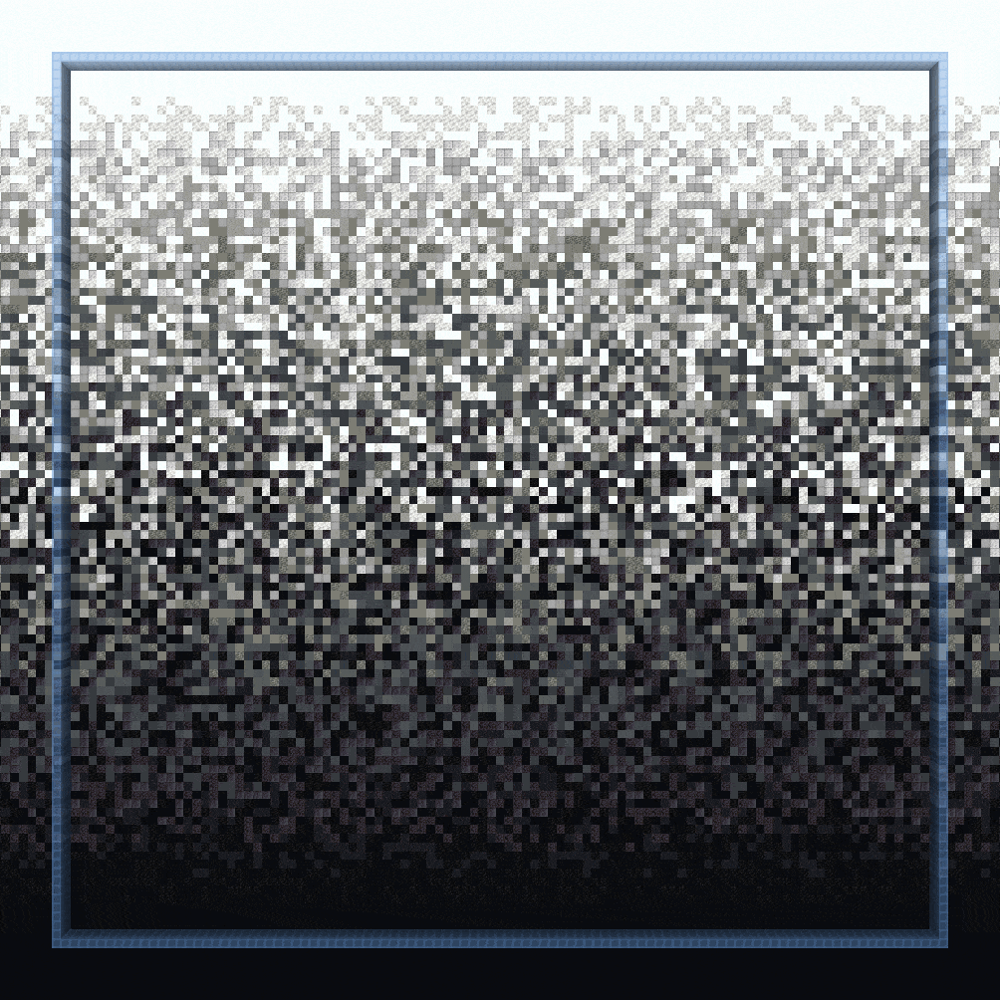

# Palette Gradient Brushes

The following commands feature brushes for creating gradients.

***

### `//ezbr `<mark style="color:orange;">`gradient`</mark>

<mark style="color:blue;">Gradient Brush</mark>

**`//ezbr gradient `**<mark style="color:orange;">**`<palette> [radius] [interpolation] [bleed] [-av] [-n <noise>] [-z <scale>] [-d <distanceFunction>]`**</mark>

The `gradient` brush allows you to first define a plane by selecting 2 points, you can then paint with your gradient with blocks chosen based on distance along this plane.

<mark style="color:blue;">**Left Click**</mark>**&#x20;to start a plane at your target block**\
<mark style="color:blue;">**Sneak + Left Click**</mark>**&#x20;to start a plane at the player position**\
<mark style="color:blue;">**Right Click**</mark>**&#x20;to set the end of the plane at your target block OR paint palette blocks if the plane is set**\
<mark style="color:blue;">**Sneak + Right Click**</mark>**&#x20;to set the end of the plane at the player position OR paint palette blocks if the plane is set**\
<mark style="color:blue;">**Swap Hands**</mark>**&#x20;(Default F key) to toggle between GLOBAL and PER\_ITEM active gradients**

* <mark style="color:orange;">**Palette**</mark>: Specifies the palette to use for the gradient.
* <mark style="color:orange;">**Radius**</mark> (Default: 8): Sets the radius of the brush.
* <mark style="color:orange;">**Interpolation**</mark> (Default: NONE): Determines the type of interpolation used in the gradient transition.
* <mark style="color:orange;">**Bleed**</mark> (Default: 0.5): Adjusts the strength of interpolation, with a normal range from 0 to 1.
* <mark style="color:orange;">**`-a`**</mark>: When activated, the gradient is allowed to replace air blocks.
* <mark style="color:orange;">**`-v`**</mark>: Deactivates WorldEditCUI integration.
* <mark style="color:orange;">**`-n <noise>`**</mark> (Default: `White()`): Adds an underlying noise field to the gradient effect.
* <mark style="color:orange;">**`-z <scale>`**</mark> (Default: 1): Modifies the scale of the noise.
* <mark style="color:orange;">**`-d <distanceFunction>`**</mark> (Default: NONE): Sets the distance mode changing the brush to work based on distance from the initial block with the given distance function.

***

### `//ezbr `<mark style="color:orange;">`gradientstroke`</mark>

<mark style="color:blue;">Gradient Stroke Brush</mark>

**`//ezbr gradientstroke `**<mark style="color:orange;">**`<palette> [radius] [interpolation] [bleed] [-advw] [-n <noise>] [-z <scale>]`**</mark>

The `gradientstroke` brush allows for gradient application along a path (stroke) defined by selecting points.

<mark style="color:blue;">**Left Click**</mark>**&#x20;to add points**\
<mark style="color:blue;">**Sneak + Left Click**</mark>**&#x20;to remove the last point**\
<mark style="color:blue;">**Right Click**</mark>**&#x20;to confirm & place the gradient stroke**\
<mark style="color:blue;">**Sneak + Right Click**</mark>**&#x20;to clear all points**\
<mark style="color:blue;">**Swap Hands**</mark>**&#x20;(Default F key) to toggle between GLOBAL and PER\_ITEM active gradients**

* <mark style="color:orange;">**Palette**</mark>: Specifies the block pattern for the gradient.
* <mark style="color:orange;">**Radius**</mark> (Default: 8): Sets the radius of the brush.
* <mark style="color:orange;">**Interpolation**</mark> (Default: LINEAR): Determines the type of interpolation used in the gradient transition.
* <mark style="color:orange;">**Bleed**</mark> (Default: 0.5): Adjusts the strength of interpolation, with a normal range from 0 to 1.
* <mark style="color:orange;">**`-a`**</mark>: When activated, allows the gradient to replace air blocks.
* <mark style="color:orange;">**`-d`**</mark>: Activates the 'distance to center' mode which applies the gradient based on distance to the middle of the stroke line instead of distance along the stroke.
* <mark style="color:orange;">**`-v`**</mark>: Deactivates WorldEditCUI integration.
* <mark style="color:orange;">**`-w`**</mark>: Clears the brush's path after every placed stroke.
* <mark style="color:orange;">**`-n <noise>`**</mark> (Default: `White()`): Adds an underlying noise field to the gradient effect.
* <mark style="color:orange;">**`-z <scale>`**</mark> (Default: 1): Modifies the scale of the noise.

***

## Gradient Parameters

There are a few parameters to creating a gradient worth explaining.

### Bleed

First off, the <mark style="color:orange;">**`bleed`**</mark> parameter.

The bleed parameter determines how much the colors bleed into each other.

### Noise

The pattern of how this bleeding takes place can be determined by <mark style="color:orange;">**`noise`**</mark>. The GIF above was using White noise (`-n White`), while the following GIFs use Perlin noise (`-n Perlin(Freq:0.25)`)

#### You can also put in any noise. Here are a few more examples:

**`-n Perlin(Freq:0.25)`**

**`-n Cellular(Freq:0.15)`**

**`-n @@ridged(Freq:0.15)`**

**`-n Shard(Freq:0.15)`**

### Interpolation Mode

In the following, we compare the five different <mark style="color:orange;">**`interpolation modes`**</mark> of applying the noise to the gradient. The GIFs go through increasing and decreasing bleed values between 0 and 1.

_The blue square's top and bottom show where the gradient starts and ends_

#### NONE

No interpolation is applied.

#### LINEAR

The noise is applied with a constant factor throughout the entire gradient. Because of that, the gradient is "clipping" outside our two selected positions.

#### TAPERED

Applies the noise strongest in the middle of the gradient and tapers off towards the start and end to avoid "clipping" outside of the given positions.

#### BEZIER

Uses Bezier interpolation to apply the noise more softly and smoothly. Breaks for a bleed value of >1.

#### SIN

