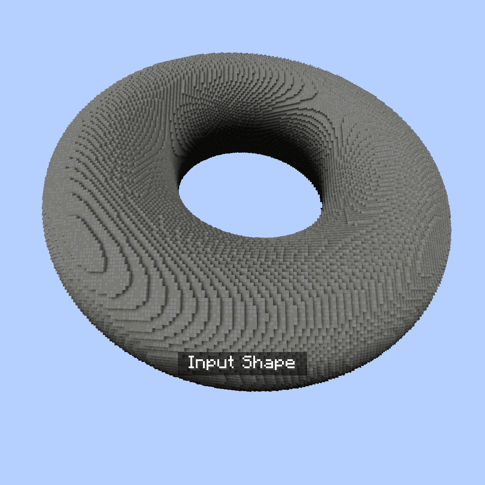
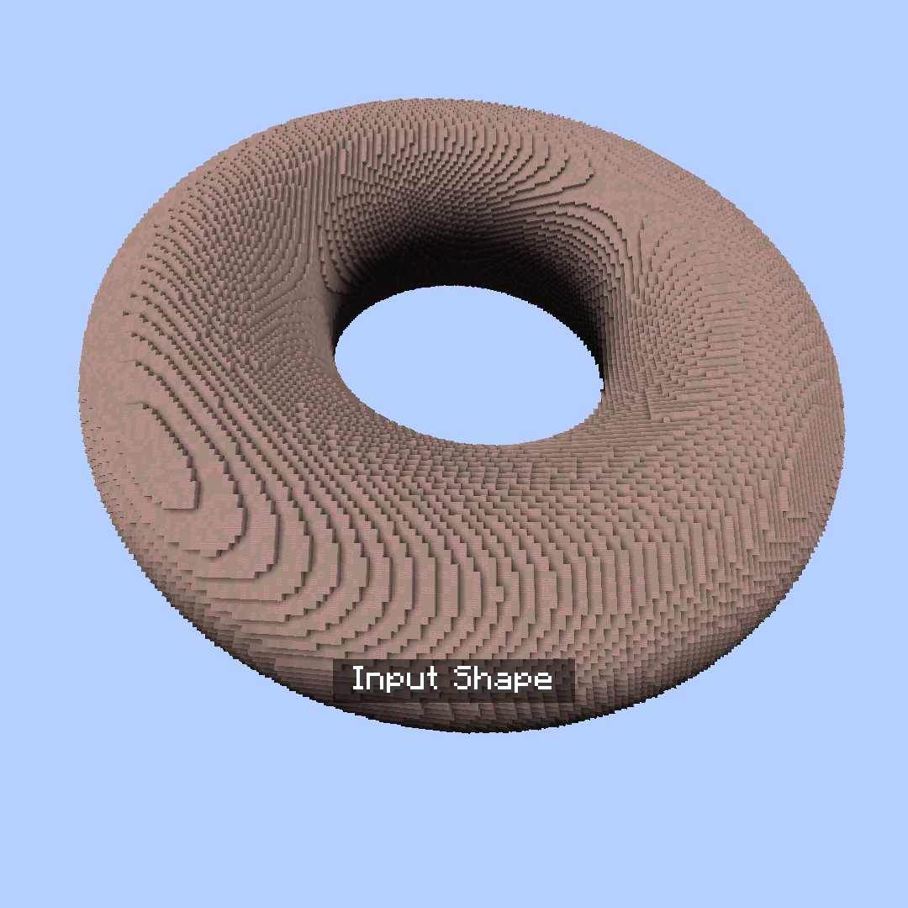
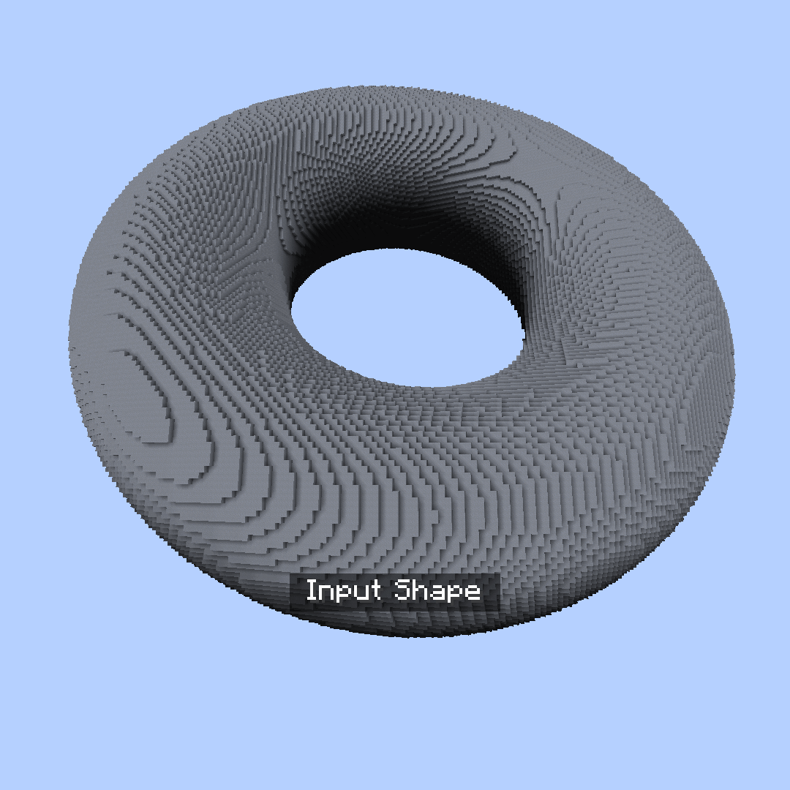
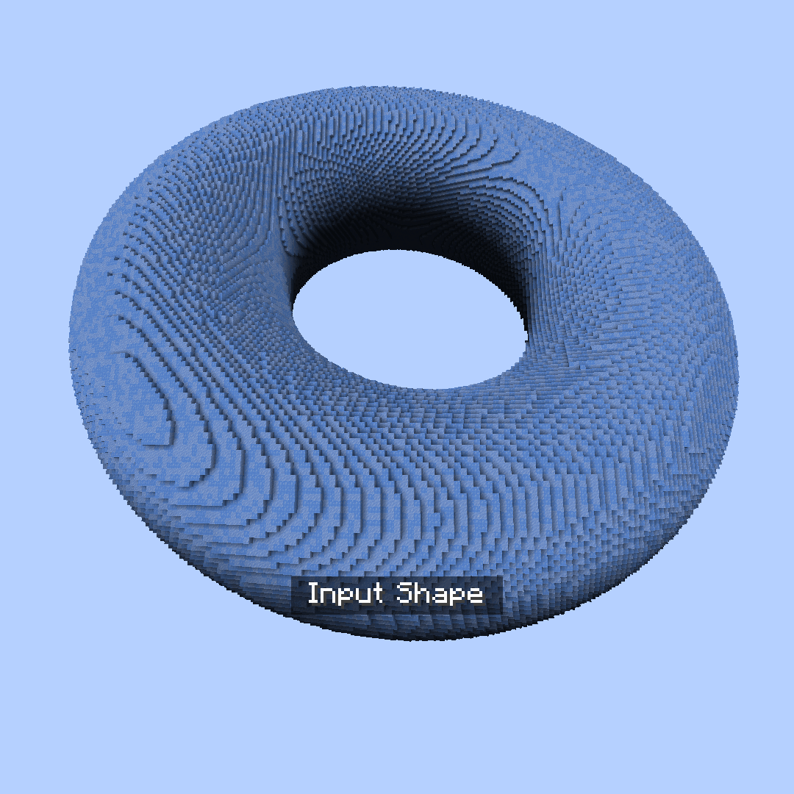
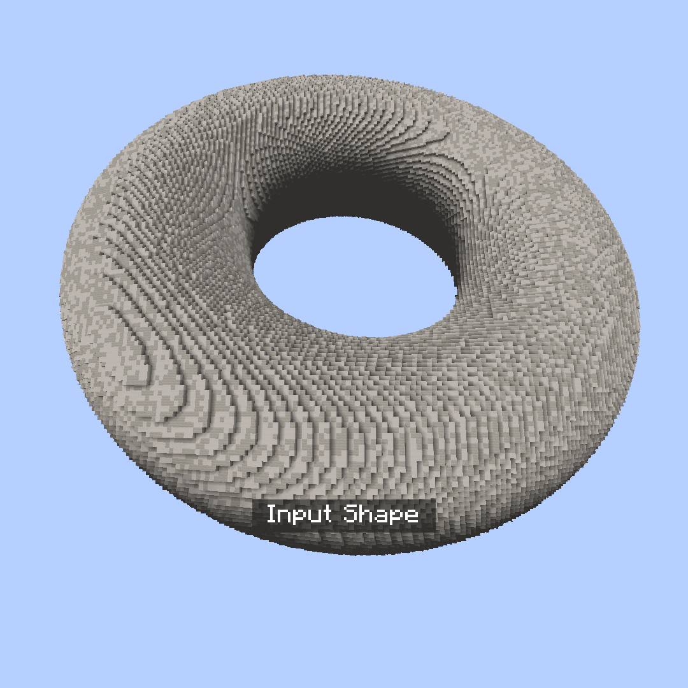
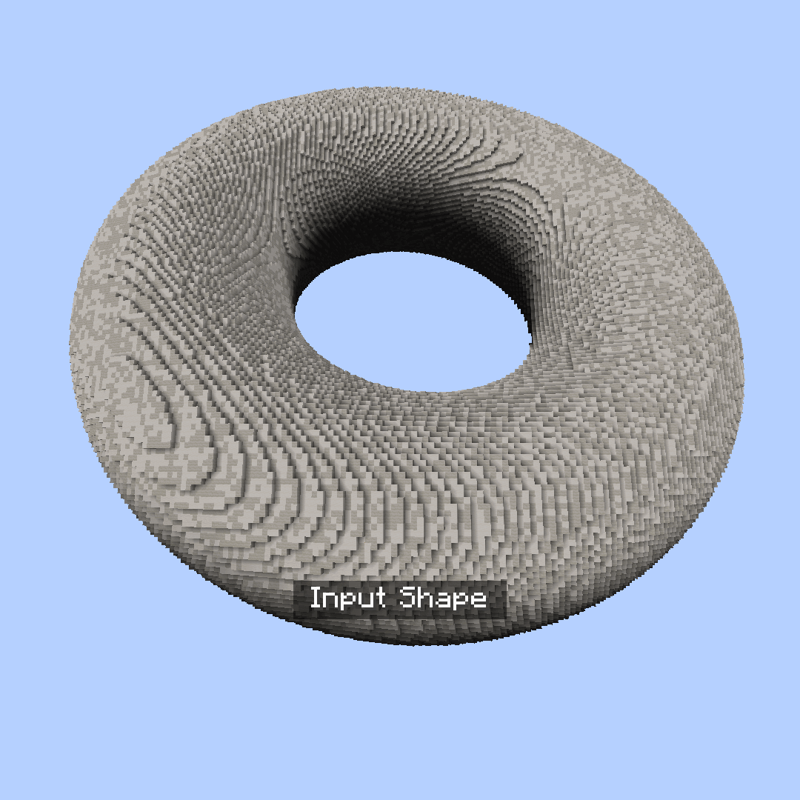

# Deformation

Deformation commands deform the contents of the given region into new shapes and forms.

All sub-commands are under `//ezdeform` (`//ezd`)\
e.g `//ezdeform hexagonalize`

***

## List of subcommands

***

#### 

### `//ezdeform`` `<mark style="color:orange;">`hexagonalize`</mark>

<mark style="color:blue;">Hexagonalize</mark>

**`//ezdeform hexagonalize [`**<mark style="color:orange;">**`size`**</mark>**`] [`**<mark style="color:orange;">**`air_gap`**</mark>**`] [`**<mark style="color:orange;">**`x_rotation`**</mark>**`] [`**<mark style="color:orange;">**`z_rotation`**</mark>**`] [`**<mark style="color:orange;">**`offset_angle`**</mark>**`] [`**<mark style="color:orange;">**`-w <profile>`**</mark>**`]`**

Deforms the region into hexagonal columns.

* <mark style="color:orange;">**Size**</mark> (Default: 12): Sets the size of hexagons.

* <mark style="color:orange;">**Air Gap**</mark> (Default: 0.0): Defines the width of the air gap between columns.

* <mark style="color:orange;">**X Rotation**</mark> (Default: 0.0): Sets the column rotation angle along the X-axis, in degrees.

* <mark style="color:orange;">**Z Rotation**</mark> (Default: 0.0): Sets the column rotation angle along the Z-axis, in degrees.

* <mark style="color:orange;">**Offset Angle**</mark> (Default: 60.0): Adjusts the offset angle, controlling the shape (range: 0-90 degrees).

* <mark style="color:orange;">**-w**</mark>: See [Smoothblocks](../smoothblocks/smoothblocks.md).

***

#### 

### `//ezdeform`` `<mark style="color:orange;">`noise`</mark>

<mark style="color:blue;">Noise</mark>

**`//ezdeform noise <`**<mark style="color:orange;">**`noise`**</mark>**`> [`**<mark style="color:orange;">**`strength`**</mark>**`] [`**<mark style="color:orange;">**`-z <zoom>`**</mark>**`] [`**<mark style="color:orange;">**`-s <seed>`**</mark>**`] [`**<mark style="color:orange;">**`-w <profile>`**</mark>**`]`**

Deforms region according the given noise field.

* <mark style="color:orange;">**Noise**</mark>: Specifies the type of noise to use for deformation.

- <mark style="color:orange;">**Strength**</mark> (Default: 2.0): Sets the strength of the noise effect.

* <mark style="color:orange;">**Zoom**</mark> (Default: 1): Determines the scale of the noise.

* <mark style="color:orange;">**-s \<seed>**</mark> (Default: -1): Optional seed for the noise pattern.
* <mark style="color:orange;">**-h**</mark>: When used, only deforms the region horizontally.

* <mark style="color:orange;">**-v**</mark>: When used, only deforms the region vertically.

* <mark style="color:orange;">**-w**</mark>: See [Smoothblocks](../smoothblocks/smoothblocks.md).

***

#### 

### `//ezdeform`` `<mark style="color:orange;">`rotate`</mark>

<mark style="color:blue;">Rotate</mark>

**`//ezdeform rotate <`**<mark style="color:orange;">**`angle`**</mark>**`> [`**<mark style="color:orange;">**`-o`**</mark>**`] [`**<mark style="color:orange;">**`-w <profile>`**</mark>**`]`**

Rotates region clockwise with the the center of rotation being the center of the selection (or the player's head position using -o) and with the player aim defining the axis of rotation.

* <mark style="color:orange;">**Angle**</mark>: Sets the angle of rotation, in degrees.

* <mark style="color:orange;">**-o**</mark>: When used, uses the player's position as the center of rotation instead of the selection's center.
* <mark style="color:orange;">**-w**</mark>: See [Smoothblocks](../smoothblocks/smoothblocks.md).

***

#### 

### `//ezdeform`` `<mark style="color:orange;">`voronoialize`</mark>

<mark style="color:blue;">Voronoialize</mark>

**`//ezdeform voronoialize [`**<mark style="color:orange;">**`size`**</mark>**`] [`**<mark style="color:orange;">**`air_gap`**</mark>**`] [`**<mark style="color:orange;">**`-s <seed>`**</mark>**`] [`**<mark style="color:orange;">**`-w <profile>`**</mark>**`]`**

Deforms region to randomly distributed voronoi cells.

* <mark style="color:orange;">**Size**</mark> (Default: 12): Determines the size of the voronoi cells.

* <mark style="color:orange;">**Air Gap**</mark> (Default: 0.0): Specifies the width of the air gap between cells.

* <mark style="color:orange;">**-s \<seed>**</mark> (Default: -1): Optional seed for generating the pattern.
* <mark style="color:orange;">**-w \<profile>**</mark>: See [Smoothblocks](../smoothblocks/smoothblocks.md).

***

#### 

### `//ezdeform`` `<mark style="color:orange;">`voronoialize2`</mark>

<mark style="color:blue;">Alternative Voronoialize</mark>

**`//ezdeform voronoialize2 <`**<mark style="color:orange;">**`amount`**</mark>**`> [`**<mark style="color:orange;">**`air_gap`**</mark>**`] [`**<mark style="color:orange;">**`-s <seed>`**</mark>**`] [`**<mark style="color:orange;">**`-r <uniformity>`**</mark>**`] [`**<mark style="color:orange;">**`-n <normalOffset>`**</mark>**`] [`**<mark style="color:orange;">**`-w <profile>`**</mark>**`]`**

Deforms the region to Voronoi cells distributed along the surface shape. Could more accurately preserve the original shape compared to the first voronoialize.

* <mark style="color:orange;">**Amount**</mark>: Specifies the cell amount in the voronoi pattern. A small amount naturally leads to larger cells and vice versa.

* <mark style="color:orange;">**Air Gap**</mark> (Default: 0.0): Determines the width of the air gap between cells.

* <mark style="color:orange;">**-s \<seed>**</mark> (Default: -1): Optional seed for generating the pattern. `-1` will randomly generate a seed.
* <mark style="color:orange;">**-r \<uniformity>**</mark> (Default: 15): Sets the voronoi seed point repulsion iteration count. 0 means fully random. 15 iterations lead to a more uniform/even appearance.

* <mark style="color:orange;">**-n \<normalOffset>**</mark> (Default: 5): Technical parameter. Adjusts how deep the cell seed is positioned into the shape. Larger/Thicker shapes could benefit from a larger value. Thinner shapes should use a smaller value if the generation breaks down.
* <mark style="color:orange;">**-w \<profile>**</mark>: See [Smoothblocks](../smoothblocks/smoothblocks.md).

***

#### 

### `//ezdeform`` `<mark style="color:orange;">`voxelize`</mark>

<mark style="color:blue;">Voxelize</mark>

**`//ezdeform voxelize <`**<mark style="color:orange;">**`scales`**</mark>**`> <`**<mark style="color:orange;">**`gap`**</mark>**`> <`**<mark style="color:orange;">**`distortion`**</mark>**`> [`**<mark style="color:orange;">**`-i <primary>`**</mark>**`] [`**<mark style="color:orange;">**`-j <secondary>`**</mark>**`] [`**<mark style="color:orange;">**`-s <seed>`**</mark>**`] [`**<mark style="color:orange;">**`-hv`**</mark>**`] [`**<mark style="color:orange;">**`-w <profile>`**</mark>**`]`**

Deforms region into larger cuboid shapes.

* <mark style="color:orange;">**Scales**</mark> (Default: 3): Sets the scale of the cuboids.&#x20;

You may put three comma-separated values to define the dimension for each axis. \

* <mark style="color:orange;">**Gap**</mark> (Default: 0.0): Defines the width of the air gap between voxels.

* <mark style="color:orange;">**Distortion**</mark> (Default: 0.0): Adjusts the strength of random grid distortion (range: 0-1).

- <mark style="color:orange;">**-s \<seed>**</mark> (Default: -1): Optional seed for the distortion.

* <mark style="color:orange;">**-i \<primary>**</mark> (Default: y): Specifies the y-axis direction for grid.

* <mark style="color:orange;">**-j \<secondary>**</mark> (Default: -x): Specifies the x-axis direction of the grid.

* <mark style="color:orange;">**-h**</mark>: When used, only voxelizes horizontally.

 

* <mark style="color:orange;">**-v**</mark>: When used, only voxelizes vertically.

 

* <mark style="color:orange;">**-w**</mark>: See [Smoothblocks](../smoothblocks/smoothblocks.md).

***

#### 

### //ezdeform <mark style="color:orange;">cylindrify</mark>

<mark style="color:blue;">Cylindrify</mark>

**`//ezdeform cylindrify [`**<mark style="color:orange;">**`-afost`**</mark>**`] [`**<mark style="color:orange;">**`-r <radii>`**</mark>**`] [`**<mark style="color:orange;">**`-d <depth>`**</mark>**`] [`**<mark style="color:orange;">**`-x <axisMap>`**</mark>**`] [`**<mark style="color:orange;">**`-i <primary>`**</mark>**`] [`**<mark style="color:orange;">**`-j <secondary>`**</mark>**`] [`**<mark style="color:orange;">**`-w <profile>`**</mark>**`]`**

Projects the region onto and generates a cylinder.

* <mark style="color:orange;">**-r \<radii>**</mark>: Set the radii and the halfsize of the generated cylinder.
* <mark style="color:orange;">**-d \<depth>**</mark> (Defaults to y-dimension of region): Determines how deep the projection pattern should go towards the center of the generated cylinder.
* <mark style="color:orange;">**-x \<axisMap>**</mark>: Determines which input axis becomes which output axis. X/Y/Z are the axes of the input region. EW/UD/NS are the axes of the generated cylinder.
* <mark style="color:orange;">**-i \<primary>**</mark> (defaults to `y`): Determines the orientation of the generated cylinder in space.
* <mark style="color:orange;">**-j \<secondary>**</mark> (defaults to `x`): Determines the orientation of the generated cylinder in space.
* <mark style="color:orange;">**-a**</mark>: Do not place a cuboid of air around the generated shape. (Air will still be placed if the input region contains air)
* <mark style="color:orange;">**-f**</mark>: Fill shape. Extrude the innermost layer into the center.
* <mark style="color:orange;">**-o**</mark>: Place shape around player instead of above/next-to the selection.
* <mark style="color:orange;">**-s**</mark>: Ignore half a block from the input in the east-west directions (Useful when stitching together a pattern.)
* <mark style="color:orange;">**-t**</mark>: Generate cylinder with a two-block center (requires -r to be set.)

- <mark style="color:orange;">**-w \<profile>**</mark>: See [Smoothblocks](../smoothblocks/smoothblocks.md).

***

#### 

### //ezdeform <mark style="color:orange;">spherify</mark>

<mark style="color:blue;">Spherify</mark>

**`//ezdeform spherify [`**<mark style="color:orange;">**`-aflost`**</mark>**`] [`**<mark style="color:orange;">**`-r <radii>`**</mark>**`] [`**<mark style="color:orange;">**`-d <depth>`**</mark>**`] [`**<mark style="color:orange;">**`-x <axisMap>`**</mark>**`] [`**<mark style="color:orange;">**`-i <primary>`**</mark>**`] [`**<mark style="color:orange;">**`-j <secondary>`**</mark>**`] [`**<mark style="color:orange;">**`-w <profile>`**</mark>**`]`**

Projects the region onto and generates a sphere / an ellipsoid using either Mercator projection (default) or a (single-patch) LAEA projection (<mark style="color:orange;">`-l`</mark>).

* <mark style="color:orange;">**-r \<radii>**</mark>: Set the radii and the halfsize of the generated sphere.
* <mark style="color:orange;">**-d \<depth>**</mark> (Defaults to y-dimension of region): Determines how deep the projection pattern should go towards the center of the generated sphere.
* <mark style="color:orange;">**-x \<axisMap>**</mark>: Determines which input axis becomes which output axis. X/Y/Z are the axes of the input region. EW/UD/NS are the axes of the generated sphere.
* <mark style="color:orange;">**-i \<primary>**</mark> (defaults to `y`): Determines the orientation of the generated sphere in space.
* <mark style="color:orange;">**-j \<secondary>**</mark> (defaults to `x`): Determines the orientation of the generated sphere in space.
* <mark style="color:orange;">**-a**</mark>: Do not place a cuboid of air around the generated sphere. (Air will still be placed if the input region contains air)
* <mark style="color:orange;">**-f**</mark>: Fill shape. Extrude the innermost layer into the center.
* <mark style="color:orange;">**-l**</mark>: Use LAEA projection instead of Mercator.
* <mark style="color:orange;">**-o**</mark>: Place sphere around player instead of above/next-to the selection.
* <mark style="color:orange;">**-s**</mark>: Ignore half a block from the input in the east-west directions (Useful when stitching together a pattern.)
* <mark style="color:orange;">**-t**</mark>: Generate sphere with a two-block center (requires -r to be set.)

- <mark style="color:orange;">**-w \<profile>**</mark>: See [Smoothblocks](../smoothblocks/smoothblocks.md).

