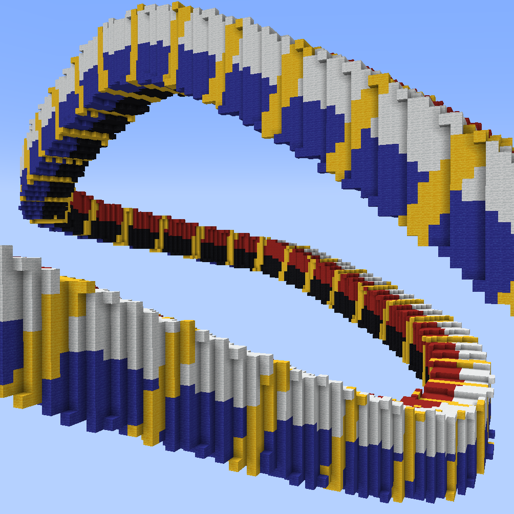
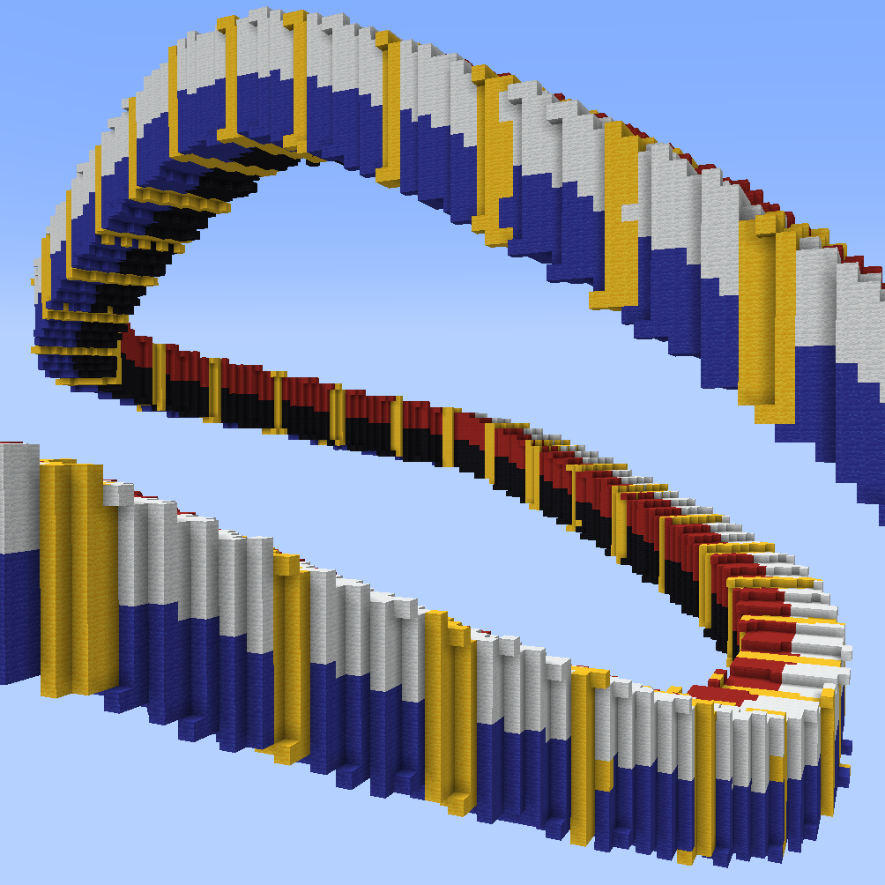
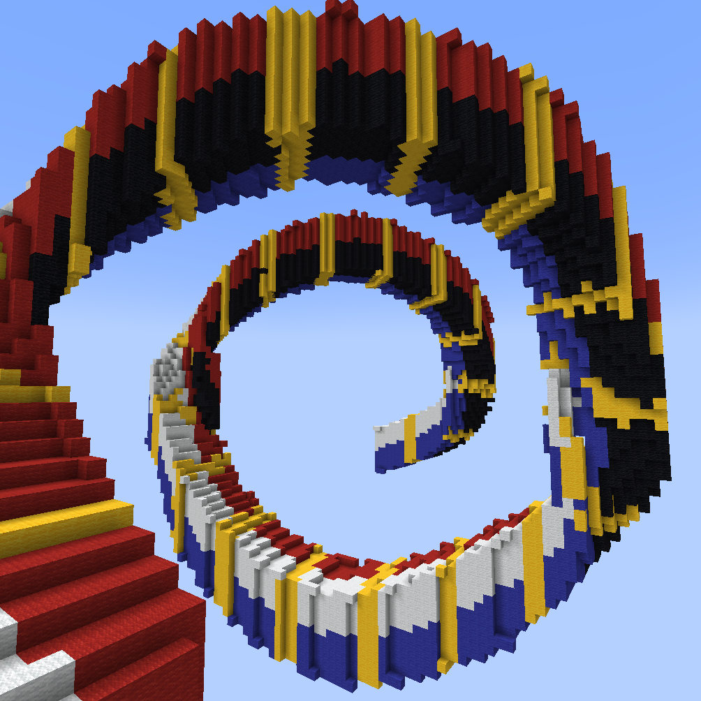

# Spline

All sub-commands are under `//ezspline` (`//ezsp`)\
e.g `//ezspline beads`

_Note that every spline can only be run with a Convex Selection type (\`//sel convex\`)._

## Common parameters

The following parameters and flags are common between all //ezspline subcommands.

***

### Radius progression: `<radii>`

Defines the thickness (course) of the spline.

**Acceptable values are:** one or more comma-separated entries, where each entry is either:

1. A **radius value** (e.g., `10`, `6.9`). Radius values must be greater than 0.
2. A **position and radius** separated by a colon, where the position is a decimal between 0 and 1 (e.g., `0:10`, `0.5:15.5`).

Whereby if specified, each _position_ must be strictly ascending, and the first and last entries must be positions of `0` and `1`. If positions are omitted, they will be set and interpolated automatically.

Example:

* `0:10, 0.3:20, 1:30`&#x20;
  * `0:10` - At the beginning of the spline (at 0% of its path), start with radius 10,
  * `0.3:20` - At 30% of the path, reach radius 20,
  * `1:30` - At the end of the path (100%) end with radius 30.
  * Equivalent to `10,0.3:20,30` since the first and last entries are automatically positions 0 and 1.

***

### Twist: `-t <angle>`

Defines how much to twist the shape along the spline. The input is an angle.

Specifics: The angle determines by how much the shape is rotated throughout the length of the current diameter of the spline. Meaning if the diameter is 30 blocks, then after 30 blocks of path length, the shape will be rotated by the given angle.

***

### Kochanek-Bartel-Parameters: `-p <kbParameters>`

Parameters for the flow of the spline. Determines what path the spline takes through the given node positions.

Provide `<tension>:<bias>:<continuity>`, colon-separated in that order (default is `0:0:0`). The expected value range for each parameter is `[-1..1]`.

[This diagram](https://en.wikipedia.org/wiki/Kochanek%E2%80%93Bartels_spline#/media/File:Kochanek_bartels_spline.svg) shows what each parameter does (Note: the order in the diagram (c,t,b) is different than what ezspline expects (t,b,c)).

***

### Quality: `-q <quality>`

Quality. Sets the number of samples of the shape-function per block. Must be greater than 0.

If you get air gaps, set the quality to a higher value.


The larger the value, the longer it will take. Large values in particular may take a very long while.

While `-q 2` might take a few _seconds_, `-q 10` will likely take _minutes_. Also, returns are diminishing.


Example

Example command: `//ezspline beads clay 10`` `**`-q <quality>`**

Gif start at `-q 1` and moves up to `-q 7`.

For this example, `-q 2` took less than a second, and `-q 7` already took 20 seconds.

***

### Spline Normal Mode: `-n <normalMode>`

There are three modes:

1. `CONSISTENT` aims to appear smooth and consistent by rolling itself in curves.
2. `HORIZONTAL` prevents the spline shape from "rolling sideways".
3. `UPRIGHT` makes the internal spline shape's y-axis with the world's y-axis.

Examples:

Example command: `//ezspline expression black,red,blue,white,yellow -o 5`` `**`-n <normalMode>`**` ``((z%2)>1.5?5:2*(x>0)+(y>0))+0.001`

`-n CONSISTENT`: The default value. The spline curves around the path in a smooth fashion. Towards the end, a noticeable amount of rolling has accumulated since (at the start white+red is the top surface, while towards the end white+blue is at the top -> the spline "rolled").

`-n HORIZONTAL`: The spline tries to align the originally upwards-facing surface to remain upwards, preventing itself from "rolling sideways". You can see that by the fact the white+red face is facing upwards throughout the entire spline.

`-n UPRIGHT`: The internal y-axis is always aligned with the world's y-axis instead of being perpendicular to the path. Notice how the yellow lines are perfectly straight now.

#### Another more dramatic example (same command, different path):

`-n CONSISTENT`

`-n HORIZONTAL`: Spline is forced to twist itself at steep/vertical sections to remain horizontal. (Here, it always tries to put the white+red surface at the top).

`-n UPRIGHT`: As you'd expect, when the spline's y-axis is perfectly vertical, then it does not like steep/vertical path sections...

***

## `//ezspline ...`

### `beads`

Bead spline

**`//ezsp beads <pattern>`** [**`<radii>`**](spline.md#radius-progression-less-than-radii-greater-than) [**`[-p <kb_parameters>]`**](spline.md#kochanek-bartel-parameters-p-less-than-kbparameters-greater-than) [**`[-q <quality>]`**](spline.md#quality-q-less-than-quality-greater-than) [**`[-n <normalMode>]`**](spline.md#spline-normal-mode-n-less-than-normalmode-greater-than) **`[-h]`**

Generates a beads-shaped spline along the selected positions.

* **`<Pattern>`**:
  * Specifies the block pattern.
* [**`<Radii>`**](spline.md#radius-progression-less-than-radii-greater-than):
  * The thickness of the spline, defined by comma-separated entries.
* [**`[-t <angle>]`**](spline.md#twist-t-less-than-angle-greater-than) (Default: 0):
  * Defines how much to twist the shape along the spline. Note: Since beads are symmetric there is no visible effect.
* [**`[-p <kbParameters>]`**](spline.md#kochanek-bartel-parameters-p-less-than-kbparameters-greater-than) (Default: "0:0:0"):
  * Sets the parameters for the flow of the spline, including tension, bias, and continuity, provided in a colon-separated format.
* [**`[-q <quality>]`**](spline.md#quality-q-less-than-quality-greater-than) (Default: 2.0):
  * Adjusts the quality of the spline generation. Increase this value to reduce air gaps, noting that higher values increase processing time.
* [**`[-n <normalMode>]`**](spline.md#spline-normal-mode-n-less-than-normalmode-greater-than) (Default: "CONSISTENT"):
  * Determines how the spline will orient itself.
* **`[-h]`**:
  * Shows the help page.

### `chainlink`

Chain Link Spline

**`//ezsp chainlink <pattern>`** [**`<radii>`**](spline.md#radius-progression-less-than-radii-greater-than) **`[inner] [offset] [stretch]`** [**`[-t <angle>]`**](spline.md#twist-t-less-than-angle-greater-than) [**`[-p <kb_parameters>]`**](spline.md#kochanek-bartel-parameters-p-less-than-kbparameters-greater-than) [**`[-q <quality>]`**](spline.md#quality-q-less-than-quality-greater-than) [**`[-n <normalMode>]`**](spline.md#spline-normal-mode-n-less-than-normalmode-greater-than) **`[-h]`**

Generates a chainlink-shaped spline along the selected positions.

* **`<Pattern>`**:
  * Specifies the block pattern.
* [**`<Radii>`**](spline.md#radius-progression-less-than-radii-greater-than):
  * The thickness of the spline, defined by comma-separated entries.
* **`[inner]`** (Default: 1.0):
  * The inner radius ratio of each link.
* **`[offset]`** (Default: 0.0):
  * Amount to offset each link by, adjusting the alignment of the links in the chain.
* **`[stretch]`** (Default: 1.0):
  * The amount to stretch the individual links along the chain.
* [**`[-t <angle>]`**](spline.md#twist-t-less-than-angle-greater-than) (Default: 0):
  * Defines how much to twist the shape along the spline.
* [**`[-p <kbParameters>]`**](spline.md#kochanek-bartel-parameters-p-less-than-kbparameters-greater-than) (Default: "0:0:0"):
  * Sets the parameters for the flow of the spline, including tension, bias, and continuity, provided in a colon-separated format.
* [**`[-q <quality>]`**](spline.md#quality-q-less-than-quality-greater-than) (Default: 2.0):
  * Adjusts the quality of the spline generation. Increase this value to reduce air gaps, noting that higher values increase processing time.
* [**`[-n <normalMode>]`**](spline.md#spline-normal-mode-n-less-than-normalmode-greater-than) (Default: "CONSISTENT"):
  * Determines how the spline will orient itself.
* **`[-h]`**:
  * Shows the help page.

### `cubes`

Cube Spline

**`//ezsp cubes <pattern>`** [**`<radii>`**](spline.md#radius-progression-less-than-radii-greater-than) **`[gap]`** [**`[-t <angle>]`**](spline.md#twist-t-less-than-angle-greater-than) [**`[-p <kb_parameters>]`**](spline.md#kochanek-bartel-parameters-p-less-than-kbparameters-greater-than) [**`[-q <quality>]`**](spline.md#quality-q-less-than-quality-greater-than) [**`[-n <normalMode>]`**](spline.md#spline-normal-mode-n-less-than-normalmode-greater-than) **`[-h]`**

Generates a chainlink-shaped spline along the selected positions.

* **`<Pattern>`**:
  * Specifies the block pattern.
* [**`<Radii>`**](spline.md#radius-progression-less-than-radii-greater-than):
  * The thickness of the spline, defined by comma-separated entries.
* **`[gap]`** (Default: 1.0):
  * Sets the gap between cubes
* [**`[-t <angle>]`**](spline.md#twist-t-less-than-angle-greater-than) (Default: 0):
  * Defines how much to twist the shape along the spline.
* [**`[-p <kbParameters>]`**](spline.md#kochanek-bartel-parameters-p-less-than-kbparameters-greater-than) (Default: "0:0:0"):
  * Sets the parameters for the flow of the spline, including tension, bias, and continuity, provided in a colon-separated format.
* [**`[-q <quality>]`**](spline.md#quality-q-less-than-quality-greater-than) (Default: 2.0):
  * Adjusts the quality of the spline generation. Increase this value to reduce air gaps, noting that higher values increase processing time.
* [**`[-n <normalMode>]`**](spline.md#spline-normal-mode-n-less-than-normalmode-greater-than) (Default: "CONSISTENT"):
  * Determines how the spline will orient itself.
* **`[-h]`**:
  * Shows the help page.

### `fishnet`

Fishnet Spline

**`//ezsp fishnet <pattern>`** [**`<radii>`**](spline.md#radius-progression-less-than-radii-greater-than) **`[inner] [offset] [stretch]`** [**`[-t <angle>]`**](spline.md#twist-t-less-than-angle-greater-than) [**`[-p <kb_parameters>]`**](spline.md#kochanek-bartel-parameters-p-less-than-kbparameters-greater-than) [**`[-q <quality>]`**](spline.md#quality-q-less-than-quality-greater-than) [**`[-n <normalMode>]`**](spline.md#spline-normal-mode-n-less-than-normalmode-greater-than) **`[-h]`**

Generates a fishnet-shaped spline along the selected positions.

* **`<Pattern>`**:
  * Specifies the block pattern.
* [**`<Radii>`**](spline.md#radius-progression-less-than-radii-greater-than):
  * The thickness of the spline, defined by comma-separated entries.
* **`[spacing]`** (Default: 10):
  * The distance between the strings of the net. Measured in blocks.
* **`[depth]`** (Default: 2):
  * The depth of each string within the net. How much it protrudes towards the center of the spline. Measured in blocks.
* **`[width]`** (Default: 2):
  * The width of each string. Measured in blocks.
* [**`[-t <angle>]`**](spline.md#twist-t-less-than-angle-greater-than) (Default: 0):
  * Defines how much to twist the shape along the spline.
* [**`[-p <kbParameters>]`**](spline.md#kochanek-bartel-parameters-p-less-than-kbparameters-greater-than) (Default: "0:0:0"):
  * Sets the parameters for the flow of the spline, including tension, bias, and continuity, provided in a colon-separated format.
* [**`[-q <quality>]`**](spline.md#quality-q-less-than-quality-greater-than) (Default: 2.0):
  * Adjusts the quality of the spline generation. Increase this value to reduce air gaps, noting that higher values increase processing time.
* [**`[-n <normalMode>]`**](spline.md#spline-normal-mode-n-less-than-normalmode-greater-than) (Default: "CONSISTENT"):
  * Determines how the spline will orient itself.
* **`[-h]`**:
  * Shows the help page.

### `oscillate`

Oscillation Spline

**`//ezsp oscillate <pattern> <radii> [depth] [interval] [-p <kb_parameters>] [-q <quality>] [-n <normalMode>] [-g] [-h]`**

Generates a spline with an oscillating thickness along the selected convex region.

* **Pattern**: Specifies the block pattern.
* **Radii**: The thickness of the spline, defined by up to three comma-separated values.\
  &#xNAN;_&#x41; radius of 10 will be 10 from the start to the end of the spline, 10,5,15 will start at 10, decreasing to 5 around the middle, and increasing to 15 at the end._
* **Depth** (Default: 2): Determines the ridge depth of the oscillation, affecting the amplitude of the waves.
* **Interval** (Default: 5): Sets the ridge interval, controlling the frequency of the oscillation along the spline.
* **-p** (Default: "0:0:0"): Sets the parameters for the flow of the spline, including tension, bias, and continuity, provided in a colon-separated format.
* **-q** (Default: 1.85): Adjusts the quality of the spline generation. Increase this value to reduce air gaps, noting that higher values increase processing time.
* **-n** (Default: "CONSISTENT"): Determines the mode for spline normal calculation.
* **-g**: When used, calculates the center radii using the geometric center for three radii.
* **-h**: Shows the help page.

### `polygon`

Polygonal Spline

**`//ezsp polygon <pattern> <radii> [sides] [spin] [-p <kb_parameters>] [-q <quality>] [-n <normalMode>] [-g] [-h]`**

Creates a regular polygon-shaped spline along the selected convex region.

* **Pattern**: Specifies the block pattern.
* **Radii**: The thickness of the spline, defined by up to three comma-separated values.\
  &#xNAN;_&#x41; radius of 10 will be 10 from the start to the end of the spline, 10,5,15 will start at 10, decreasing to 5 around the middle, and increasing to 15 at the end._
* **Sides** (Default: 6): Determines the number of sides to the polygon.
* **Spin** (Default: 0.0): Adds twist to the spline.
* **-p** (Default: "0:0:0"): Sets the parameters for the flow of the spline, including tension, bias, and continuity, provided in a colon-separated format.
* **-q** (Default: 1.85): Adjusts the quality of the spline generation. Increase this value to reduce air gaps, noting that higher values increase processing time.
* **-n** (Default: "CONSISTENT"): Determines the mode for spline normal calculation.
* **-g**: When used, calculates the center radii using the geometric center for three radii.
* **-h**: Shows the help page.

### `rings`

Rings Spline

**`//ezsp rings <pattern> <radii> [count] [thickness] [innerRadius] [-p <kb_parameters>] [-q <quality>] [-n <normalMode>] [-g] [-h]`**

Creates a spline of rings along the selected convex region.

* **Pattern**: Specifies the block pattern.
* **Radii**: The thickness of the spline, defined by up to three comma-separated values.\
  &#xNAN;_&#x41; radius of 10 will be 10 from the start to the end of the spline, 10,5,15 will start at 10, decreasing to 5 around the middle, and increasing to 15 at the end._
* **Count** (Default: 8): Determines the number of rings.
* **Thickness** (Default: 3.0): Determines the size of the rings in the direction of the spline.
* **Inner Radius** (Default: 0.7): A value between 0 and 1 which determines the size of the central hole in the ring.
* **-p** (Default: "0:0:0"): Sets the parameters for the flow of the spline, including tension, bias, and continuity, provided in a colon-separated format.
* ### `noise`
* **-q** (Default: 1.85): Adjusts the quality of the spline generation. Increase this value to reduce air gaps, noting that higher values increase processing time.
* **-n** (Default: "CONSISTENT"): Determines the mode for spline normal calculation.
* **-g**: When used, calculates the center radii using the geometric center for three radii.
* **-h**: Shows the help page.

### `rope`

Rope Spline

**`//ezsp rope <pattern> <radii> [ropeCount] [spin] [-p <kb_parameters>] [-q <quality>] [-n <normalMode>] [-g] [-h]`**

Creates a rope-shaped spline along the selected convex region.

* **Pattern**: Specifies the block pattern.
* **Radii**: The thickness of the spline, defined by up to three comma-separated values.\
  &#xNAN;_&#x41; radius of 10 will be 10 from the start to the end of the spline, 10,5,15 will start at 10, decreasing to 5 around the middle, and increasing to 15 at the end._
* **RopeCount** (Default: 3): Determines the number of intertwining ropes.
* **Spin** (Default: 2.0): Adds twist to the spline.
* **-p** (Default: "0:0:0"): Sets the parameters for the flow of the spline, including tension, bias, and continuity, provided in a colon-separated format.
* **-q** (Default: 1.85): Adjusts the quality of the spline generation. Increase this value to reduce air gaps, noting that higher values increase processing time.
* **-n** (Default: "CONSISTENT"): Determines the mode for spline normal calculation.
* **-g**: When used, calculates the center radii using the geometric center for three radii.
* **-h**: Shows the help page.

### `simple`

Simple Spline

**`//ezsp simple <pattern> <radii> [-p <kb_parameters>] [-q <quality>]`**\
&#xNAN;**`[-n <normalMode>] [-g] [-h]`**

Creates a simple cylindrical spline along the selected convex region.

* **Pattern**: Specifies the block pattern.
* **Radii**: The thickness of the spline, defined by up to three comma-separated values.\
  &#xNAN;_&#x41; radius of 10 will be 10 from the start to the end of the spline, 10,5,15 will start at 10, decreasing to 5 around the middle, and increasing to 15 at the end._
* **-p** (Default: "0:0:0"): Sets the parameters for the flow of the spline, including tension, bias, and continuity, provided in a colon-separated format.
* **-q** (Default: 1.85): Adjusts the quality of the spline generation. Increase this value to reduce air gaps, noting that higher values increase processing time.
* **-n** (Default: "CONSISTENT"): Determines the mode for spline normal calculation.
* **-g**: When used, calculates the center radii using the geometric center for three radii.
* **-h**: Shows the help page.

***

## Advanced splines

### `noise`

Noise Spline

**`//ezsp noise <pattern> <radii> [strength] [stretch] [spin] <noise> [-p <kb_parameters>] [-q <quality>] [-n <normalMode>] [-g] [-h]`**

Creates a noise-based spline along the selected convex region.

* **Pattern**: Specifies the block pattern.
* **Radii**: The thickness of the spline, defined by up to three comma-separated values.\
  &#xNAN;_&#x41; radius of 10 will be 10 from the start to the end of the spline, 10,5,15 will start at 10, decreasing to 5 around the middle, and increasing to 15 at the end._
* **Strength** (Default: 0.5): Determines the noise strength, affecting the intensity of the noise.
* **Stretch** (Default: 4.0): Controls the stretch factor of noise along the spline.
* **Spin** (Default: 0): Adds twist to the spline.
* **Noise** (Default: `Perlin(Freq:3)`): Specifies the type of noise to use for generation.
* **-p** (Default: "0:0:0"): Sets the parameters for the flow of the spline, including tension, bias, and continuity, provided in a colon-separated format.
* **-q** (Default: 1.85): Adjusts the quality of the spline generation. Increase this value to reduce air gaps, noting that higher values increase processing time.
* **-n** (Default: "CONSISTENT"): Determines the mode for spline normal calculation.
* **-g**: When used, calculates the center radii using the geometric center for three radii.
* **-h**: Shows the help page.

### `expression`

Expression Spline

**`//ezsp expression <palette>`** [**`<radii>`**](spline.md#radius-progression-less-than-radii-greater-than) [**`[-t <angle>]`**](spline.md#twist-t-less-than-angle-greater-than) [**`[-p <kb_parameters>]`**](spline.md#kochanek-bartel-parameters-p-less-than-kbparameters-greater-than) [**`[-q <quality>]`**](spline.md#quality-q-less-than-quality-greater-than) [**`[-n <normalMode>]`**](spline.md#spline-normal-mode-n-less-than-normalmode-greater-than) **`[-z] [-o] [-h]`**

Generates a spline shaped by the given WorldEdit expression along the selected positions.

* **`<Palette>`**:
  * Specifies the block palette.
* [**`<Radii>`**](spline.md#radius-progression-less-than-radii-greater-than):
  * The thickness of the spline, defined by comma-separated entries.
* [**`[-t <angle>]`**](spline.md#twist-t-less-than-angle-greater-than) (Default: 0):
  * Defines how much to twist the shape along the spline.
* [**`[-p <kbParameters>]`**](spline.md#kochanek-bartel-parameters-p-less-than-kbparameters-greater-than) (Default: "0:0:0"):
  * Sets the parameters for the flow of the spline, including tension, bias, and continuity, provided in a colon-separated format.
* [**`[-q <quality>]`**](spline.md#quality-q-less-than-quality-greater-than) (Default: 2.0):
  * Adjusts the quality of the spline generation. Increase this value to reduce air gaps, noting that higher values increase processing time.
* [**`[-n <normalMode>]`**](spline.md#spline-normal-mode-n-less-than-normalmode-greater-than) (Default: "CONSISTENT"):
  * Determines how the spline will orient itself.
* **`[-z]:`**
  * Without setting this flag, the domain of the z-axis is 0 to the length of the spline divided by the radius. You may set this flag to normalize the Z-Axis, that runs along the path of the spline, to the \[-1,1] domain.
* **`[-o]`**:
  * By default, expression output maps >0..1 to the palette. Use this flag to instead map the output to whole numbers.
* **`[-h]`**:
  * Shows the help page.

### `structure`

Structure Spline

**`//ezsp structure <structure> <radii> [-p <kb_parameters>] [-q <quality>]`**\
&#xNAN;**`[-n <normalMode>] [-g] [-h]`**

Embeds a structure along the path defined by the selected convex region.

* **Structure**: Specifies the structure to embed along the path.
* **Radii**: The thickness of the spline, defined by up to three comma-separated values.\
  &#xNAN;_&#x41; radius of 10 will be 10 from the start to the end of the spline, 10,5,15 will start at 10, decreasing to 5 around the middle, and increasing to 15 at the end._
* **-p** (Default: "0:0:0"): Sets the parameters for the flow of the spline, including tension, bias, and continuity, provided in a colon-separated format.
* **-q** (Default: 1.85): Adjusts the quality of the spline generation. Increase this value to reduce air gaps, noting that higher values increase processing time.
* **-n** (Default: "CONSISTENT"): Determines the mode for spline normal calculation.
* **-g**: When used, calculates the center radii using the geometric center for three radii.
* **-h**: Shows the help page.

The structure will be placed in its Z-direction facing along the path. If you use -g, then one instance of the structure will be stretched across the whole length of the path. Otherwise, multiple instances will be repeated one after another.

