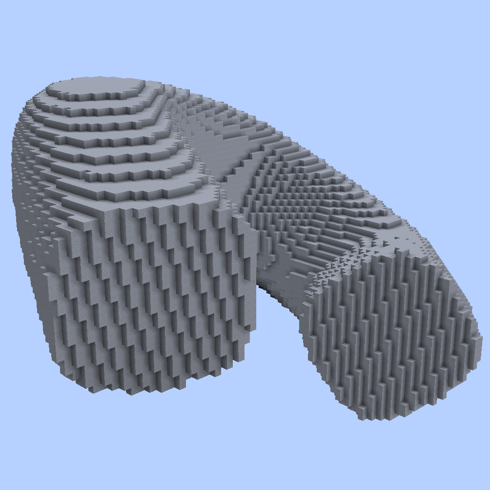

# 2D Spline Shapes

The following `//ezsp` subcommands feature splines from predefined 2D shapes swept along the spline path.

***

## Syntax

**`//ezspline 2d `**<mark style="color:orange;">**`<shape>`**</mark> <mark style="color:orange;">**`<pattern>`**</mark> [**`<radii>`**](common-parameters.md#radii) [**`[-t <angle>]`**](common-parameters.md#twist) [**`[-p <kbParameters>]`**](common-parameters.md#kb-parameters) [**`[-q <quality>]`**](common-parameters.md#quality) [**`[-n <normalMode>]`**](common-parameters.md#normal-mode) [**`[-h]`**](common-parameters.md#help-page)

* <mark style="color:orange;">**`<shape>`**</mark> : The 2D shape defines the cross-section of the spline. Choose one from the list below.
* <mark style="color:orange;">**`<pattern>`**</mark>: Specifies the block(s) the spline is made out of, e.g. `clay`.

_The remaining arguments are outlined on the_ [_Common Parameters_](common-parameters.md) _subpage._

***

## List of <mark style="color:orange;">`<shape>`</mark>s

<table data-view="cards"><thead><tr><th></th><th data-hidden data-card-cover data-type="files"></th><th data-hidden data-card-target data-type="content-ref"></th></tr></thead><tbody><tr><td><strong><code>Circle</code></strong> (<strong><code>Ci</code></strong>)</td><td><a href="../../.gitbook/assets/SplinesSimple.png">SplinesSimple.png</a></td><td><a href="2d-spline-shapes.md#circle-spline">#circle-spline</a></td></tr><tr><td><strong><code>Square</code></strong> (<strong><code>Sq</code></strong>)</td><td><a href="../../.gitbook/assets/Splines2DSquare.png">Splines2DSquare.png</a></td><td><a href="2d-spline-shapes.md#square-spline">#square-spline</a></td></tr><tr><td><strong><code>Diamond</code></strong> (<strong><code>Di</code></strong>)</td><td><a href="../../.gitbook/assets/Splines2DDiamond.png">Splines2DDiamond.png</a></td><td><a href="2d-spline-shapes.md#diamond-spline">#diamond-spline</a></td></tr><tr><td><strong><code>RoundedSquare</code></strong> (<strong><code>RS</code></strong>)</td><td><a href="../../.gitbook/assets/Splines2DRoundedSquare.png">Splines2DRoundedSquare.png</a></td><td><a href="2d-spline-shapes.md#roundedsquare-spline">#roundedsquare-spline</a></td></tr><tr><td><strong><code>SuperCircle</code></strong> (<strong><code>SC</code></strong>)</td><td><a href="../../.gitbook/assets/SplinesSuperCircle.gif">SplinesSuperCircle.gif</a></td><td><a href="2d-spline-shapes.md#supercircle-spline">#supercircle-spline</a></td></tr><tr><td><strong><code>CirclesCircle</code></strong> (<strong><code>CC</code></strong>)</td><td><a href="../../.gitbook/assets/SplinesCirclesCircle.gif">SplinesCirclesCircle.gif</a></td><td><a href="2d-spline-shapes.md#circlescircle-spline">#circlescircle-spline</a></td></tr><tr><td><strong><code>Polygon</code></strong> (<strong><code>Po</code></strong>)</td><td><a href="../../.gitbook/assets/SplinesPolygon.gif">SplinesPolygon.gif</a></td><td><a href="2d-spline-shapes.md#polygon-spline">#polygon-spline</a></td></tr><tr><td><strong><code>Rectangle</code></strong> (<strong><code>Re</code></strong>)</td><td><a href="../../.gitbook/assets/SplinesRectangle.gif">SplinesRectangle.gif</a></td><td><a href="2d-spline-shapes.md#rectangle-spline">#rectangle-spline</a></td></tr><tr><td>Star (<strong><code>St</code></strong>)</td><td><a href="../../.gitbook/assets/SplinesStar.gif">SplinesStar.gif</a></td><td><a href="2d-spline-shapes.md#star-spline">#star-spline</a></td></tr><tr><td><strong><code>Flower</code></strong> (<strong><code>Fl</code></strong>)</td><td><a href="../../.gitbook/assets/SplinesFlower.gif">SplinesFlower.gif</a></td><td><a href="2d-spline-shapes.md#flower-spline">#flower-spline</a></td></tr></tbody></table>

***

#### 

### `//ezspline 2d `<mark style="color:orange;">`Circle (Ci)`</mark>`(`<mark style="color:blue;">`//ezspline basic`</mark>`)` 

<mark style="color:blue;">Circle Spline</mark>

**`//ezsp 2d Circle`** [**`<pattern>`**](2d-spline-shapes.md#syntax) [**`<radii>`**](common-parameters.md#radii) [**`[-t <angle>]`**](common-parameters.md#twist) [**`[-p <kbParameters>]`**](common-parameters.md#kb-parameters) [**`[-q <quality>]`**](common-parameters.md#quality) [**`[-n <normalMode>]`**](common-parameters.md#normal-mode) [**`[-h]`**](common-parameters.md#help-page)

Generates a simple cylindrical spline along the spline path.

* _Cylinder shape has no parameters._

`//ezsp basic` is an alias of `//ezsp 2d Circle`.

***

#### 

### `//ezspline 2d `<mark style="color:orange;">`Square (Sq)`</mark> 

<mark style="color:blue;">Square Spline</mark>

**`//ezsp 2d Square`** [**`<pattern>`**](2d-spline-shapes.md#syntax) [**`<radii>`**](common-parameters.md#radii) [**`[-t <angle>]`**](common-parameters.md#twist) [**`[-p <kbParameters>]`**](common-parameters.md#kb-parameters) [**`[-q <quality>]`**](common-parameters.md#quality) [**`[-n <normalMode>]`**](common-parameters.md#normal-mode) [**`[-h]`**](common-parameters.md#help-page)

Generates a simple square-shaped spline along the spline path.

* _Square shape has no parameters._

***

#### 

### `//ezspline 2d `<mark style="color:orange;">`Diamond (Di)`</mark> 

<mark style="color:blue;">Diamond Spline</mark>

**`//ezsp 2d Diamond`** [**`<pattern>`**](2d-spline-shapes.md#syntax) [**`<radii>`**](common-parameters.md#radii) [**`[-t <angle>]`**](common-parameters.md#twist) [**`[-p <kbParameters>]`**](common-parameters.md#kb-parameters) [**`[-q <quality>]`**](common-parameters.md#quality) [**`[-n <normalMode>]`**](common-parameters.md#normal-mode) [**`[-h]`**](common-parameters.md#help-page)

Generates a simple diamond-shaped spline along the spline path.

* _Diamond shape has no parameters._

***

#### 

### `//ezspline 2d `<mark style="color:orange;">`RoundedSquare (RS)`</mark> 

<mark style="color:blue;">RoundedSquare Spline</mark>

**`//ezsp 2d RoundedSquare`** [**`<pattern>`**](2d-spline-shapes.md#syntax) [**`<radii>`**](common-parameters.md#radii) [**`[-t <angle>]`**](common-parameters.md#twist) [**`[-p <kbParameters>]`**](common-parameters.md#kb-parameters) [**`[-q <quality>]`**](common-parameters.md#quality) [**`[-n <normalMode>]`**](common-parameters.md#normal-mode) [**`[-h]`**](common-parameters.md#help-page)

Generates a simple rounded square-shaped spline along the spline path.

* _RoundedSquare shape has no parameters._

***

#### 

### `//ezspline 2d `<mark style="color:orange;">`SuperCircle (SC)`</mark> 

<mark style="color:blue;">SuperCircle Spline</mark>

**`//ezsp 2d SuperCircle([`**<mark style="color:orange;">**`Exponent:<value>`**</mark>**`])`** [**`<pattern>`**](2d-spline-shapes.md#syntax) [**`<radii>`**](common-parameters.md#radii) [**`[-t <angle>]`**](common-parameters.md#twist) [**`[-p <kbParameters>]`**](common-parameters.md#kb-parameters) [**`[-q <quality>]`**](common-parameters.md#quality) [**`[-n <normalMode>]`**](common-parameters.md#normal-mode) [**`[-h]`**](common-parameters.md#help-page)

Generates a spline with the given super-circle shape as the cross-section along the spline path.

* **`[`**<mark style="color:orange;">**`Exponent:<value>`**</mark>**`]`** (<mark style="color:orange;">**`E`**</mark>) (Default: 2.0)
  * Determines the shape.
    * below 1 are stars, 1 is a diamond, 2 is a circle, and above 2 approaches a square shape
  * See [https://www.desmos.com/calculator/vewqf5sc0x](https://www.desmos.com/calculator/vewqf5sc0x)

Example:

`//ezsp 2d SuperCircle(`<mark style="color:orange;">`Exponent:`</mark><mark style="color:orange;">**`0.5`**</mark>`) clay 15`

This GIF goes through running the above command with the following set of exponent values `0.5, 1.0, 2.0, 3.0, 99.0`:

***

#### 

### `//ezspline 2d `<mark style="color:orange;">`CirclesCircle (CC)`</mark> (<mark style="color:blue;">`//ezspline rope`</mark>`)` 

<mark style="color:blue;">CirclesCircle Spline</mark>

**`//ezsp 2d CirclesCircle([`**<mark style="color:orange;">**`Count:<value>`**</mark>**`],[`**<mark style="color:orange;">**`Filled:<boolean>`**</mark>**`])`** [**`<pattern>`**](2d-spline-shapes.md#syntax) [**`<radii>`**](common-parameters.md#radii) [**`[-t <angle>]`**](common-parameters.md#twist) [**`[-p <kbParameters>]`**](common-parameters.md#kb-parameters) [**`[-q <quality>]`**](common-parameters.md#quality) [**`[-n <normalMode>]`**](common-parameters.md#normal-mode) [**`[-h]`**](common-parameters.md#help-page)

Generates multiple cylinder splines next to each other along the spline path.

* **`[`**<mark style="color:orange;">**`Count:<value>`**</mark>**`]`** (<mark style="color:orange;">**`C`**</mark>) (Default: 3)
  * Determines how many circles there are in the circle of circles. Must be between 1 and 12.
* **`[`**<mark style="color:orange;">**`Filled:<boolean>`**</mark>**`]`** (<mark style="color:orange;">**`F`**</mark>) (Default: false)
  * Determines whether the inside should be filled or not.

See [https://www.desmos.com/calculator/ht9tak6nri](https://www.desmos.com/calculator/ht9tak6nri)

Example:

`//ezsp 2d CC(`<mark style="color:orange;">`Count:`</mark><mark style="color:orange;">**`1`**</mark>`) clay 15`

The following GIF has been generated by just running the above command, and incrementing the <mark style="color:orange;">Count</mark> parameter each time, from **1** up to **10** in this case:

`//ezspline 2d CirclesCircle `<mark style="color:orange;">**`-t 90`**</mark>` clay 10`

The following spline can be generated using the above command, which is simply applying the [twist parameter](common-parameters.md#twist):

Or by using `//ezspline rope clay 10`

<mark style="color:blue;">`//ezspline rope`</mark> is an alias for <mark style="color:orange;">`//ezspline 2d CirclesCircle`</mark><mark style="color:orange;">` `</mark><mark style="color:orange;">**`-t 90`**</mark>

***

#### 

### `//ezspline 2d `<mark style="color:orange;">`Polygon (Po)`</mark> 

<mark style="color:blue;">Polygon Spline</mark>

**`//ezsp 2d Polygon([`**<mark style="color:orange;">**`Sides:<value>`**</mark>**`])`** [**`<pattern>`**](2d-spline-shapes.md#syntax) [**`<radii>`**](common-parameters.md#radii) [**`[-t <angle>]`**](common-parameters.md#twist) [**`[-p <kbParameters>]`**](common-parameters.md#kb-parameters) [**`[-q <quality>]`**](common-parameters.md#quality) [**`[-n <normalMode>]`**](common-parameters.md#normal-mode) [**`[-h]`**](common-parameters.md#help-page)

Generates a polygon-shaped spline along the spline path.

* **`[`**<mark style="color:orange;">**`Sides:<value>`**</mark>**`]`** (<mark style="color:orange;">**`S`**</mark>) (Default: 5):
  * The number of sides of the polygon. 3 means triangle, 4 means square, 5 means pentagon, etc. Must be at least 3.
  * See [https://www.desmos.com/calculator/eemibllcg8](https://www.desmos.com/calculator/eemibllcg8)

Example:

`//ezsp 2d Polygon(`<mark style="color:orange;">`Sides:`</mark><mark style="color:orange;">**`3`**</mark>`) clay 15`

The GIF has been generated by running the above command, and incrementing the count parameter each time, from 3 up to 8 in this case:

***

#### 

### `//ezspline 2d `<mark style="color:orange;">`Rectangle (Re)`</mark> 

<mark style="color:blue;">Rectangle Spline</mark>

**`//ezsp 2d Rectangle([`**<mark style="color:orange;">**`X1:<value>`**</mark>**`],[`**<mark style="color:orange;">**`Y1:<value>`**</mark>**`],[`**<mark style="color:orange;">**`X2:<value>`**</mark>**`],[`**<mark style="color:orange;">**`Y2:<value>`**</mark>**`])`** [**`<pattern>`**](2d-spline-shapes.md#syntax) [**`<radii>`**](common-parameters.md#radii) [**`[-t <angle>]`**](common-parameters.md#twist) [**`[-p <kbParameters>]`**](common-parameters.md#kb-parameters) [**`[-q <quality>]`**](common-parameters.md#quality) [**`[-n <normalMode>]`**](common-parameters.md#normal-mode) [**`[-h]`**](common-parameters.md#help-page)

Generates a rectangle-shaped spline along the spline path.

* **`[`**<mark style="color:orange;">**`X1:<value>`**</mark>**`]`** (Default: -1.0):
  * Defines the x-position of the first corner of the rectangle. Between -1 and 1.
* **`[`**<mark style="color:orange;">**`Y1:<value>`**</mark>**`]`** (Default: -1.0):
  * Defines the y-position of the first corner of the rectangle. Between -1 and 1.
* **`[`**<mark style="color:orange;">**`X2:<value>`**</mark>**`]`** (Default: 1.0):
  * Defines the x-position of the second corner of the rectangle. Between -1 and 1.
* **`[`**<mark style="color:orange;">**`Y2:<value>`**</mark>**`]`** (Default: 1.0):
  * Defines the y-position of the second corner of the rectangle. Between -1 and 1.

(<mark style="color:red;">**`!`**</mark>) We provide a neat little interactive plot, in which you can position your rectangle and see what values match up to it and vice-versa: [https://www.desmos.com/calculator/jqyaujpdsk](https://www.desmos.com/calculator/jqyaujpdsk)

Example:

* The "Hi" from above has been generated by running the following set of commands:
  * `//ezsp 2d `<mark style="color:orange;">`Re(x1:`</mark><mark style="color:orange;">**`-1.0`**</mark><mark style="color:orange;">`,y1:`</mark><mark style="color:orange;">**`-1.0`**</mark><mark style="color:orange;">`,x2:`</mark><mark style="color:orange;">**`-0.6`**</mark><mark style="color:orange;">`,y2:`</mark><mark style="color:orange;">**`1.0`**</mark><mark style="color:orange;">`)`</mark>` clay 12`
    * (The left column from the H)
  * `//ezsp 2d `<mark style="color:orange;">`Re(x1:`</mark><mark style="color:orange;">**`-0.2`**</mark><mark style="color:orange;">`,y1:`</mark><mark style="color:orange;">**`-1.0`**</mark><mark style="color:orange;">`,x2:`</mark><mark style="color:orange;">**`0.2`**</mark><mark style="color:orange;">`,y2:`</mark><mark style="color:orange;">**`1.0`**</mark><mark style="color:orange;">`)`</mark>` clay 12`
    * (The left column from the H)
  * `//ezsp 2d `<mark style="color:orange;">`Re(x1:`</mark><mark style="color:orange;">**`-1.0`**</mark><mark style="color:orange;">`,y1:`</mark><mark style="color:orange;">**`-0.2`**</mark><mark style="color:orange;">`,x2:`</mark><mark style="color:orange;">**`0.2`**</mark><mark style="color:orange;">`,y2:`</mark><mark style="color:orange;">**`0.2`**</mark><mark style="color:orange;">`)`</mark>` clay 12`
    * (The horizontal line from the H)
  * `//ezsp 2d `<mark style="color:orange;">`Re(x1:`</mark><mark style="color:orange;">**`0.6`**</mark><mark style="color:orange;">`,y1:`</mark><mark style="color:orange;">**`-1.0`**</mark><mark style="color:orange;">`,x2:`</mark><mark style="color:orange;">**`1.0`**</mark><mark style="color:orange;">`,y2:`</mark><mark style="color:orange;">**`0.2`**</mark><mark style="color:orange;">`)`</mark>` clay 12`
    * (The column of the i)
  * `//ezsp 2d `<mark style="color:orange;">`Re(x1:`</mark><mark style="color:orange;">**`0.6`**</mark><mark style="color:orange;">`,y1:`</mark><mark style="color:orange;">**`0.6`**</mark><mark style="color:orange;">`,x2:`</mark><mark style="color:orange;">**`1.0`**</mark><mark style="color:orange;">`,y2:`</mark><mark style="color:orange;">**`1.0`**</mark><mark style="color:orange;">`)`</mark>` clay 12`
    * (The dot of the i)

***

#### 

### `//ezspline 2d `<mark style="color:orange;">`Star (St)`</mark> 

<mark style="color:blue;">Star Spline</mark>

**`//ezsp 2d Star([`**<mark style="color:orange;">**`Sides:<value>`**</mark>**`],[`**<mark style="color:orange;">**`Depth:<value>`**</mark>**`])`** [**`<pattern>`**](2d-spline-shapes.md#syntax) [**`<radii>`**](common-parameters.md#radii) [**`[-t <angle>]`**](common-parameters.md#twist) [**`[-p <kbParameters>]`**](common-parameters.md#kb-parameters) [**`[-q <quality>]`**](common-parameters.md#quality) [**`[-n <normalMode>]`**](common-parameters.md#normal-mode) [**`[-h]`**](common-parameters.md#help-page)

Generates a star-shaped spline along the spline path.

* **`[`**<mark style="color:orange;">**`Sides:<value>`**</mark>**`]`** (<mark style="color:orange;">**`S`**</mark>) (Default: 5):
  * The number of sides of the polygon. 3 means triangle, 4 means square, 5 means pentagon, etc. Must be at least 3.
* **`[`**<mark style="color:orange;">**`Depth:<value>`**</mark>**`]`** (<mark style="color:orange;">**`D`**</mark>) (Default: 0.5):
  * Sets how deep the folds of the star cut towards the center. Between 0 and 1.
  * 0 imitates polygons,
  * Values close to 1 lead to extremely thin spikes.
* (<mark style="color:red;">**`!`**</mark>) See [https://www.desmos.com/calculator/gqclaezcxc](https://www.desmos.com/calculator/gqclaezcxc)

***

#### 

### `//ezspline 2d `<mark style="color:orange;">`Flower (Fl)`</mark> 

<mark style="color:blue;">Flower Spline</mark>

**`//ezsp 2d Flower([`**<mark style="color:orange;">**`Count:<value>`**</mark>**`],[`**<mark style="color:orange;">**`Depth:<value>`**</mark>**`])`** [**`<pattern>`**](2d-spline-shapes.md#syntax) [**`<radii>`**](common-parameters.md#radii) [**`[-t <angle>]`**](common-parameters.md#twist) [**`[-p <kbParameters>]`**](common-parameters.md#kb-parameters) [**`[-q <quality>]`**](common-parameters.md#quality) [**`[-n <normalMode>]`**](common-parameters.md#normal-mode) [**`[-h]`**](common-parameters.md#help-page)

Generates a flower-shaped spline along the spline path.

* **`[`**<mark style="color:orange;">**`Count:<value>`**</mark>**`]`** (<mark style="color:orange;">**`S`**</mark>) (Default: 5):
  * The number of petals of the flower.
* **`[`**<mark style="color:orange;">**`Depth:<value>`**</mark>**`]`** (<mark style="color:orange;">**`D`**</mark>) (Default: 0.5):
  * Sets how deep the folds in between two petals of the flower cut towards the center. Between 0 and 1.
* (<mark style="color:red;">**`!`**</mark>) See [https://www.desmos.com/calculator/tah7yjltyr](https://www.desmos.com/calculator/tah7yjltyr)

***
