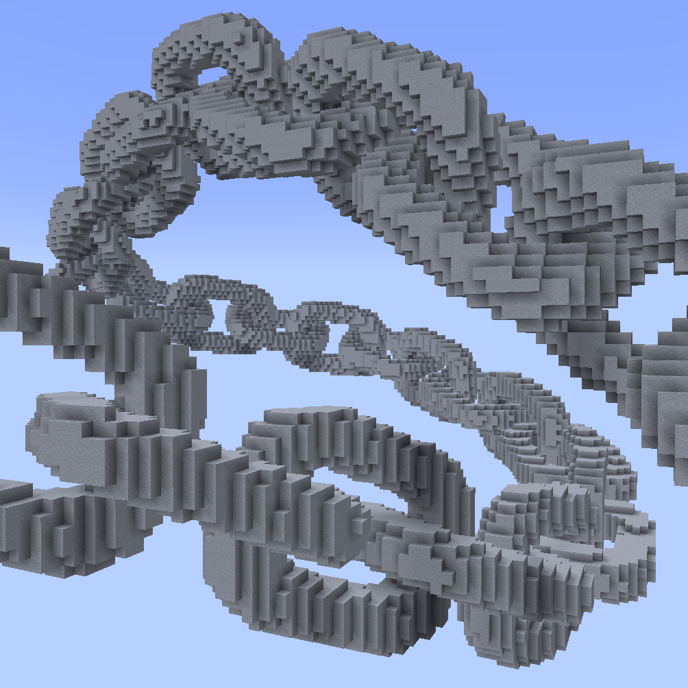
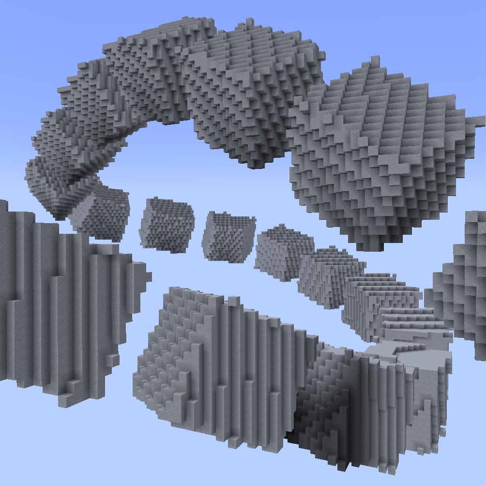
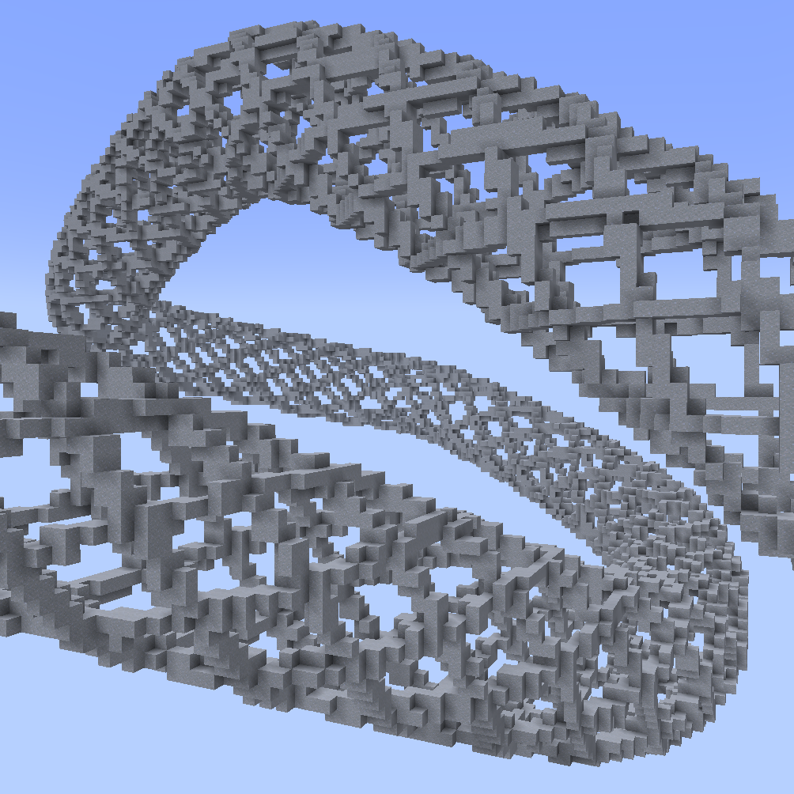

# 3D Spline Shapes

The following //ezsp subcommands feature 3D spline shapes embedded along the spline path.

***

#### 

### `//ezspline`` `<mark style="color:orange;">`beads`</mark>

<mark style="color:blue;">Bead spline</mark>

**`//ezsp beads <pattern>`** [**`<radii>`**](common-parameters.md#radius-progression-less-than-radii-greater-than) [**`[-t <angle>]`**](common-parameters.md#twist-t-less-than-angle-greater-than) [**`[-p <kbParameters>]`**](common-parameters.md#kochanek-bartel-parameters-p-less-than-kbparameters-greater-than) [**`[-q <quality>]`**](common-parameters.md#quality-q-less-than-quality-greater-than) [**`[-n <normalMode>]`**](common-parameters.md#spline-normal-mode-n-less-than-normalmode-greater-than) [**`[-h]`**](common-parameters.md#ingame-help-page-h)

Generates a beads-shaped spline along the selected positions.

* **`<Pattern>`**:
  * Specifies the block(s) the spline is made out of.

The remaining arguments are outlined on the [Common Parameters](common-parameters.md) subpage.

***

#### 

### `//ezspline`` `<mark style="color:orange;">`chainlink`</mark>

<mark style="color:blue;">Chain Link Spline</mark>

**`//ezsp chainlink <pattern>`** [**`<radii>`**](common-parameters.md#radius-progression-less-than-radii-greater-than) **`[extrusion] [inner] [offset] [major]`** **`[minor] [stretch]`** [**`[-t <angle>]`**](common-parameters.md#twist-t-less-than-angle-greater-than) [**`[-p <kbParameters>]`**](common-parameters.md#kochanek-bartel-parameters-p-less-than-kbparameters-greater-than) [**`[-q <quality>]`**](common-parameters.md#quality-q-less-than-quality-greater-than) [**`[-n <normalMode>]`**](common-parameters.md#spline-normal-mode-n-less-than-normalmode-greater-than) [**`[-h]`**](common-parameters.md#ingame-help-page-h)

Generates a chainlink-shaped spline along the selected positions.

* **`<Pattern>`**:
  * Specifies the block(s) the spline is made out of.
* **`[extrusion]`** (Default: 0.2):
  * The amount to length to add for each individual link along the chain.
* **`[inner]`** (Default: 1.0):
  * The inner radius ratio of each link.
* **`[offset]`** (Default: 0.0):
  * Amount to offset each link by, adjusting the overlap of the links in the chain.
* **`[major]`** (Default: 3.0):
  * The exponent defining the outer shape of an individual chain link.
* **`[minor]`** (Default: 3.0):
  * The exponent defining the shape of the cross-section of an individual chain link.
* **`[stretch]`** (Default: 1.0):
  * The stretch factor for the entire spline along the path.

We provide an interactive 3D plot to play around with all chain-link parameters: [<mark style="background-color:purple;">https://www.desmos.com/3d/jn07vcnfec</mark>](https://www.desmos.com/3d/jn07vcnfec)

The remaining arguments are outlined on the [Common Parameters](common-parameters.md) subpage.

***

#### 

### `//ezspline`` `<mark style="color:orange;">`cubes`</mark>

<mark style="color:blue;">Cubes Spline</mark>

**`//ezsp cubes <pattern>`** [**`<radii>`**](common-parameters.md#radius-progression-less-than-radii-greater-than) **`[gap]`** [**`[-t <angle>]`**](common-parameters.md#twist-t-less-than-angle-greater-than) [**`[-p <kbParameters>]`**](common-parameters.md#kochanek-bartel-parameters-p-less-than-kbparameters-greater-than) [**`[-q <quality>]`**](common-parameters.md#quality-q-less-than-quality-greater-than) [**`[-n <normalMode>]`**](common-parameters.md#spline-normal-mode-n-less-than-normalmode-greater-than) [**`[-h]`**](common-parameters.md#ingame-help-page-h)

Generates a chainlink-shaped spline along the selected positions.

* **`<Pattern>`**:
  * Specifies the block(s) the spline is made out of.
* **`[gap]`** (Default: 1.0):
  * Sets the gap between cubes

The remaining arguments are outlined on the [Common Parameters](common-parameters.md) subpage.

***

#### 

### `//ezspline`` `<mark style="color:orange;">`fishnet`</mark>

<mark style="color:blue;">Fishnet Spline</mark>

**`//ezsp fishnet <pattern>`** [**`<radii>`**](common-parameters.md#radius-progression-less-than-radii-greater-than) **`[spacing] [depth] [width]`** [**`[-t <angle>]`**](common-parameters.md#twist-t-less-than-angle-greater-than) [**`[-p <kbParameters>]`**](common-parameters.md#kochanek-bartel-parameters-p-less-than-kbparameters-greater-than) [**`[-q <quality>]`**](common-parameters.md#quality-q-less-than-quality-greater-than) [**`[-n <normalMode>]`**](common-parameters.md#spline-normal-mode-n-less-than-normalmode-greater-than) [**`[-h]`**](common-parameters.md#ingame-help-page-h)

Generates a fishnet-shaped spline along the selected positions.

* **`<Pattern>`**:
  * Specifies the block(s) the spline is made out of.
* **`[spacing]`** (Default: 10):
  * The distance between the strings of the net. Measured in blocks.
* **`[depth]`** (Default: 2):
  * The depth of each string within the net. How much it protrudes towards the center of the spline. Measured in blocks.
* **`[width]`** (Default: 2):
  * The width of each string. Measured in blocks.

The remaining arguments are outlined on the [Common Parameters](common-parameters.md) subpage.

***

#### 

### `//ezspline`` `<mark style="color:orange;">`oscillate`</mark>

<mark style="color:blue;">Oscillation Spline</mark>

**`//ezsp oscillate <pattern>`** [**`<radii>`**](common-parameters.md#radius-progression-less-than-radii-greater-than) **`[depth] [interval]`** [**`[-t <angle>]`**](common-parameters.md#twist-t-less-than-angle-greater-than) [**`[-p <kbParameters>]`**](common-parameters.md#kochanek-bartel-parameters-p-less-than-kbparameters-greater-than) [**`[-q <quality>]`**](common-parameters.md#quality-q-less-than-quality-greater-than) [**`[-n <normalMode>]`**](common-parameters.md#spline-normal-mode-n-less-than-normalmode-greater-than) [**`[-h]`**](common-parameters.md#ingame-help-page-h)

Generates a spline with an oscillating thickness along the selected positions.

* **`<Pattern>`**:
  * Specifies the block(s) the spline is made out of.
* **`[depth]`** (Default: 2):
  * Specifies how many blocks deep the ridges cut into the surface of the spline, measured in blocks.
* **`[interval]`** (Default: 5):
  * Specifies the distance between each ridge, measured in blocks.

The remaining arguments are outlined on the [Common Parameters](common-parameters.md) subpage.

***

####

### `//ezspline`` `<mark style="color:orange;">`rings`</mark>

<mark style="color:blue;">Rings Spline</mark>

**`//ezsp rings <pattern>`** [**`<radii>`**](common-parameters.md#radius-progression-less-than-radii-greater-than) **`[count] [thickness] [innerRadius]`** [**`[-t <angle>]`**](common-parameters.md#twist-t-less-than-angle-greater-than) [**`[-p <kbParameters>]`**](common-parameters.md#kochanek-bartel-parameters-p-less-than-kbparameters-greater-than) [**`[-q <quality>]`**](common-parameters.md#quality-q-less-than-quality-greater-than) [**`[-n <normalMode>]`**](common-parameters.md#spline-normal-mode-n-less-than-normalmode-greater-than) [**`[-h]`**](common-parameters.md#ingame-help-page-h)

Generates a spline of rings along the selected positions.

* **`<Pattern>`**:
  * Specifies the block(s) the spline is made out of.
* **`[count]`** (Default: 8):
  * Determines the number of rings.
* **`[thickness]`** (Default: 3.0):
  * Determines the width of each ring in the direction of the spline path, measured in blocks.
* **`[innerRadius]`** (Default: 0.7):
  * A value between 0 and 1, determining the size of the central hole in the ring.

The remaining arguments are outlined on the [Common Parameters](common-parameters.md) subpage.

***
