# 3D Spline Shapes

This page covers the `//ezspline 3d` subcommand which feature 3D spline shapes embedded along the spline path.

***

## Syntax

**`//ezspline 3d`` `**<mark style="color:orange;">**`<shape>`**</mark> <mark style="color:orange;">**`<pattern>`**</mark> [**`<radii>`**](common-parameters.md#radius-progression-less-than-radii-greater-than) [**`[-s <stretch>]`**](common-parameters.md#stretch-s-less-than-stretchfactor-greater-than) [**`[-t <angle>]`**](common-parameters.md#twist-t-less-than-angle-greater-than) [**`[-p <kbParameters>]`**](common-parameters.md#kochanek-bartel-parameters-p-less-than-kbparameters-greater-than) [**`[-q <quality>]`**](common-parameters.md#quality-q-less-than-quality-greater-than) [**`[-n <normalMode>]`**](common-parameters.md#spline-normal-mode-n-less-than-normalmode-greater-than) [**`[-h]`**](common-parameters.md#ingame-help-page-h)

* <mark style="color:orange;">**`<shape>`**</mark> : Choose one from the list below.
* <mark style="color:orange;">**`<pattern>`**</mark>: Specifies the block(s) the spline is made out of, e.g. `clay`.

_The remaining arguments are outlined on the_ [_Common Parameters_](common-parameters.md) _subpage._

***

## List of <mark style="color:orange;">**`<shape>`**</mark>s

***

#### 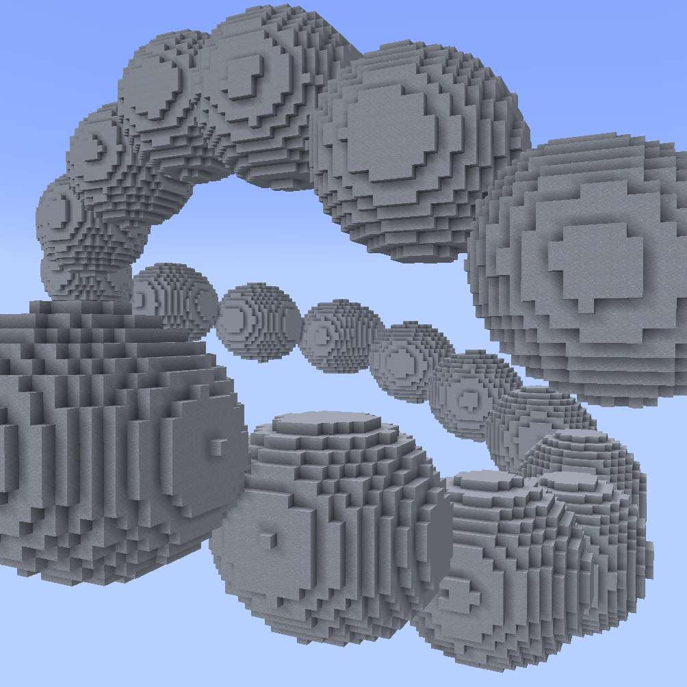

### `//ezspline 3d`` `<mark style="color:orange;">`Beads (Be)`</mark>

<mark style="color:blue;">Bead spline</mark>

**`//ezsp 3d Beads`** [**`<pattern>`**](3d-spline-shapes.md#syntax) [**`<radii>`**](common-parameters.md#radius-progression-less-than-radii-greater-than) [**`[-s <stretch>]`**](common-parameters.md#stretch-s-less-than-stretchfactor-greater-than) [**`[-t <angle>]`**](common-parameters.md#twist-t-less-than-angle-greater-than) [**`[-p <kbParameters>]`**](common-parameters.md#kochanek-bartel-parameters-p-less-than-kbparameters-greater-than) [**`[-q <quality>]`**](common-parameters.md#quality-q-less-than-quality-greater-than) [**`[-n <normalMode>]`**](common-parameters.md#spline-normal-mode-n-less-than-normalmode-greater-than) [**`[-h]`**](common-parameters.md#ingame-help-page-h)

Generates a beads-shaped spline along the selected positions.

* _Beads shape has no parameters._

Example:

`//ezsp 3d`` `<mark style="color:orange;">`Beads`</mark>` ``clay 10`

_This shape can also be achieved with the_ [_Rings_](3d-spline-shapes.md#ezspline-3d-rings) _shape using the following set of parameters: `Rings(E:0,T:1,G:0,M:2,N:2)`_

***

#### 

### `//ezspline 3d`` `<mark style="color:orange;">`Cubes (Cu)`</mark>

<mark style="color:blue;">Cubes Spline</mark>

**`//ezsp 3d Cubes([`**<mark style="color:orange;">**`Gap:<value>`**</mark>**`])`** [**`<pattern>`**](3d-spline-shapes.md#syntax) [**`<radii>`**](common-parameters.md#radius-progression-less-than-radii-greater-than) [**`[-s <stretch>]`**](common-parameters.md#stretch-s-less-than-stretchfactor-greater-than) [**`[-t <angle>]`**](common-parameters.md#twist-t-less-than-angle-greater-than) [**`[-p <kbParameters>]`**](common-parameters.md#kochanek-bartel-parameters-p-less-than-kbparameters-greater-than) [**`[-q <quality>]`**](common-parameters.md#quality-q-less-than-quality-greater-than) [**`[-n <normalMode>]`**](common-parameters.md#spline-normal-mode-n-less-than-normalmode-greater-than) [**`[-h]`**](common-parameters.md#ingame-help-page-h)

Generates a chainlink-shaped spline along the selected positions.

* **`[`**<mark style="color:orange;">**`Gap:<value>`**</mark>**`]`** (G) (Default: 0.5):
  * Sets the gap between cubes

Examples:

`//ezsp 3d`` `<mark style="color:orange;">`Cubes`</mark>` ``clay 7`

Default gap is 0.5

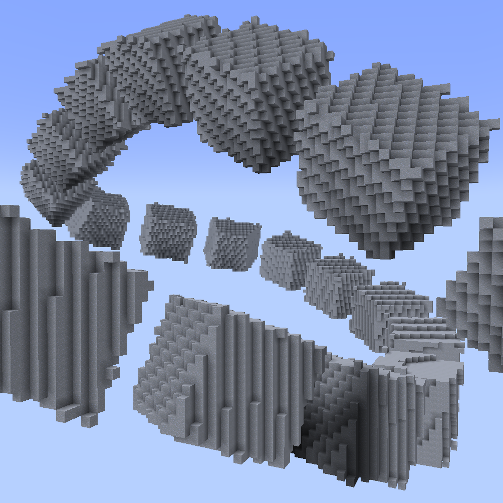

`//ezsp 3d`` `<mark style="color:orange;">`Cubes(Gap:0.0)`</mark>` ``clay 7`

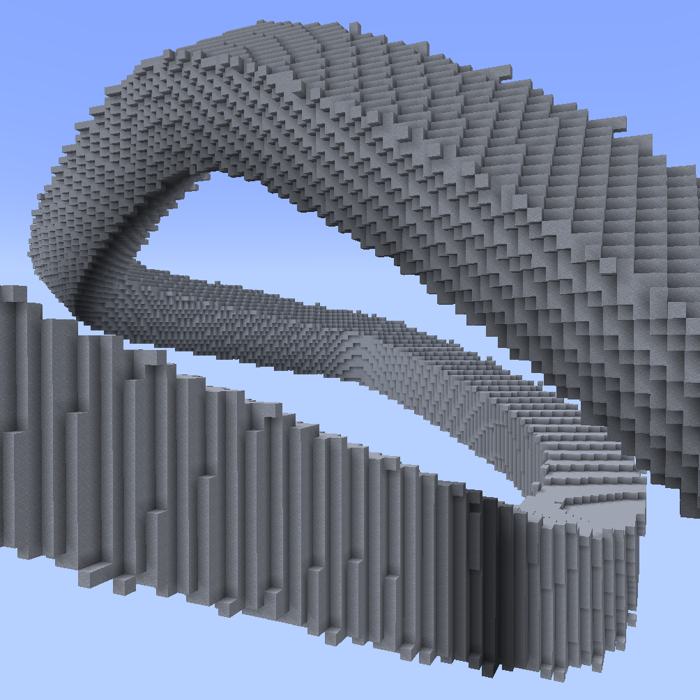

`//ezsp 3d`` `<mark style="color:orange;">`Cubes(Gap:1.0)`</mark>` ``clay 7`

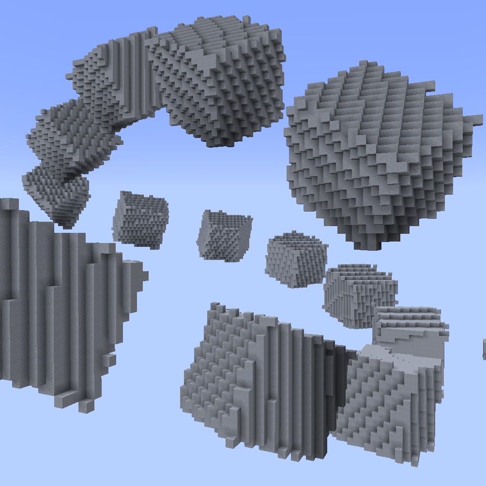

`//ezsp 3d`` `<mark style="color:orange;">`Cu(G:2.0)`</mark>` ``clay 7`

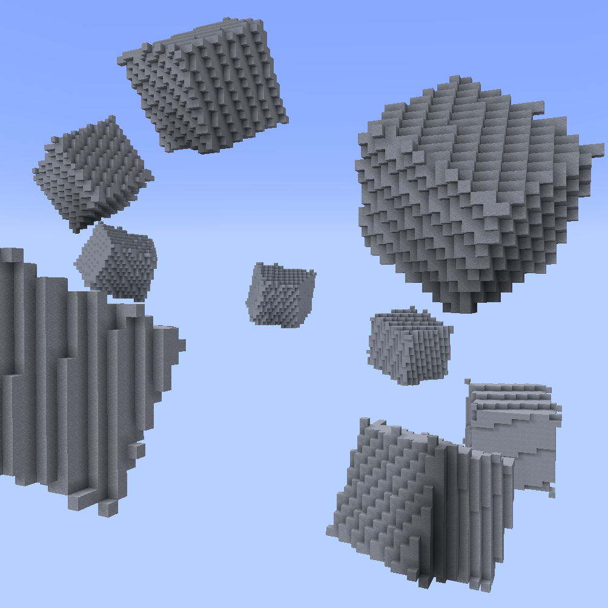

***

#### 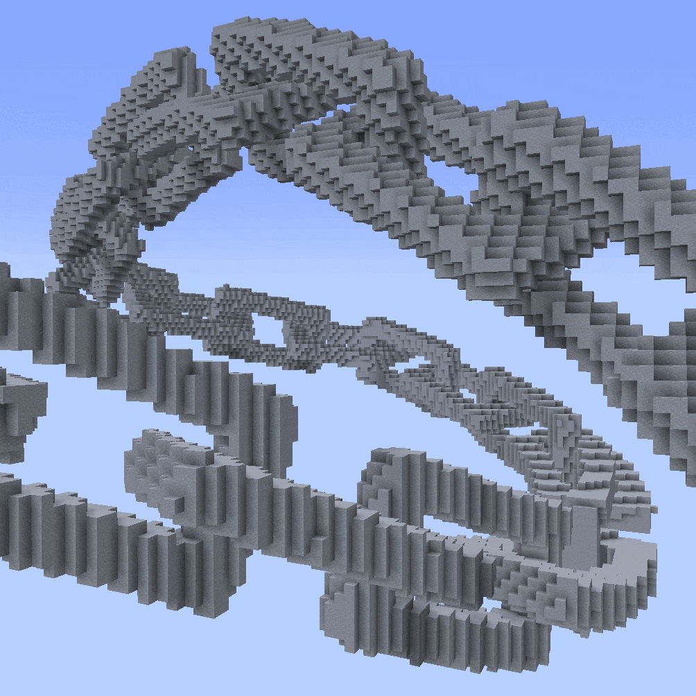

### `//ezspline 3d`` `<mark style="color:orange;">`Chainlink (Ch)`</mark>

<mark style="color:blue;">Chain-Link Spline</mark>

**`//ezsp 3d Chainlink([`**<mark style="color:orange;">**`Extrusion:<value>`**</mark>**`],[`**<mark style="color:orange;">**`Thickness:<value>`**</mark>**`],[`**<mark style="color:orange;">**`Gap:<value>`**</mark>**`],[`**<mark style="color:orange;">**`MajorExponent:<value>`**</mark>**`],[`**<mark style="color:orange;">**`MinorExponent:<value>`**</mark>**`],[`**<mark style="color:orange;">**`Place:<value>`**</mark>**`])`** [**`<pattern>`**](3d-spline-shapes.md#syntax) [**`<radii>`**](common-parameters.md#radius-progression-less-than-radii-greater-than) [**`[-s <stretch>]`**](common-parameters.md#stretch-s-less-than-stretchfactor-greater-than) [**`[-t <angle>]`**](common-parameters.md#twist-t-less-than-angle-greater-than) [**`[-p <kbParameters>]`**](common-parameters.md#kochanek-bartel-parameters-p-less-than-kbparameters-greater-than) [**`[-q <quality>]`**](common-parameters.md#quality-q-less-than-quality-greater-than) [**`[-n <normalMode>]`**](common-parameters.md#spline-normal-mode-n-less-than-normalmode-greater-than) [**`[-h]`**](common-parameters.md#ingame-help-page-h)

Generates a highly customisable chainlink-shaped spline along the selected positions.

* **`[`**<mark style="color:orange;">**`Extrusion:<value>`**</mark>**`]`** (<mark style="color:orange;">**`E`**</mark>) (Default: 0.2):
  * The amount to length to add for each individual link along the chain.
* **`[`**<mark style="color:orange;">**`Thickness:<value>`**</mark>**`]`** (<mark style="color:orange;">**`T`**</mark>) (Default: 1.0):
  * The inner/minor radius of each link.
* **`[`**<mark style="color:orange;">**`Gap:<value>`**</mark>**`]`** (<mark style="color:orange;">**`G`**</mark>) (Default: 0.0):
  * Amount to offset each link by, adjusting the overlap of the links in the chain.
* **`[`**<mark style="color:orange;">**`MajorExponent:<value>`**</mark>**`]`** (<mark style="color:orange;">**`M`**</mark>) (Default: 3.0):
  * The exponent defining the outer shape of an individual chain link.
* **`[`**<mark style="color:orange;">**`MinorExponent:<value>`**</mark>**`]`** (<mark style="color:orange;">**`N`**</mark>) (Default: 3.0):
  * The exponent defining the shape of the cross-section of an individual chain link.
* **`[`**<mark style="color:orange;">**`Place:<value>`**</mark>**`]`** (<mark style="color:orange;">**`P`**</mark>) (Default: "BOTH"):
  * Choose between "FIRST", "SECOND", or "BOTH" to place only half of the chain links or both.

(<mark style="color:red;">**`!`**</mark>) We provide an interactive 3D plot to play around with all parameters (it's very neat): [https://www.desmos.com/3d/yvrsv605mf](https://www.desmos.com/3d/yvrsv605mf)

Examples:

`//ezsp 3d`` `<mark style="color:orange;">`Chainlink`</mark>` ``clay 10`

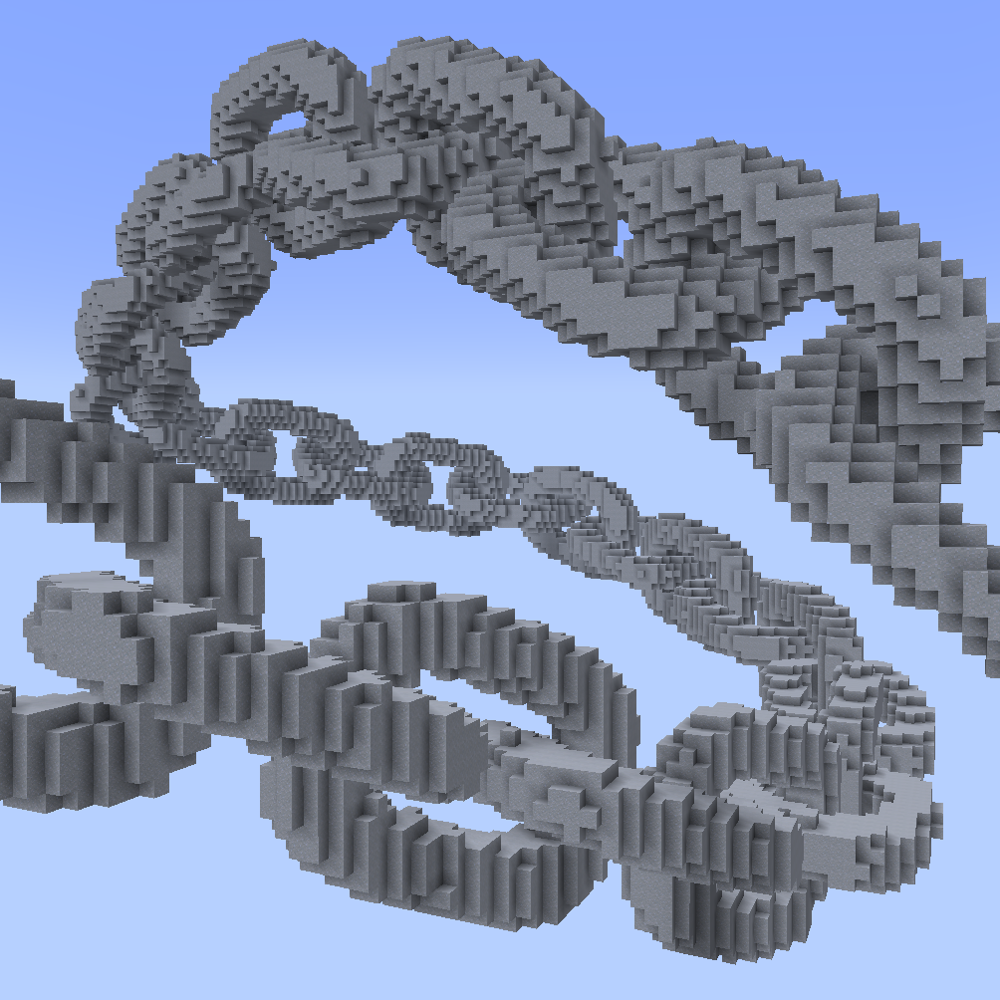

`//ezsp 3d`` `<mark style="color:orange;">`Chainlink(M:99,N:99,Extrusion:0.6)`</mark>` ``clay 10`

* `M:99` is responsible for making the chains appear rectangular (instead of elliptical).
* `N:99` is responsible for making the square chain link's cross-section square-shaped.

`//ezsp 3d`` `<mark style="color:orange;">`Chainlink(M:1,N:1,E:0.7,G:-0.2,T:1.2)`</mark>` ``clay 11`

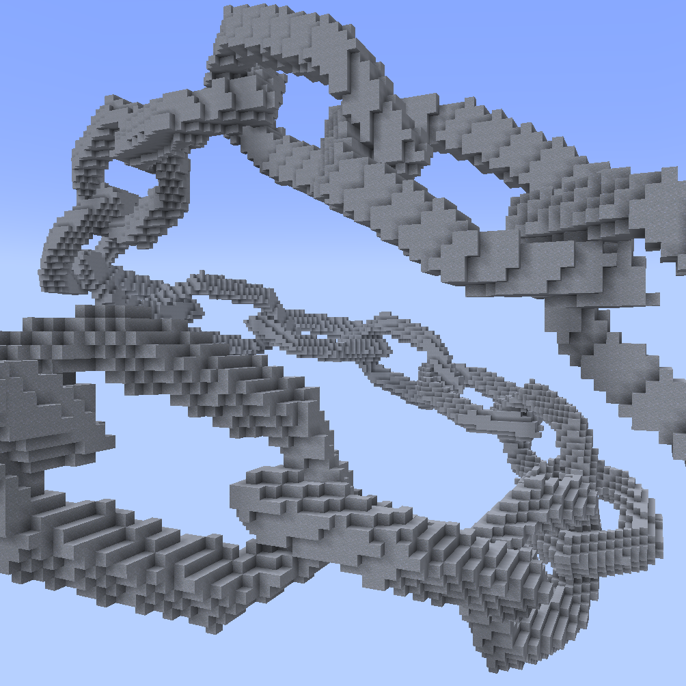

`//ezsp 3d`` `<mark style="color:orange;">`Chainlink(M:2,N:2,E:0,G:1)`</mark>` ``clay 11`

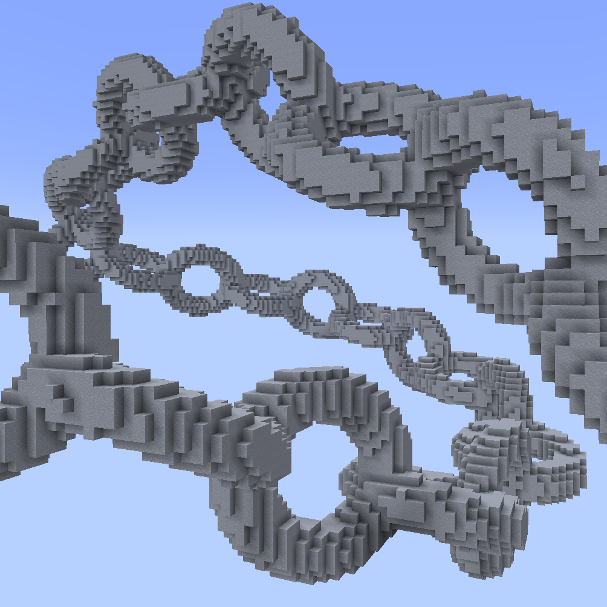

`//ezspline 3d`` `<mark style="color:orange;">`Chainlink(P:FIRST)`</mark> <mark style="color:red;">`red_terracotta`</mark>` ``10`

`//ezspline 3d`` `<mark style="color:orange;">`Chainlink(P:SECOND)`</mark> <mark style="color:blue;">`blue_wool`</mark>` ``10`

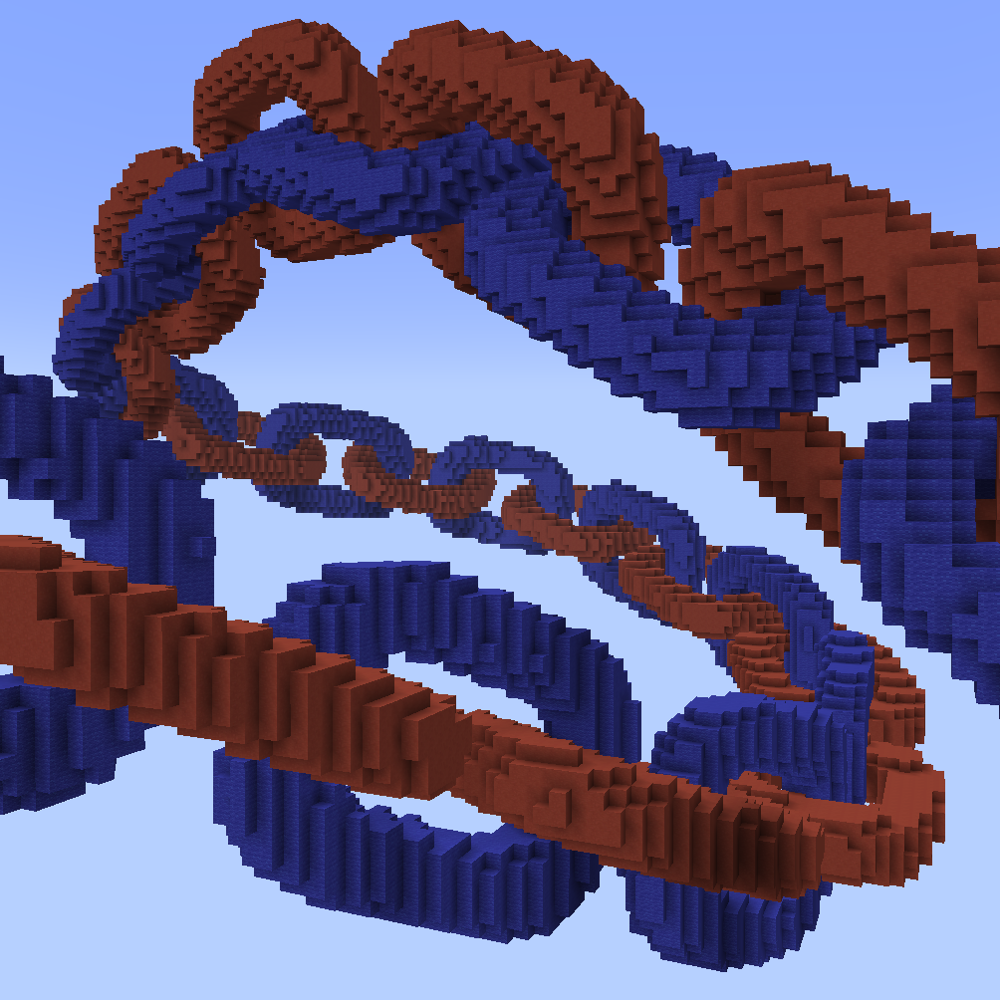

***

#### 

### `//ezspline 3d`` `<mark style="color:orange;">`Fishnet (Fi)`</mark>

<mark style="color:blue;">Fishnet Spline</mark>

**`//ezsp 3d Fishnet([`**<mark style="color:orange;">**`Spacing:<value>`**</mark>**`],[`**<mark style="color:orange;">**`Depth:<value>`**</mark>**`],[`**<mark style="color:orange;">**`Width:<value>`**</mark>**`])`** [**`<pattern>`**](3d-spline-shapes.md#syntax) [**`<radii>`**](common-parameters.md#radius-progression-less-than-radii-greater-than) [**`[-s <stretch>]`**](common-parameters.md#stretch-s-less-than-stretchfactor-greater-than) [**`[-t <angle>]`**](common-parameters.md#twist-t-less-than-angle-greater-than) [**`[-p <kbParameters>]`**](common-parameters.md#kochanek-bartel-parameters-p-less-than-kbparameters-greater-than) [**`[-q <quality>]`**](common-parameters.md#quality-q-less-than-quality-greater-than) [**`[-n <normalMode>]`**](common-parameters.md#spline-normal-mode-n-less-than-normalmode-greater-than) [**`[-h]`**](common-parameters.md#ingame-help-page-h)

Generates a fishnet-shaped spline along the selected positions.

* **`[`**<mark style="color:orange;">**`Spacing:<value>`**</mark>**`]`** (<mark style="color:orange;">**`S`**</mark>) (Default: 1.0):
  * The distance between the strings of the net.
* **`[`**<mark style="color:orange;">**`Depth:<value>`**</mark>**`]`** (<mark style="color:orange;">**`D`**</mark>) (Default: 0.2):
  * The depth of each string within the net. How much it protrudes towards the center of the spline.
* **`[`**<mark style="color:orange;">**`Width:<value>`**</mark>**`]`** (<mark style="color:orange;">**`W`**</mark>) (Default: 0.2):
  * The width of each string.

Examples:

`//ezspline 3d`` `<mark style="color:orange;">`Fishnet`</mark>` ``clay 10`

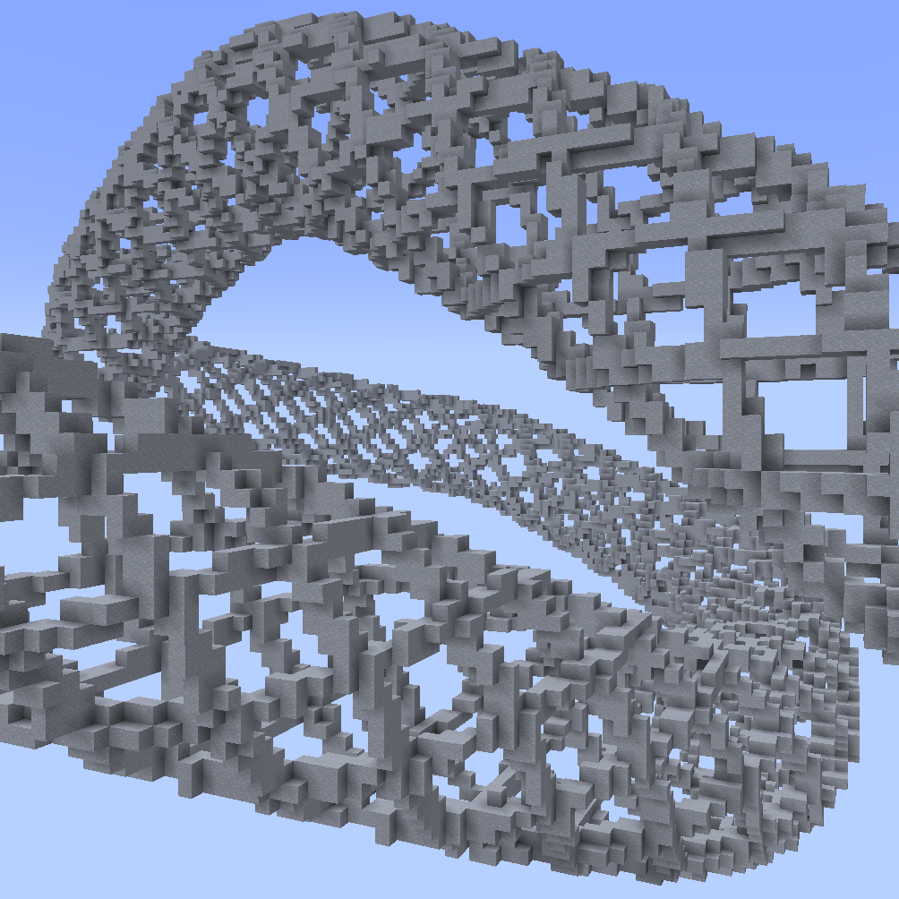

`//ezsp 3d`` `<mark style="color:orange;">`Fishnet(Spacing:2.0)`</mark>` ``clay 10`

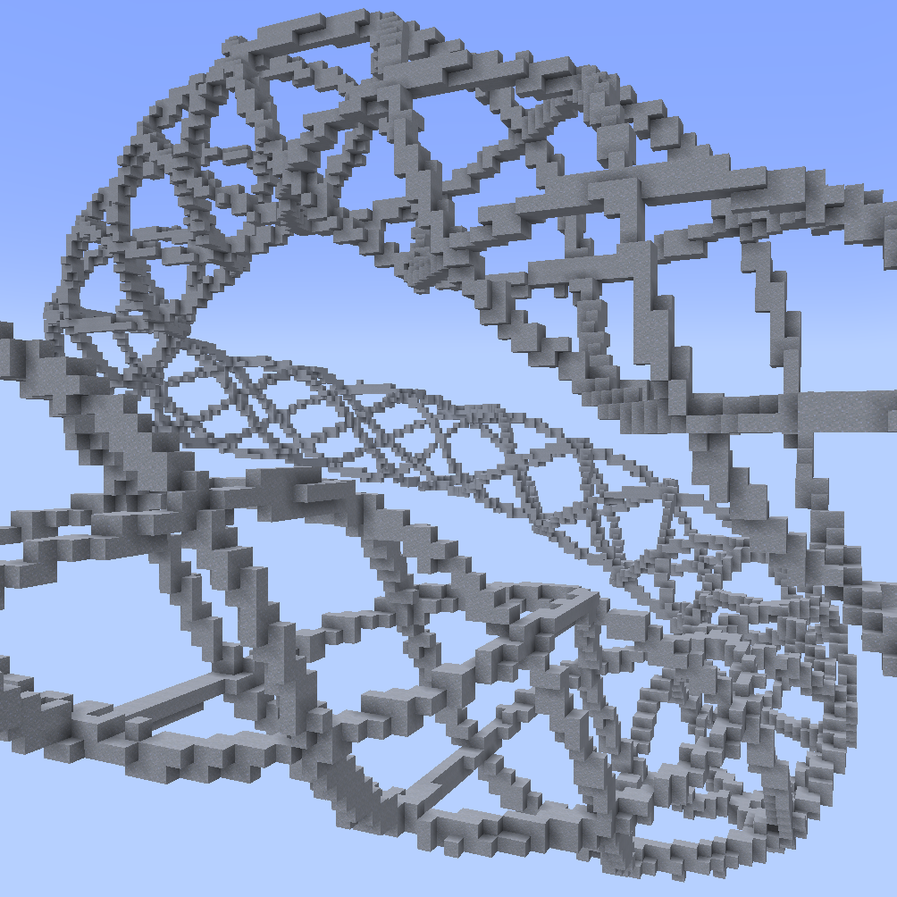

`//ezsp 3d`` `<mark style="color:orange;">`Fishnet(S:2.0,Depth:1.0,Width:0.3)`</mark>` ``clay 10`

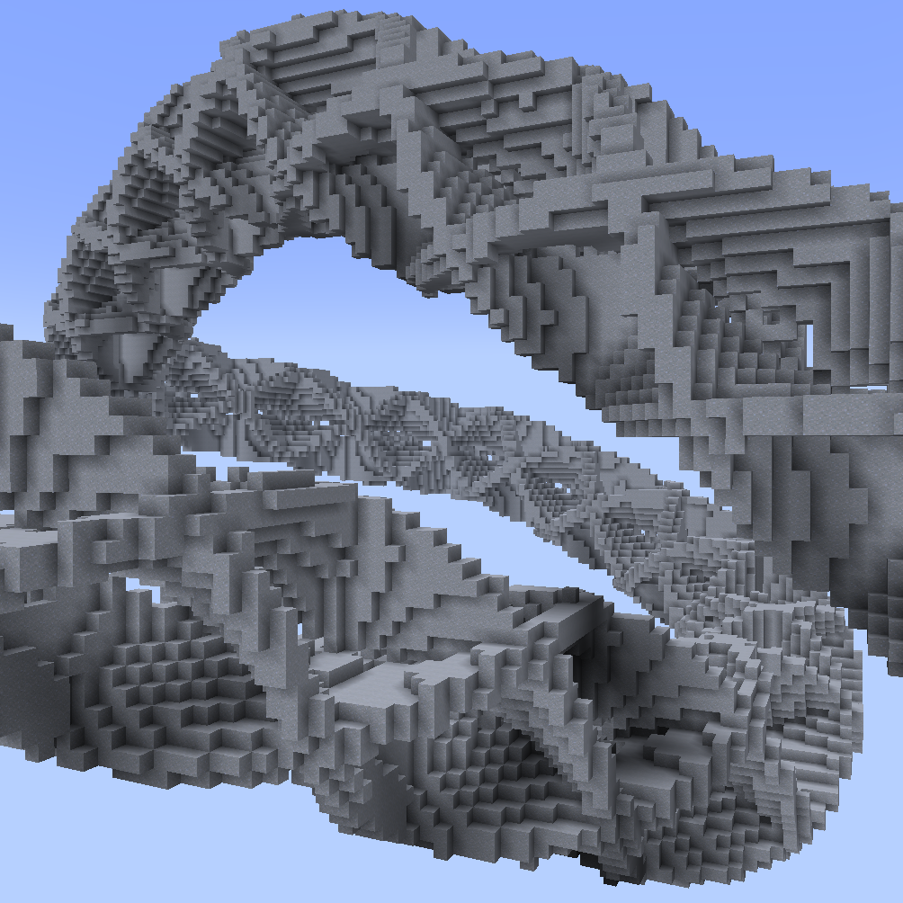

`//ezsp 3d`` `<mark style="color:orange;">`Fi(S:2.0,D:0.5,W:0.5)`</mark>` ``clay 10`

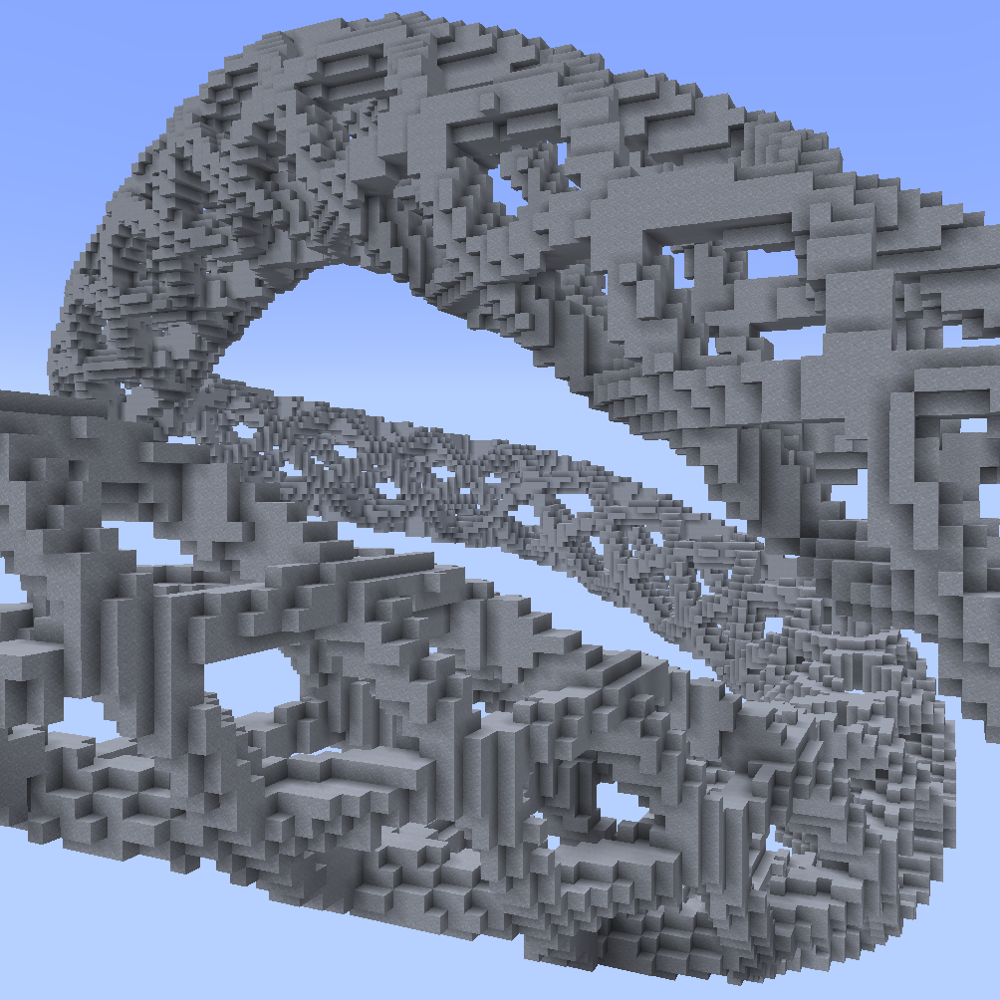

***

#### 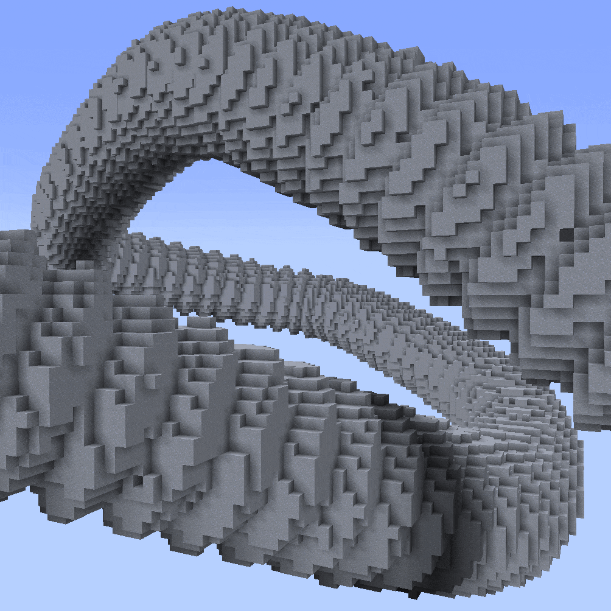

### `//ezspline 3d`` `<mark style="color:orange;">`Oscillate (Os)`</mark>

<mark style="color:blue;">Oscillation Spline</mark>

**`//ezsp 3d Oscillate([`**<mark style="color:orange;">**`Depth:<value>`**</mark>**`],[`**<mark style="color:orange;">**`Interval:<value>`**</mark>**`])`** [**`<pattern>`**](3d-spline-shapes.md#syntax) [**`<radii>`**](common-parameters.md#radius-progression-less-than-radii-greater-than)[**`[-s <stretch>]`**](common-parameters.md#stretch-s-less-than-stretchfactor-greater-than) [**`[-t <angle>]`**](common-parameters.md#twist-t-less-than-angle-greater-than) [**`[-p <kbParameters>]`**](common-parameters.md#kochanek-bartel-parameters-p-less-than-kbparameters-greater-than) [**`[-q <quality>]`**](common-parameters.md#quality-q-less-than-quality-greater-than) [**`[-n <normalMode>]`**](common-parameters.md#spline-normal-mode-n-less-than-normalmode-greater-than) [**`[-h]`**](common-parameters.md#ingame-help-page-h)

Generates a spline with an oscillating thickness along the selected positions.

* **`[`**<mark style="color:orange;">**`Depth:<value>`**</mark>**`]`** (<mark style="color:orange;">**`D`**</mark>) (Default: 0.2):
  * Specifies how many blocks deep the ridges cut into the surface of the spline.
* **`[`**<mark style="color:orange;">**`Interval:<value>`**</mark>**`]`** (<mark style="color:orange;">**`I`**</mark>) (Default: 0.5):
  * Specifies the distance between each ridge.

Examples:

`//ezspline 3d`` `<mark style="color:orange;">`Oscillate`</mark>` ``clay 10`

Uses default values <mark style="color:orange;">`Depth:0.2`</mark> and <mark style="color:orange;">`Interval:0.5`</mark>

`//ezsp 3d`` `<mark style="color:orange;">`Oscillate(Depth:0.6)`</mark>` ``clay 10`

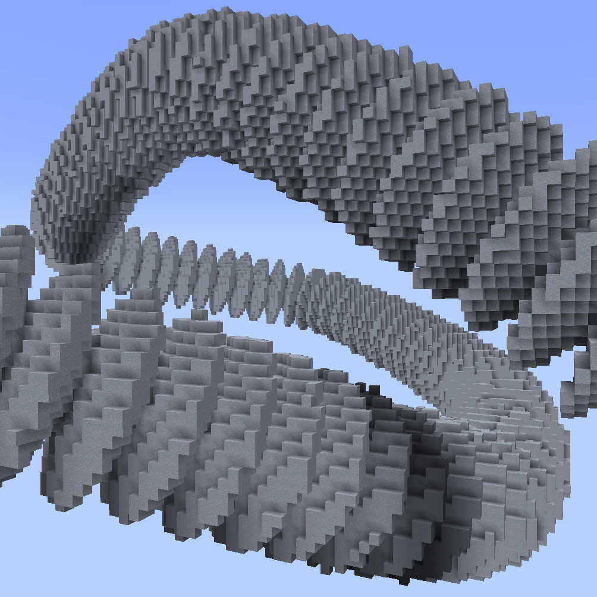

`//ezsp 3d`` `<mark style="color:orange;">`Oscillate(Depth:0.6,Interval:1.5)`</mark>` ``clay 10`

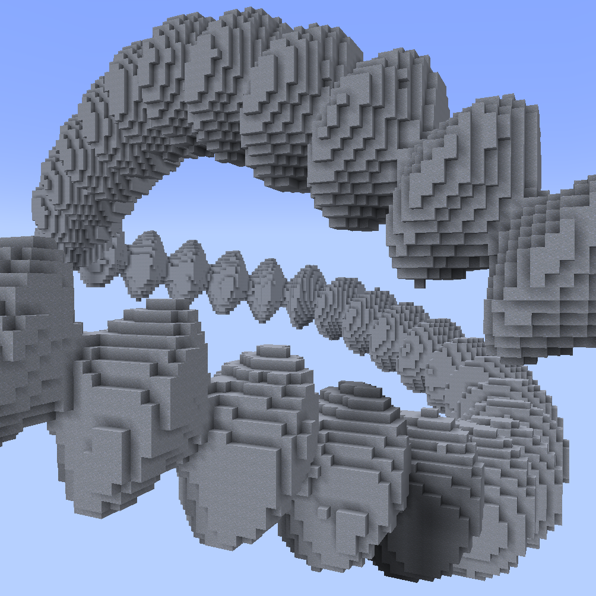

`//ezsp 3d`` `<mark style="color:orange;">`Oscillate(Depth:0.2,Interval:1.5)`</mark>` ``clay 10`

Can be abbreviated to <mark style="color:orange;">`Os(D:0.2,I:1.5)`</mark>

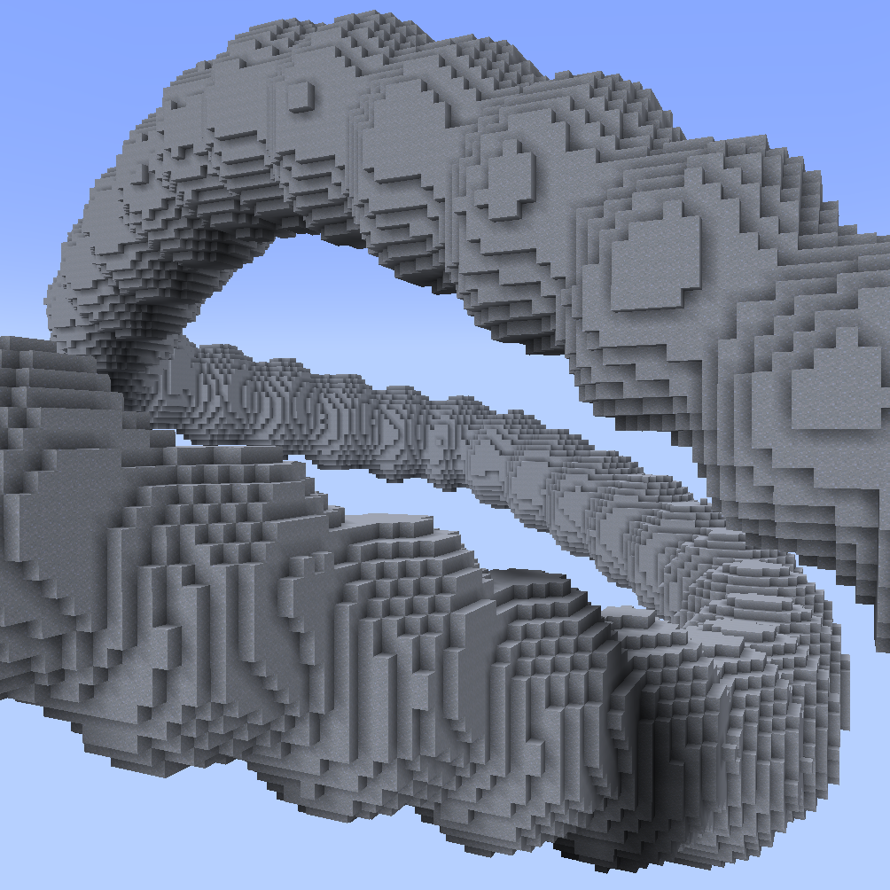

***

#### 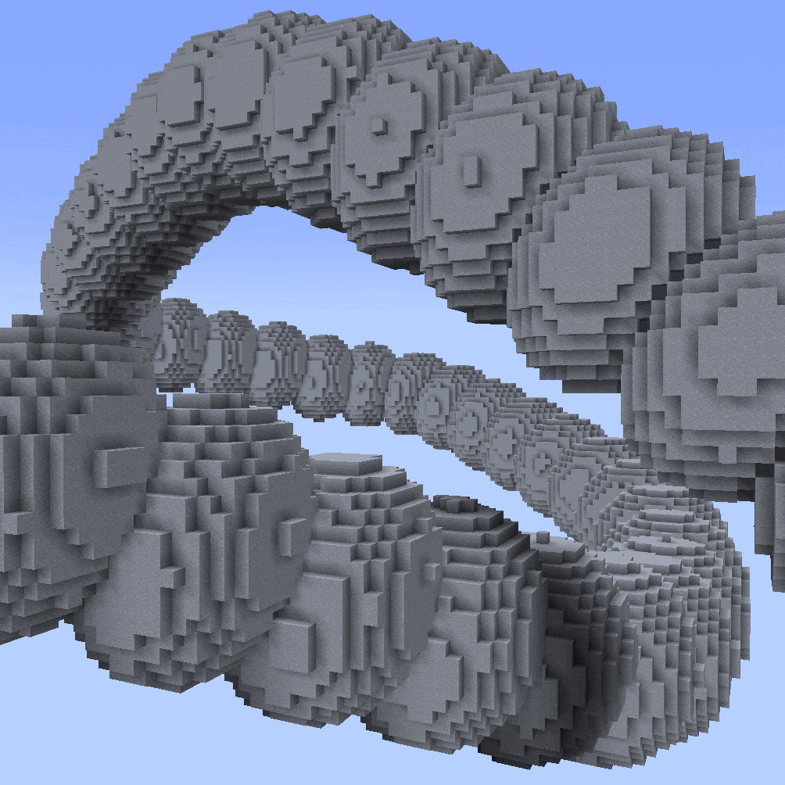

### `//ezspline 3d`` `<mark style="color:orange;">`Rings (Ri)`</mark>

<mark style="color:blue;">Rings Spline</mark>

**`//ezsp Rings([`**<mark style="color:orange;">**`Extrusion:<value>`**</mark>**`],[`**<mark style="color:orange;">**`Thickness:<value>`**</mark>**`],[`**<mark style="color:orange;">**`Gap:<value>`**</mark>**`],[`**<mark style="color:orange;">**`MajorExponent:<value>`**</mark>**`],[`**<mark style="color:orange;">**`MinorExponent:<value>`**</mark>**`])`** [**`<pattern>`**](3d-spline-shapes.md#syntax) [**`<radii>`**](common-parameters.md#radius-progression-less-than-radii-greater-than)[**`[-s <stretch>]`**](common-parameters.md#stretch-s-less-than-stretchfactor-greater-than) [**`[-t <angle>]`**](common-parameters.md#twist-t-less-than-angle-greater-than) [**`[-p <kbParameters>]`**](common-parameters.md#kochanek-bartel-parameters-p-less-than-kbparameters-greater-than) [**`[-q <quality>]`**](common-parameters.md#quality-q-less-than-quality-greater-than) [**`[-n <normalMode>]`**](common-parameters.md#spline-normal-mode-n-less-than-normalmode-greater-than) [**`[-h]`**](common-parameters.md#ingame-help-page-h)

Generates a highly customisable spline of repeating rings/cubes/spheres along the spline path.

* **`[`**<mark style="color:orange;">**`Extrusion:<value>`**</mark>**`]`** (Default: 0.2):
  * The amount to length to add for each individual link along the chain.
* **`[`**<mark style="color:orange;">**`Thickness:<value>`**</mark>**`]`** (Default: 0.15):
  * Thickness of each ring. Smaller values lead to a larger hole in the middle. 1.0 results in a (super-)sphere.
* **`[`**<mark style="color:orange;">**`Gap:<value>`**</mark>**`]`** (Default: 0.0):
  * Relative gap size between each torus. 0 means there is no gap, all toruses come right after another. 1 means the distance is exactly the size of one torus. Negative values result in overlapping.
* **`[`**<mark style="color:orange;">**`MajorExponent:<value>`**</mark>**`]`** (Default: 2.0):
  * The exponent defining the outer shape of an individual torus.
* **`[`**<mark style="color:orange;">**`MinorExponent:<value>`**</mark>**`]`** (Default: 2.0):
  * The exponent defining the shape of the cross-section of an individual torus.

(<mark style="color:red;">**`!`**</mark>) We provide an interactive 3D plot to play around with all parameters (it's very neat): [https://www.desmos.com/3d/eukcghnohc](https://www.desmos.com/3d/eukcghnohc)

***

#### 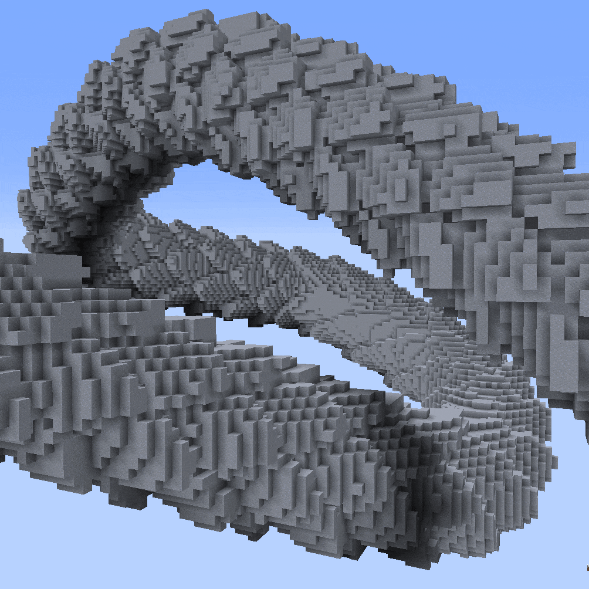

### `//ezspline 3d`` `<mark style="color:orange;">`Scales (Sc)`</mark>

<mark style="color:blue;">Scales Spline</mark>

**`//ezsp Scales([`**<mark style="color:orange;">**`Scale:<value>`**</mark>**`],[`**<mark style="color:orange;">**`HorizontalOffset:<value>`**</mark>**`],[`**<mark style="color:orange;">**`VerticalOffset:<value>`**</mark>**`],[`**<mark style="color:orange;">**`MajorExponent:<value>`**</mark>**`],[`**<mark style="color:orange;">**`MinorExponent:<value>`**</mark>**`],[`**<mark style="color:orange;">**`Angle:<value>`**</mark>**`],[`**<mark style="color:orange;">**`DepthMultiplier:<value>`**</mark>**`])`** [**`<pattern>`**](3d-spline-shapes.md#syntax) [**`<radii>`**](common-parameters.md#radius-progression-less-than-radii-greater-than)[**`[-s <stretch>]`**](common-parameters.md#stretch-s-less-than-stretchfactor-greater-than) [**`[-t <angle>]`**](common-parameters.md#twist-t-less-than-angle-greater-than) [**`[-p <kbParameters>]`**](common-parameters.md#kochanek-bartel-parameters-p-less-than-kbparameters-greater-than) [**`[-q <quality>]`**](common-parameters.md#quality-q-less-than-quality-greater-than) [**`[-n <normalMode>]`**](common-parameters.md#spline-normal-mode-n-less-than-normalmode-greater-than) [**`[-h]`**](common-parameters.md#ingame-help-page-h)

Generates a highly customisable spline with a scales-like three-dimensional texture on it.

* <mark style="color:orange;">**`Columns`**</mark>**&#x20;(**<mark style="color:orange;">**`C`**</mark>**).** (Default: 8):
  * Sets how many tiles should fit per "layer".&#x20;
* <mark style="color:orange;">**`HorizontalOffset`**</mark> **(**<mark style="color:orange;">**`H`**</mark>**).** Default: 1.05):
  * Determines how far apart each tile is sideways.
* <mark style="color:orange;">**`VerticalOffset`**</mark> **(**<mark style="color:orange;">**`V`**</mark>**).**  (Default: 1.2):
  * Determines how far apart each tile is along the spline path direction.
* <mark style="color:orange;">**`MajorExponent`**</mark> **(**<mark style="color:orange;">**`M`**</mark>**).**  (Default: 1.4):
  * The exponent defining the shape of the tile.
* <mark style="color:orange;">**`MinorExponent`**</mark> **(**<mark style="color:orange;">**`N`**</mark>**).**  (Default: 14.0):
  * The exponent defining the shape of the cross-section of each tile.
* <mark style="color:orange;">**`Angle`**</mark> **(**<mark style="color:orange;">**`A`**</mark>**).**  (Default: 14.0):
  * Defines the orientation of each tile.
* <mark style="color:orange;">**`DepthMultiplier`**</mark> **(**<mark style="color:orange;">**`D`**</mark>**).**  (Default: 1.0):
  * Adjusts how deep the ridges between the tiles go.
  * Values larger than 1 carve out blocks.
  * Value less than 1 fill with more blocks.

(<mark style="color:red;">**`!`**</mark>) We provide an interactive 3D plot to play around with all parameters (it's very neat): [https://www.desmos.com/3d/ymmixtkdgf](https://www.desmos.com/3d/ymmixtkdgf)

Example:

`//ezsp 3d`` `<mark style="color:orange;">`Sc(c:8,d:1.2)`</mark>` ``clay 22,9`

<mark style="color:blue;">`//ezt ambient clay ##EnchantedBright`</mark>

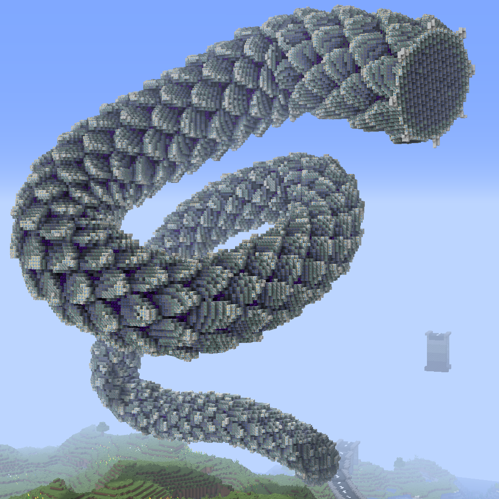

***

#### 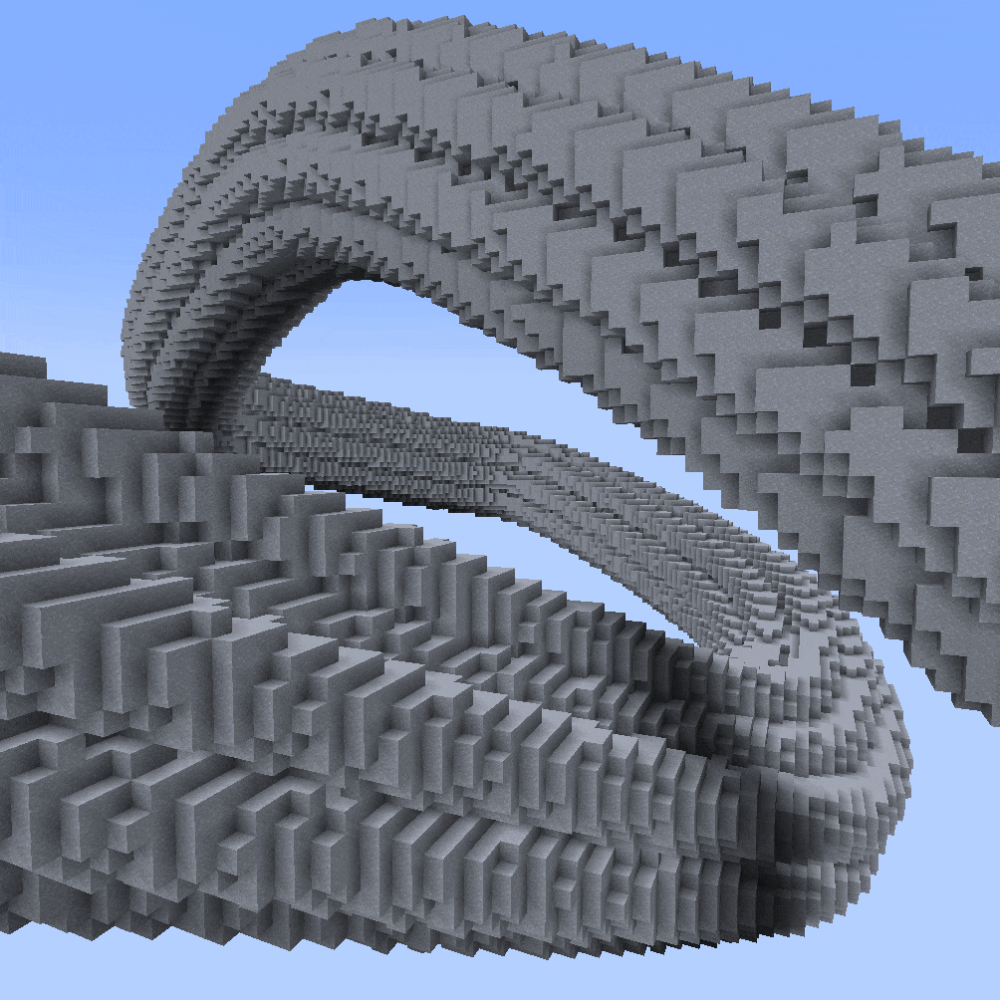

### `//ezspline 3d`` `<mark style="color:orange;">`Noodles (No)`</mark>

<mark style="color:blue;">Noodles Spline</mark>

**`//ezsp Noodles([`**<mark style="color:orange;">**`Amount:<value>`**</mark>**`],[`**<mark style="color:orange;">**`Density:<value>`**</mark>**`],[`**<mark style="color:orange;">**`Frequency:<value>`**</mark>**`],[`**<mark style="color:orange;">**`Tangle:<value>`**</mark>**`],[`**<mark style="color:orange;">**`Width:<value>`**</mark>**`],[`**<mark style="color:orange;">**`Seed:<value>`**</mark>**`])`** [**`<pattern>`**](3d-spline-shapes.md#syntax) [**`<radii>`**](common-parameters.md#radius-progression-less-than-radii-greater-than)[**`[-s <stretch>]`**](common-parameters.md#stretch-s-less-than-stretchfactor-greater-than) [**`[-t <angle>]`**](common-parameters.md#twist-t-less-than-angle-greater-than) [**`[-p <kbParameters>]`**](common-parameters.md#kochanek-bartel-parameters-p-less-than-kbparameters-greater-than) [**`[-q <quality>]`**](common-parameters.md#quality-q-less-than-quality-greater-than) [**`[-n <normalMode>]`**](common-parameters.md#spline-normal-mode-n-less-than-normalmode-greater-than) [**`[-h]`**](common-parameters.md#ingame-help-page-h)

Experimental spline which generates a set of twisted, intertwining, non-intersecting sub-splines.

* **`[`**<mark style="color:orange;">**`Amount:<value>`**</mark>**`]`** (Default: 12):
  * The number of intertwining lines.
* **`[`**<mark style="color:orange;">**`Tangle:<value>`**</mark>**`]`** (Default: 3.0):
  * Determines how much the noodles intertwine and move around. Low values result in fully straight noodles. High values result in more chaotic paths.
  * 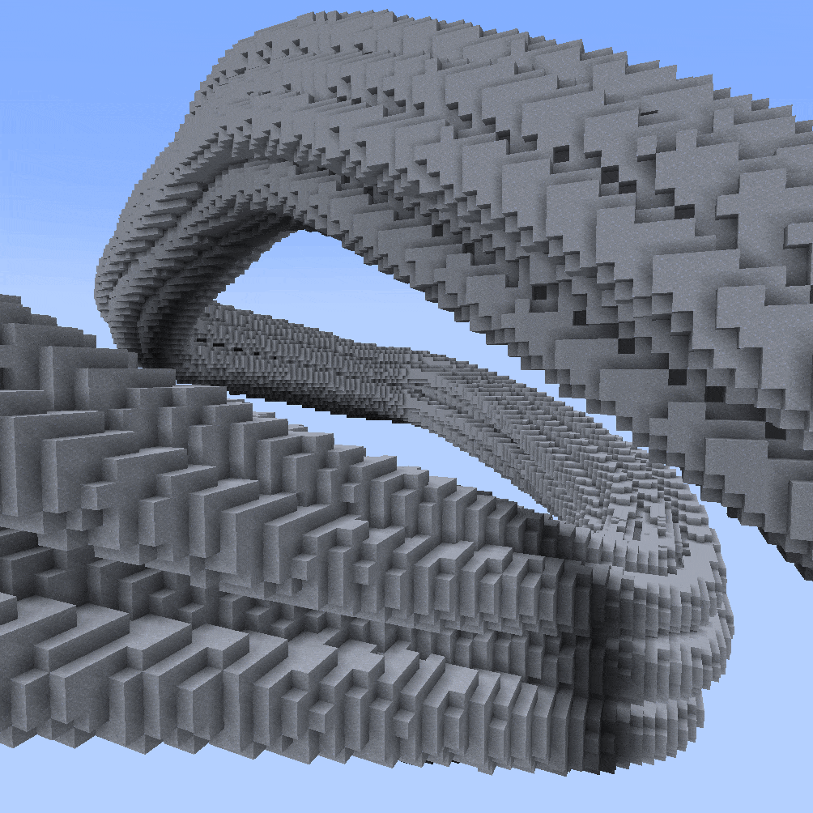
* **`[`**<mark style="color:orange;">**`Density:<value>`**</mark>**`]`** (Default: 70%):
  * Indirectly determines the width of the noodles by specifying how much the cross-section should be filled with material vs just air. 100% makes the noodles as thick as they can be so that the given amount of noodles can still fit into the spline radius. Thus, large values do not leave the noodles much space to move which gives rise to glitchy paths. Small values leave large air gaps between the noodles.
  * Example: Cross section of the spline at 100%
  * 
  * Example Cross section of the spline at 50% (same number of noodles)
  * 
  * The smaller the density the smaller the individual radius of the noodles. Difference to the width parameter: The determined radius is the one used for collision detection. The width parameter has no influence on the collision between noodles.
  * 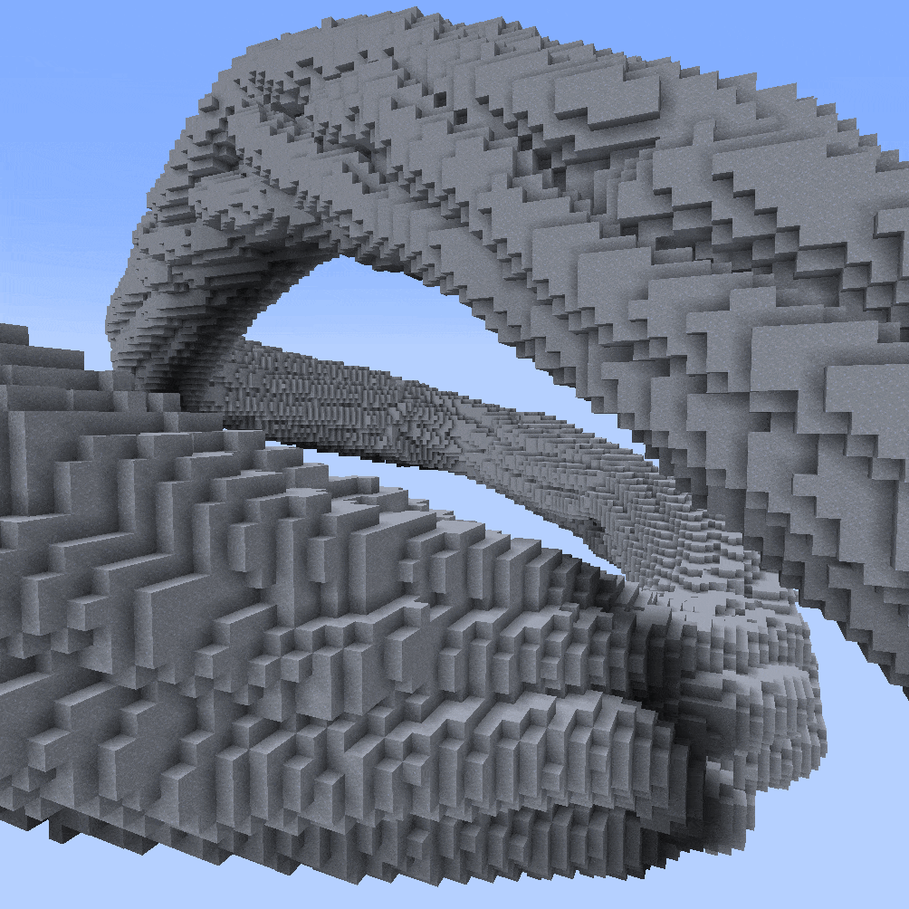
* **`[`**<mark style="color:orange;">**`Width:<value>`**</mark>**`]`** (Default: 0.8):
  * Relative width multiplier for all noodles independent of the noodle collision detection. Noodle collisions are calculated at width 1.0. This parameter defines the width at which the noodles are rendered/placed. This means values larger than one result in overlapping noodles, clipping into each other, meanwhile, values smaller than one ensure an air gap between all noodles.
  * 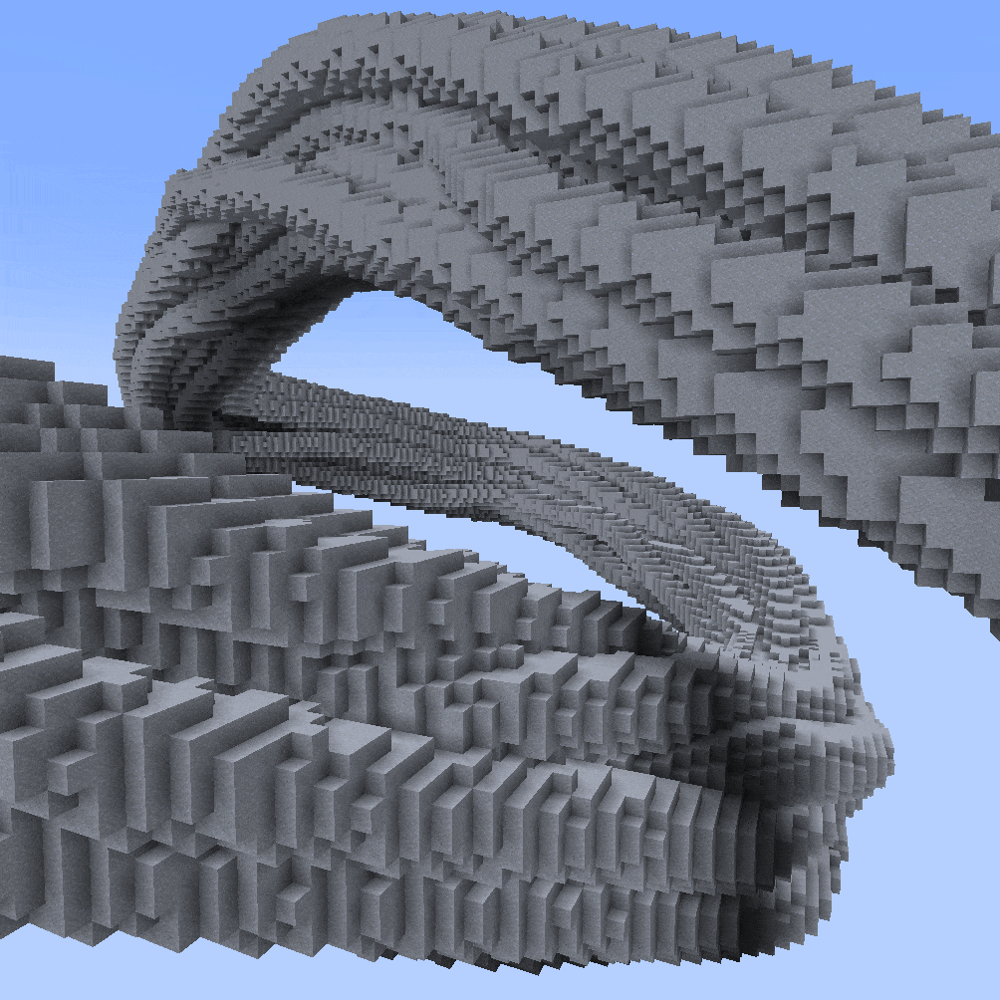
* **`[`**<mark style="color:orange;">**`Frequency:<value>`**</mark>**`]`** (Default: 0.5):
  * Sets the frequency value of the underlying noise responsible for the random perturbations. Higher values result in jittering.
* **`[`**<mark style="color:orange;">**`Seed:<value>`**</mark>**`]`** (Default: -1 (random)):
  * Sets the seed of the underlying noise responsible for the random perturbations.

***
