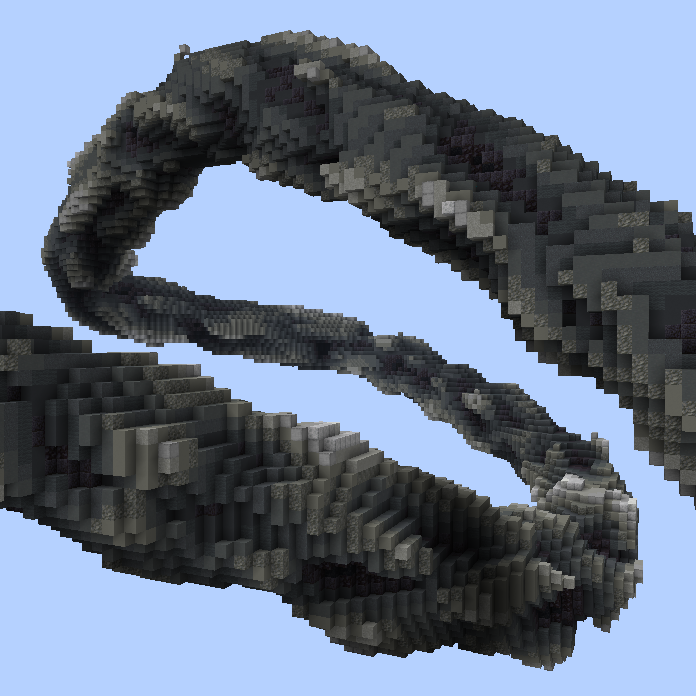
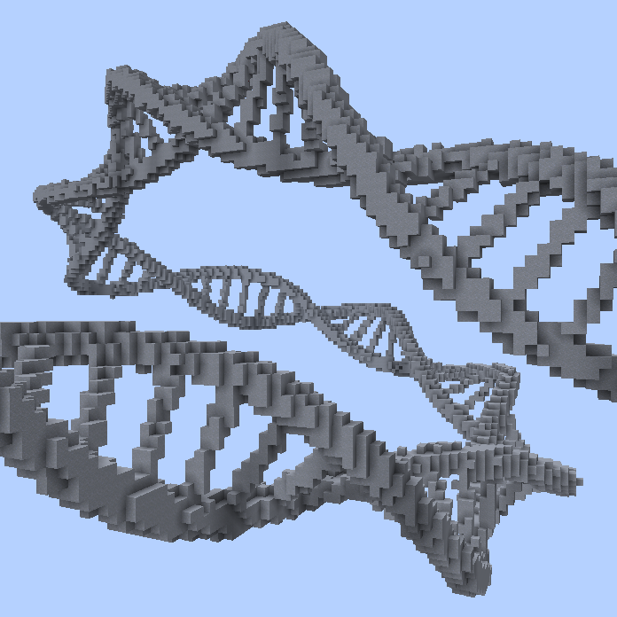
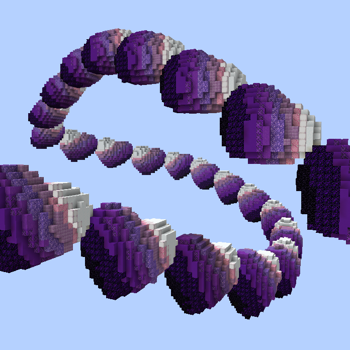

# Advanced Spline Shapes

The following `//ezspline` subcommands feature three very powerful but more complex spline shapes with effectively limitless customizability.

***

#### 

### `//ezspline `<mark style="color:orange;">`noise`</mark>

<mark style="color:blue;">Noise Spline</mark>

**`//ezsp noise `**<mark style="color:orange;">**`<pattern>`**</mark> [**`<radii>`**](common-parameters.md#radius-progression-less-than-radii-greater-than) <mark style="color:orange;">**`[noise]`**</mark> <mark style="color:orange;">**`[depth]`**</mark> [**`[-s <stretch>]`**](common-parameters.md#stretch-s-less-than-stretchfactor-greater-than) [**`[-t <angle>]`**](common-parameters.md#twist-t-less-than-angle-greater-than) [**`[-p <kbParameters>]`**](common-parameters.md#kochanek-bartel-parameters-p-less-than-kbparameters-greater-than) [**`[-q <quality>]`**](common-parameters.md#quality-q-less-than-quality-greater-than) [**`[-n <normalMode>]`**](common-parameters.md#spline-normal-mode-n-less-than-normalmode-greater-than) [**`[-h]`**](common-parameters.md#ingame-help-page-h)

Generates a noise-based spline along the selected positions.

* <mark style="color:orange;">**`<Pattern>`**</mark>:
  * Specifies the block(s) the spline is made out of.
* <mark style="color:orange;">**`[noise]`**</mark> (Default: "Perlin(Freq:2,z:0.5)"):
  * The noise that should be embedded along the spline path.
* <mark style="color:orange;">**`[depth]`**</mark> (Default: 0.7):
  * How deep the noise should cut into the cylinder-shaped spline. Depths approaching 0 approach the original cylinder-shaped spline, 0.5 means the noise may reach half the radius deep, and 1.0 means the full radius, reaching the center. Larger than 1.0 will result in a choppy look.
* <mark style="color:orange;">**`[-e <expression>]`**</mark> (Default: "`r=sqrt(x*x+y*y);t=r/d+1-1/d;f=r>1?1:(4*r*(r-1))^2;g=f*t+(1-f)*n;p=min(d,1);(g>t)*max((r-1)/p+1,0.01)`"):
  * Advanced parameter for nerds. Ignore if this above looks scary.
  * This expression implements the functionality of the noise cutting into a cylinder at a certain relative `<depth>`. [Derivation](https://www.desmos.com/calculator/qw8fro1npf). If you _**really**_ want to, you can come up with a different expression here to get a different result. If you don't need custom noises just use `//ezspline expression` instead though.
  * Input parameters are _`x,y,z,n,d`_ whereby _`x,y,z`_ are assigned like in [//ezspline expression](advanced-spline-shapes.md#expression-spline), _`n`_ is the evaluation of the given `<noise>` at the coordinates _`x,y,z`_ and _`d`_ is the given `<depth>` parameter.
  * An alternative expression could be:
    * `r=sqrt(x*x+y*y);(r<1&&n>0.5)*max(n,0.01)`: If you only want the noise to be restricted to a cylinder shape

_The remaining arguments are outlined on the_ [_Common Parameters_](common-parameters.md) _subpage._

Example:

* `//ezspline noise ##Grayscale 10`
  * 

***

#### 

### `//ezspline `<mark style="color:orange;">`expression`</mark>

<mark style="color:blue;">Expression Spline</mark>

**`//ezsp expression `**<mark style="color:orange;">**`<palette>`**</mark> [**`<radii>`**](common-parameters.md#radius-progression-less-than-radii-greater-than)[**`[-s <stretch>]`**](common-parameters.md#stretch-s-less-than-stretchfactor-greater-than) [**`[-t <angle>]`**](common-parameters.md#twist-t-less-than-angle-greater-than) [**`[-p <kbParameters>]`**](common-parameters.md#kochanek-bartel-parameters-p-less-than-kbparameters-greater-than) [**`[-q <quality>]`**](common-parameters.md#quality-q-less-than-quality-greater-than) [**`[-n <normalMode>]`**](common-parameters.md#spline-normal-mode-n-less-than-normalmode-greater-than) <mark style="color:orange;">**`[-z] [-o]`**</mark> [**`[-h]`**](common-parameters.md#ingame-help-page-h) <mark style="color:orange;">**`<expression...>`**</mark>

Generates a spline shaped by the given WorldEdit expression along the selected positions.

* <mark style="color:orange;">**`<Palette>`**</mark>:
  * Specifies the block palette.
* <mark style="color:orange;">**`[-z]`**</mark>:
  * Without setting this flag, the domain of the z-axis is 0 to the length of the spline divided by the radius. You may set this flag to normalize the z-Axis, that runs along the path of the spline, to the \[-1,1] domain.
* <mark style="color:orange;">**`[-o]`**</mark>:
  * By default, expression output maps >0..1 to the palette. Use this flag to instead map the output to whole numbers.
* <mark style="color:orange;">**`<expression...>`**</mark>:
  * [A WorldEdit expression](https://worldedit.enginehub.org/en/latest/usage/other/expressions/). Input variables are
    * -1 ≤ _`x`_ ≤ 1
    * -1 ≤ _`y`_ ≤ 1
    * 0 ≤ _`z`_ ≤ L, whereby L is the length of the spline divided by its radius.
    * or -1 ≤ _`z`_ ≤ 1, if you're using the `-z` flag.
  * Output is either a normalized palette index (0,1] or if using the -o flag (0,P] whereby P is the number of blocks in the palette. Note that <=0 means not placing any block.

_The remaining arguments are outlined on the_ [_Common Parameters_](common-parameters.md) _subpage._

Example:

* `//ezspline expression clay 10 -t 90 R=0.2;r=0.1;w=0.7;s=0.5;sqrt((abs(x)-w)^2+y^2)<R||sqrt(((z+1)%s-r)^2+y^2)<r&&abs(x)<w`
  * Expression by [imhols](https://twitter.com/imhols1)
  * 

***

#### 

### `//ezspline `<mark style="color:orange;">`structure`</mark>

<mark style="color:blue;">Structure Spline</mark>

**`//ezsp structure `**<mark style="color:orange;">**`<structure>`**</mark> [**`<radii>`**](common-parameters.md#radius-progression-less-than-radii-greater-than)[**`[-s <stretch>]`**](common-parameters.md#stretch-s-less-than-stretchfactor-greater-than) [**`[-t <angle>]`**](common-parameters.md#twist-t-less-than-angle-greater-than) [**`[-p <kbParameters>]`**](common-parameters.md#kochanek-bartel-parameters-p-less-than-kbparameters-greater-than) [**`[-q <quality>]`**](common-parameters.md#quality-q-less-than-quality-greater-than) [**`[-n <normalMode>]`**](common-parameters.md#spline-normal-mode-n-less-than-normalmode-greater-than) <mark style="color:orange;">**`[-z]`**</mark> [**`[-h]`**](common-parameters.md#ingame-help-page-h)

Embeds a structure along the path defined by the selected convex region.

* <mark style="color:orange;">**`<structure>`**</mark>:
  * The shape/clipboard/schematic to embed along the path. See [available-structures.md](../structures/available-structures.md "mention").&#x20;
* <mark style="color:orange;">**`[-z]`**</mark>:
  * Normalizes the Z-Axis, which results in exactly one structure being stretched out throughout the entire length of the path.

The structure will be placed in its Z-direction facing along the path. Multiple instances will be repeated one after another as often as its bounding box fits, unless you use `-z`, in which case one instance of the structure will be stretched across the whole length of the path.

_The remaining arguments are outlined on the_ [_Common Parameters_](common-parameters.md) _subpage._

**Examples**:

* `//ezsp structure TS(P:##GlowPurple,S:Heart,T:=(z+y)*.4+.5) 12`
  * 

***
