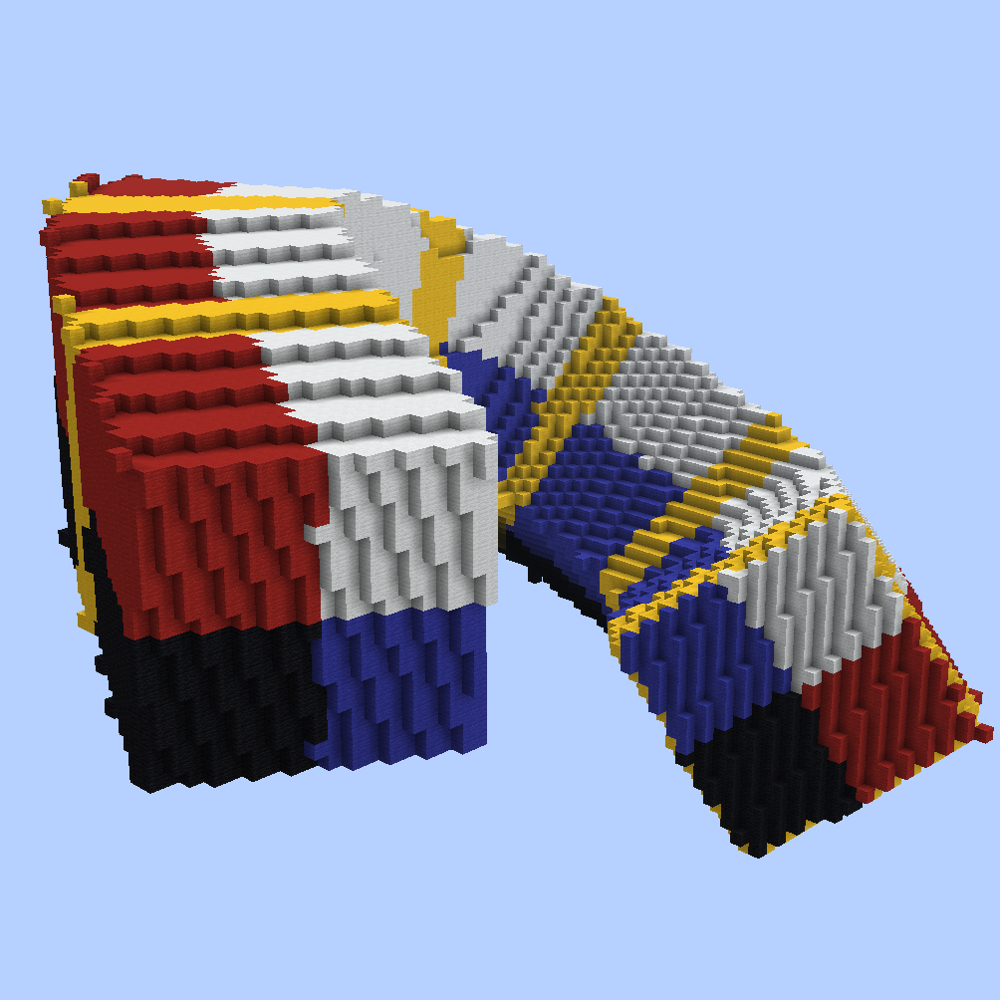

# Common Parameters

The following parameters and flags are available for **all** `//ezspline` subcommands.

***

### Radius progression: <mark style="color:orange;">`<radii>`</mark>

Defines the thickness (course) of the spline.

**Acceptable values are:** one or more comma-separated entries, where each entry is either:

1. A **radius value** (e.g., `10`, `6.9`). Radius values must be greater than 0.
2. A **position and radius**, separated by a colon, where the position is a decimal between 0 and 1 (e.g., `0:10`, `0.5:15.5`).

Whereby if specified, each _position_ must be strictly ascending, and the first and last entries must be positions of `0` and `1`. If positions are omitted, they will be set and interpolated automatically.

For example

* `0.5:10`_`,`_`2` is illegal because the _first_ entry, which is always position `0.0`, has been specified as position "`0.5`"
* `5`_`,`_`0.6:10`_`,`_`15`_`,`_`0.4:20`_`,`_`5` is illegal because the positions are not in strictly ascending order since 0.4 came after 0.6.

<mark style="color:blue;">Examples:</mark>

Example command: `//ezsp rope clay `**`<radii>`**

* Single radius entry: GIF going from `//ezsp rope clay `**`5`** through up to `//ezsp rope clay `**`10`**.

* Two radii entries: `//ezsp rope clay `**`1,12`** . The spline starts with radius 1 and progressively gets thicker up to radius 12 at the end.

* Triple radii entries: `//ezsp rope clay `**`1,12,1`**. The spline starts with radius 1, and progressively gets larger up until the middle of the spline (50% of the path) where it reaches 12 and goes back to radius 1 towards the end:

 As the first and last values always define the start- and end-radius of the spline and as all unspecified positions in between are interpolated, that means `1,12,1` (no positions specified) is expanded to **`0`**`:1,`**`0.5`**`:12,`**`1`**`:1` when you execute the command. You may also specify the positions yourself though.

* Using the command `//ezsp rope clay `**`1,0.1:12,1`**, and going from `1,`**`0.1`**`:12,1` up through `1,`**`0.9`**`:12,1`. This shifts the "keyframe position" of our radius-12-entry throughout the spline (start and end are still fixed at radius 1):

* Many radii entries: `//ezsp rope clay 2,10,2,12,2,10,2`. You may define any number of entries and their respective positions.

***

### Kochanek-Bartels-Parameters: <mark style="color:orange;">`-p <kbParameters>`</mark>

Parameters for the flow of the spline. Determines what path the spline takes through the given node positions.

Provide `<tension>:<bias>:<continuity>`, colon-separated in that order (default is `0:0:0`). The expected value range for each parameter is `[-1..1]`.


[This diagram](https://en.wikipedia.org/wiki/Kochanek%E2%80%93Bartels_spline#/media/File:Kochanek_bartels_spline.svg) shows what each parameter does.

(Note: the order in the diagram (c,t,b) is different than what ezspline expects (t,b,c).)


<mark style="color:blue;">Examples:</mark>

Example command: `//ezsp polygon clay 10 4 `**`-p <kbParameters>`**

**`-p 0:0:0`**

**`-p 0:-1:0`**

**`-p -1:0:0`**

**`-p 0:1:0`**

***

### Quality: <mark style="color:orange;">`-q <quality>`</mark>

Sets the number of samples of the shape per dimension per block. Must be greater than 0.

Defaults to `2.0` (which produces a mediocre result relatively quickly).

If you get air gaps, or a noise-y / unsmoothed appearance, set the quality to a higher value, e.g. `-q 5.0`.


Higher values for the `-q` parameter can significantly increase processing time. While small values (e.g., `-q 2`) are relatively quick, larger values (e.g., `-q 10`) may take minutes. Additionally, the benefit of increasing the `-q` value diminishes beyond a certain point. We suggest using 2 while testing parameters and rendering with 4-6 for the final placement.


<mark style="color:blue;">Example</mark>

Example command: `//ezspline beads clay 10 `**`-q <quality>`**

GIF start at `-q 1` and moves up to `-q 7`.

For this example, `-q 2` took less than a second, and `-q 7` took 20 seconds to run.

***

### Initial roll: <mark style="color:orange;">`-r <startingRoll>`</mark>

Allows to rotate the spline shape around the spline's axis, aka. rolling it. Expecting an angle given in degrees.

Defaults to `0`.

<mark style="color:blue;">Example</mark>

Example command: `//ezspline 2d Re(Y1:-0.2,Y2:0.2) clay 10 `**`-r <angle>`**

GIF start at `-q 0` and moves up to `-q 180`.

***

### Stretch: <mark style="color:orange;">`-s <stretchFactor>`</mark>

Allows stretching or compressing the spline shape in the direction of the spline path.

Defaults to `0`.


Note: `//ezspline structure`'s and `//ezspline expressions`'s `-z` flag overrides this flag. If `-z` is on, then `-s` does nothing.


<mark style="color:blue;">Example:</mark>

Example command: `//ezsp 3d Chainlink clay 10 `**`-s <stretchFactor>`**

GIF starts at `-s 0.2`, briefly pauses at `-s 1`, and increases up to `-s 4`.

***

### Twist: <mark style="color:orange;">`-t <angle>`</mark>

Defines how much to twist the shape along the spline. The input is an angle given in degrees.

Defaults to `0`. (Except for `//ezsp rope`, there it's 90)

Specifics: The angle determines how much the shape is rotated throughout the length of the current diameter of the spline. Meaning, that if the diameter is 30 blocks, then after 30 blocks of path length, the shape will have rotated by the given angle.

<mark style="color:blue;">Example:</mark>

Example command: `//ezsp 2d Polygon(S:4) clay 10 `**`-t <angle>`**

GIF starts at `-t 0` and increases up to `-t 90`.

***

### Spline Normal Mode: <mark style="color:orange;">`-n <normalMode>`</mark>

There are three modes:

1. `CONSISTENT` aims to appear smooth and consistent by "rolling" the spline shape in curves.
2. `HORIZONTAL` prevents the spline shape from "rolling sideways", keeping its initial orientation.
3. `UPRIGHT` makes the internal spline shape's y-axis with the world's y-axis.

The default is `CONSISTENT`.

<mark style="color:blue;">Examples:</mark>

Example command: `//ezspline expression black,red,blue,white,yellow 5 -o `**`-n <normalMode>`**` ((z%2)>1.5?5:2*(x>0)+(y>0))+0.001`

`-n CONSISTENT`: The default value. The spline curves around the path in a smooth fashion. Towards the end, a noticeable amount of rolling has accumulated since. (At the start white+red is the top surface, while towards the end white+blue is at the top -> the spline "rolled").

`-n HORIZONTAL`: The spline tries to align the originally upwards-facing surface to remain upwards, preventing itself from "rolling sideways". You can see that by the fact the white+red face is facing upwards throughout the entire spline.

`-n UPRIGHT`: The internal y-axis is always aligned with the world's y-axis instead of being perpendicular to the path. Notice how the yellow stripes are not perpendicular but perfectly vertical now.

**Another more dramatic example (same command, different path):**

`-n CONSISTENT`

`-n HORIZONTAL`: Spline is forced to twist itself at steep/vertical sections to remain horizontal. (Here, it always tries to put the white+red surface at the top).

`-n UPRIGHT`: As you'd expect, when the spline's y-axis is perfectly vertical, then it does not like steep/vertical path sections...

***

### Ingame help page: <mark style="color:orange;">`-h`</mark>

Prints the in-game help page. Shortcut for `//help ezspline ...`

***
