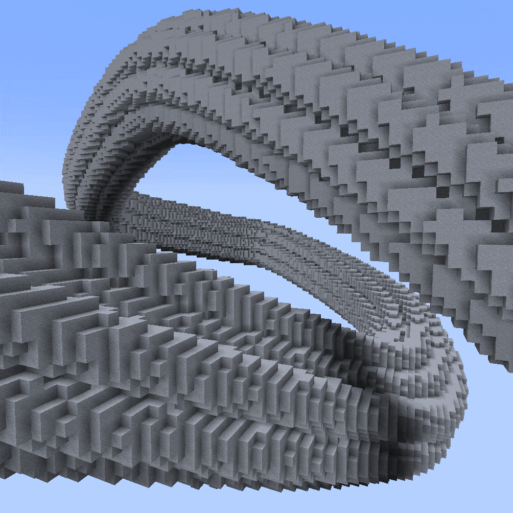
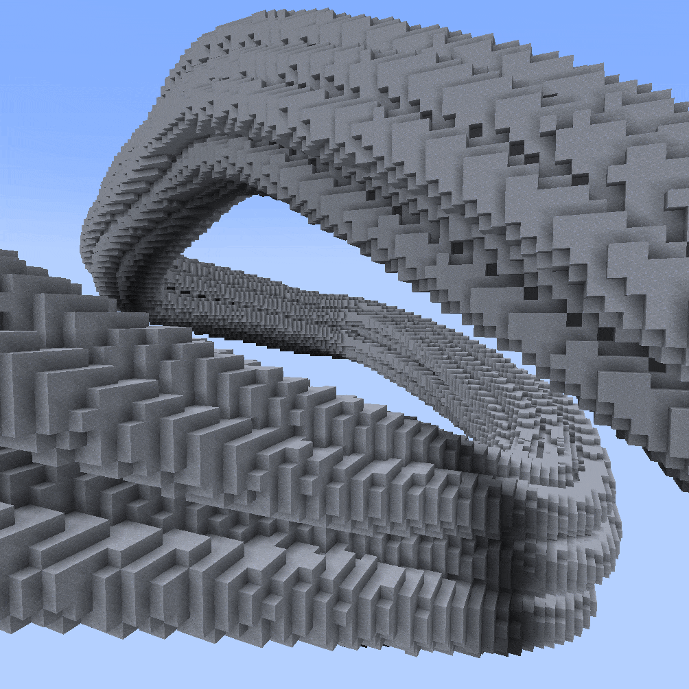
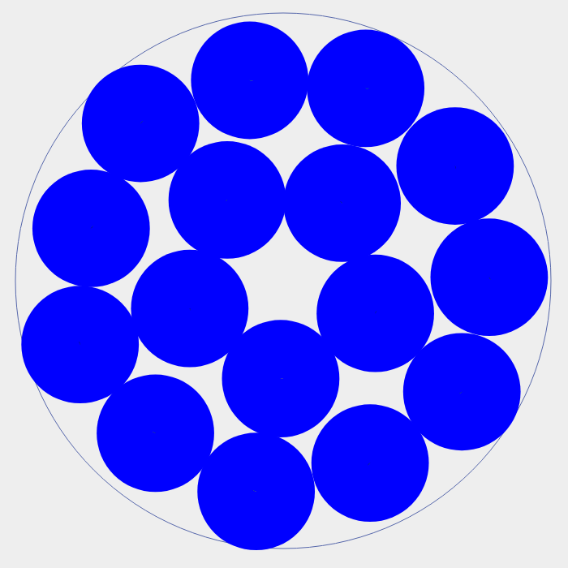
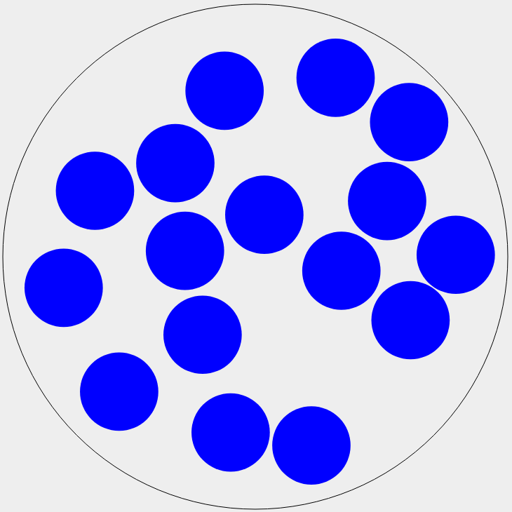
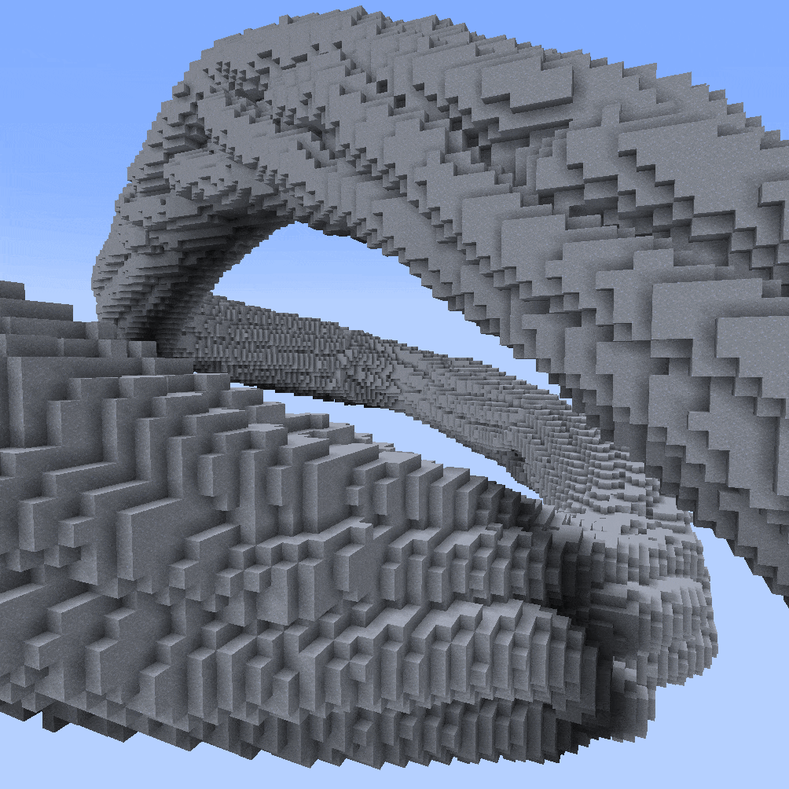
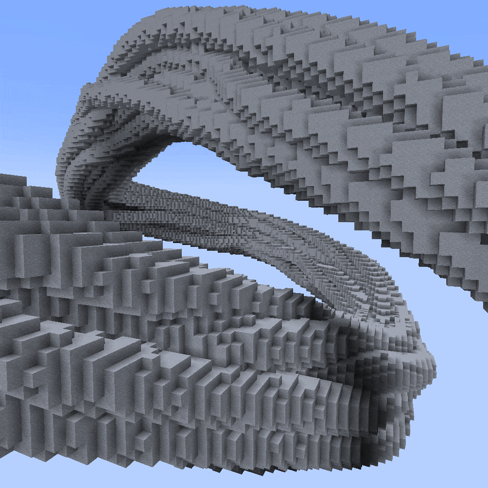

# Hopefully Invisible Spaghetti Spline

***

#### 

### `//ezspline 3d`` `<mark style="color:orange;">`Sphaghetti (Sp)`</mark>

<mark style="color:blue;">Spaghetti Spline</mark>

**`//ezsp Spaghetti([`**<mark style="color:orange;">**`Amount:<value>`**</mark>**`],[`**<mark style="color:orange;">**`Density:<value>`**</mark>**`],[`**<mark style="color:orange;">**`Frequency:<value>`**</mark>**`],[`**<mark style="color:orange;">**`Tangle:<value>`**</mark>**`],[`**<mark style="color:orange;">**`Width:<value>`**</mark>**`],[`**<mark style="color:orange;">**`Seed:<value>`**</mark>**`])`** [**`<pattern>`**](hopefully-invisible-spaghetti-spline.md#syntax) [**`<radii>`**](common-parameters.md#radius-progression-less-than-radii-greater-than)[**`[-s <stretch>]`**](common-parameters.md#stretch-s-less-than-stretchfactor-greater-than) [**`[-t <angle>]`**](common-parameters.md#twist-t-less-than-angle-greater-than) [**`[-p <kbParameters>]`**](common-parameters.md#kochanek-bartel-parameters-p-less-than-kbparameters-greater-than) [**`[-q <quality>]`**](common-parameters.md#quality-q-less-than-quality-greater-than) [**`[-n <normalMode>]`**](common-parameters.md#spline-normal-mode-n-less-than-normalmode-greater-than) [**`[-h]`**](common-parameters.md#ingame-help-page-h)

Experimental spline which generates a set of twisted, intertwining, non-intersecting sub-splines.

* **`[`**<mark style="color:orange;">**`Amount:<value>`**</mark>**`]`** (Default: 12):
  * The number of intertwining lines.
* **`[`**<mark style="color:orange;">**`Tangle:<value>`**</mark>**`]`** (Default: 3.0):
  * Determines how much the lines intertwine and move around. Low values result in fully straight lines. High values result in more chaotic paths.
  * &#x20;
* **`[`**<mark style="color:orange;">**`Density:<value>`**</mark>**`]`** (Default: 70%):
  * Indirectly determines the width of the noodles by specifying how much the cross-section should be filled with material vs just air. 100% makes the noodles as thick as they can be so that the given amount of noodles can still fit into the spline radius. Thus, large values do not leave the lines much space to move which give rise to glitchy paths. Small values leave large air gaps between the lines.
  * Example: Cross section of the spline at 100%&#x20;
  * 
  * Example Cross section of the spline at 50% (same number of lines)
  * &#x20;
  * The smaller the density the smaller the individual radius of the lines. Difference to the width parameter: The determined radius is the one used for collision detection. The width parameter has no influence on the collision between lines.
  * 
* **`[`**<mark style="color:orange;">**`Width:<value>`**</mark>**`]`** (Default: 0.8):
  * Relative width multiplier for all noodles independent of the line collision detection. Line collisions are calculated at width 1.0. This parameter defines the width at which the lines are rendered/placed. This means values larger than one result in overlapping lines, clipping into each other, meanwhile, values smaller than one ensure an air gap between all lines.&#x20;
  * 
* **`[`**<mark style="color:orange;">**`Frequency:<value>`**</mark>**`]`** (Default: 0.5):
  * Sets the frequency value of the underlying noise responsible for the random perturbations. Higher values result in jittering. Tip: Use a higher/lower frequency if your spline is significantly longer/shorter than it is wide.
* **`[`**<mark style="color:orange;">**`Seed:<value>`**</mark>**`]`** (Default: -1 (random)):
  * Sets the seed of the underlying noise responsible for the random perturbations.

