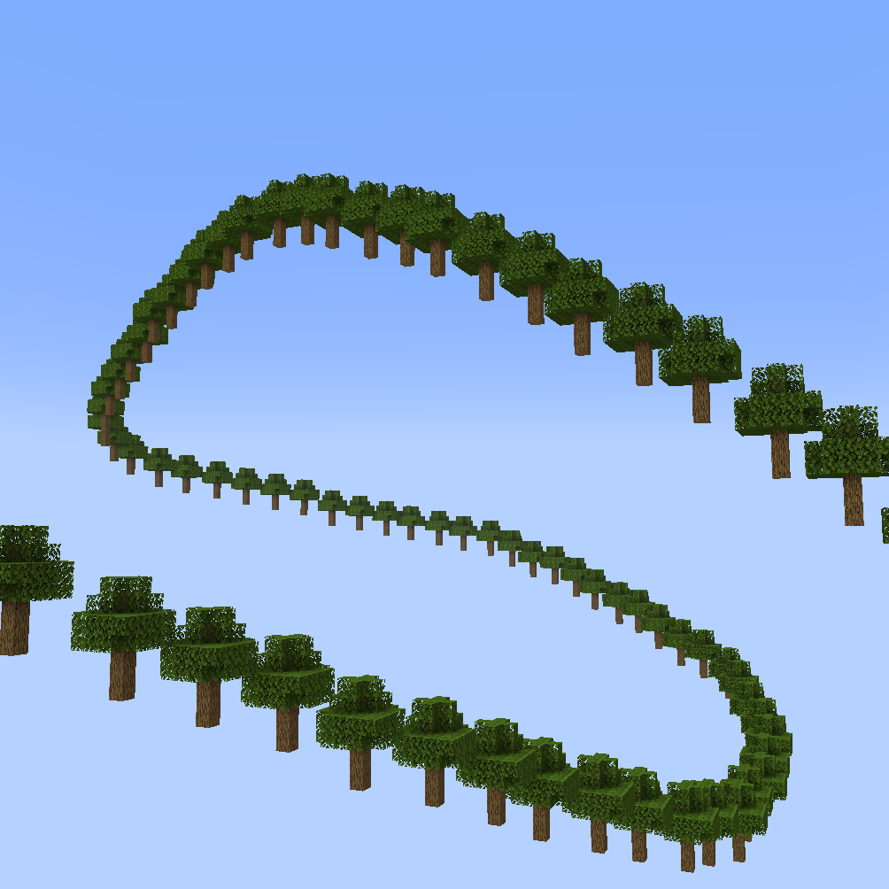
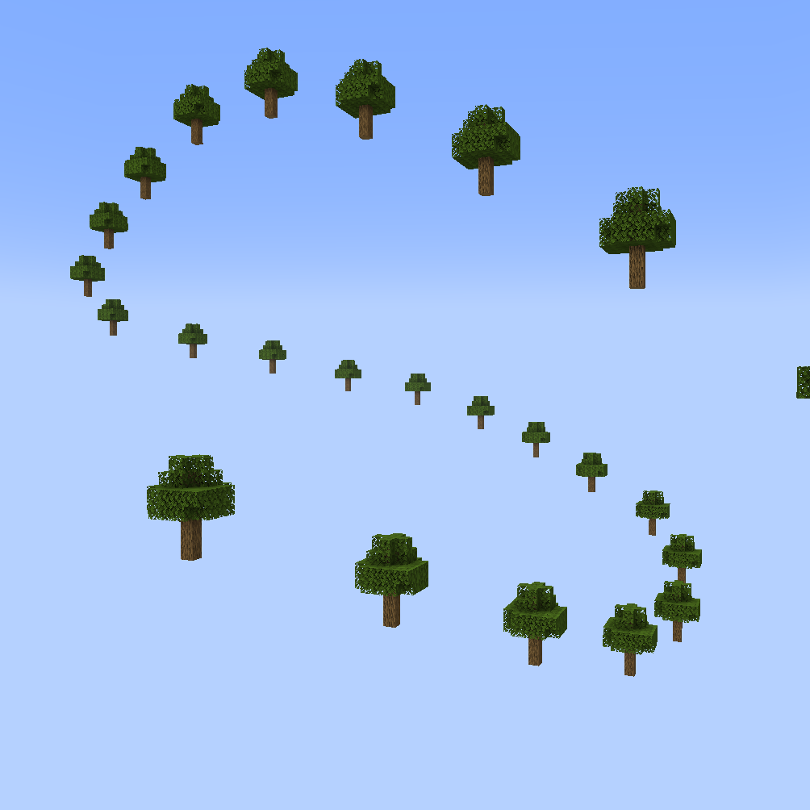
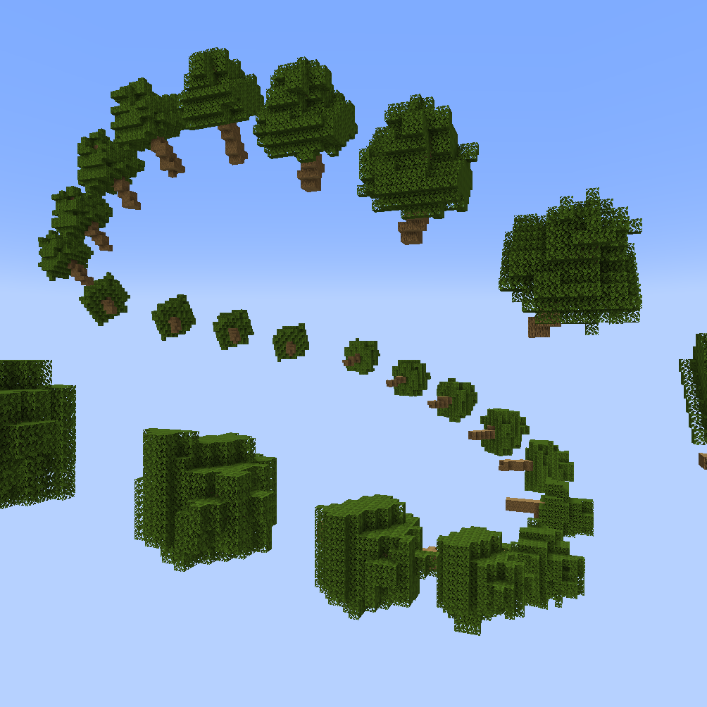
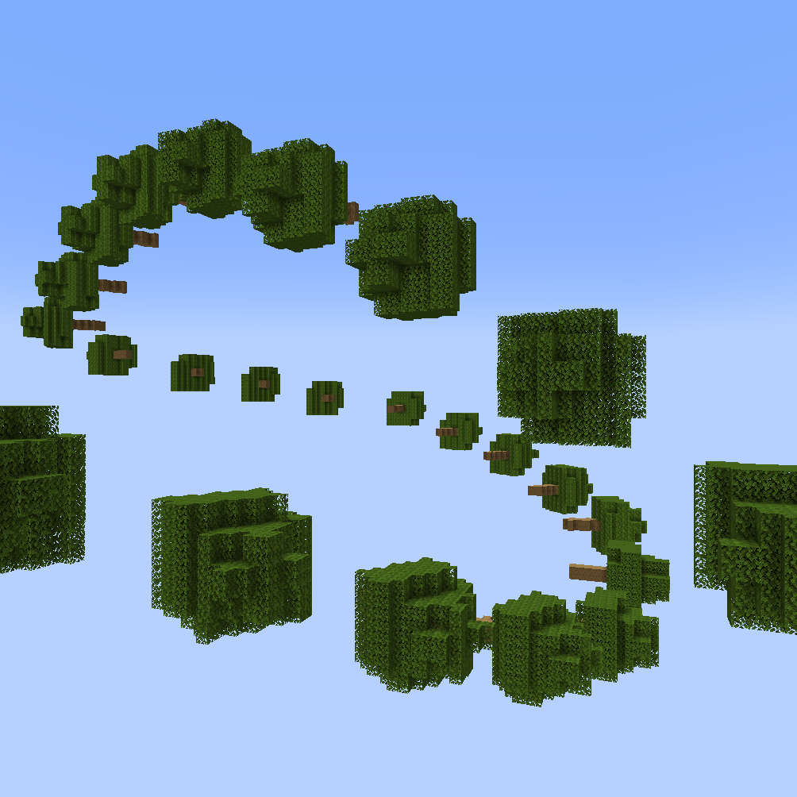
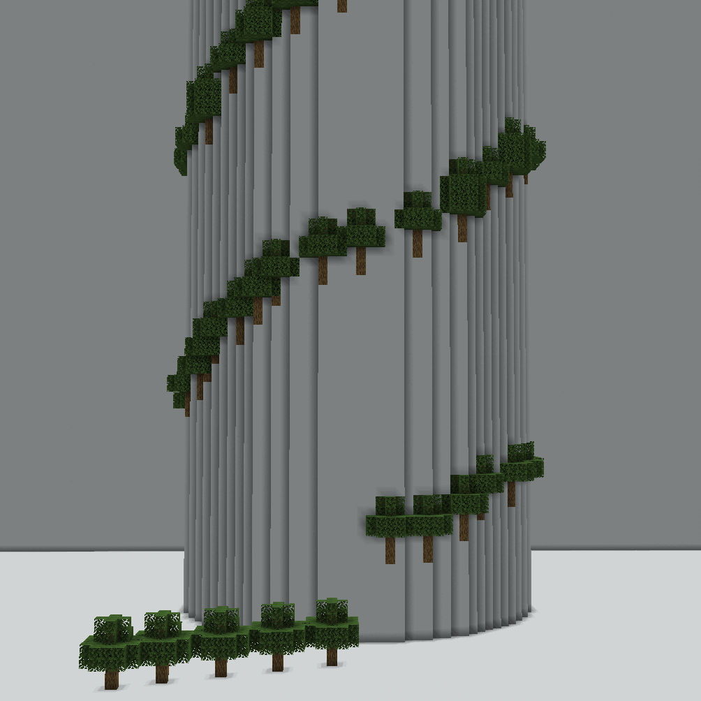

# Array Parameters

`//ezarray` and `//ezbrush array` place multiple shapes along a path. The following parameters apply to these commands:

***

### Distance: <mark style="color:orange;">`-g <gap>`</mark>

Control how close all placements are by defining the gap distance between each placement.

Defaults to 0. Meaning, in a straight line each placement comes right after another with no gap.

Positive values will increase that distance and place fewer structures in total.

Negative values cause the placements to overlap.

> #### Examples
>
> Ex. command: `//ezarray Clipboard`` `**`-g <gap>`** (with the clipboard being a default vanilla oak tree for no particular reason)
>
>
>
> `//ezar Cl`` `**`-g 0`** : (default value, placements are right next to each other)
>
> 
>
>
>
> `//ezar Cl`` `**`-g 10`** : (placements are now further apart)
>
> 
>
>
>
> `//ezar Cl`` `**`-g -3`** (negative values cause placements to overlap)
>
> 

***

### Progressive Scaling: <mark style="color:orange;">`-q <radii>`</mark>

Similar to Random Scaling, this modifier allows scaling of the placements using relative values, e.g. 1 keeps the scale as is, 2 means doubling the size, and 0.5 halfs the size.

The scaling factors are defined as a progression along the spline. Meaning you may specify as many comma-separated scaling factors as you like, and the spline path will smoothly interpolate through all entries.

Advanced Tip: You may prepend each entry with a position between 0 and 1 to specify at what part of the spline a radius should be reached. `-q 0:1,0.8:3,1:1` means start and end with radius 1 (`0:1` & `1:1`), but "keyframe" a radius of 3 at 80% of the spline path (`0.8:3`). (If no positions are given then equally distant positions are chosen.)

> #### Examples
>
> Ex. command: `//ezarray Clipboard`` `**`-q <radii>`**
>
> `//ezar Cl`` `**`-q 1`**&#x20;
>
> (default value, no scaling applied)
>
> 
>
>
>
> `//ezar Cl`` `**`-q 0.3,3`**&#x20;
>
> (placements are down-scaled by a factor of 0.3 at the beginning of the path and slowly get bigger up to triple their original size towards the end of the spline path)
>
> 
>
>
>
> `//ezar Cl`` `**`-q 1.5,0.5,5.0,2.0,0.2`**&#x20;
>
> (Tree is being scaled progressively through all given values throughout the spline path)
>
> 
>
>
>
> `//ezar Cl`` `**`-q 1.5,0.5,5.0,2.0,0.2 -o 0.7,1.3`**&#x20;
>
> (Combining progressive scaling -q with [random scaling](placement-parameters.md#random-scaling-o-less-than-sizemultiplierrange-greater-than) -o)
>
> 
>
>

***

### Path Parameters: <mark style="color:orange;">`-p <kbParameters>`</mark>

Modifies how the path is created from the input (convex selection) points. See [#kochanek-bartel-parameters-p-less-than-kbparameters-greater-than](../spline/common-parameters.md#kochanek-bartel-parameters-p-less-than-kbparameters-greater-than "mention")

***

### Spline orientation: <mark style="color:orange;">`-n <normalMode>`</mark>

Modifies how the ORTHOGONAL option for the `<primary>` and `<secondary>` arguments behave. See [#spline-normal-mode-n-less-than-normalmode-greater-than](../spline/common-parameters.md#spline-normal-mode-n-less-than-normalmode-greater-than "mention")

> #### Examples
>
> Ex. command: `//ezarray Clipboard Orthogonal Constant`**`-n <normalMode>`**
>
> `//ezar Cl O C`` `**`-n CONSISTENT`**&#x20;
>
> (default value)
>
> 
>
>
>
> `//ezar Cl O C`` `**`-n UPRIGHT`**&#x20;
>
> (placements are not as tilted anymore)
>
> 

***

### Snap placements to surfaces: <mark style="color:orange;">`-b`</mark>

By default, structures are placed along the spline path that's induced by the input (convex selection) points. This flag moves the placement positions to the nearest surface block instead, in case the position on the path is in midair or submerged in blocks.

> #### Example
>
> GIF comparing
>
> `//ezarray Clipboard` (placements are placed along path)
>
> `//ezarray Clipboard`` `**`-b`** (placements positions moved to nearest surface block)
>
> 

***
