# Available Structures

In the context of ezEdits, we call an arrangement of blocks in 3D space a "structure". Each of the above-mentioned commands requires the user to provide a `<structure>` argument.

Currently available structures are:

<mark style="color:blue;"><strong>Clipboard (Cl)</strong></mark>

A structure based on your current WorldEdit Clipboard (//copy).

Syntax: <mark style="color:orange;">`Clipboard`</mark>

Abbr.: <mark style="color:orange;">`Cl`</mark>

Options:

* <mark style="color:blue;">**Origin (O)**</mark>. Defaults to INHERENT.
  * INHERENT (I) will use the position it was copied at
  * CENTER (C) will use the geometric center of the clipboard
* <mark style="color:blue;">**PasteMethod (PM**</mark><mark style="color:blue;">)</mark>. Defaults to FAST. See [#comparison-between-fast-and-smooth-pastemethod](available-structures.md#comparison-between-fast-and-smooth-pastemethod "mention")
  * FAST (fast): Default unaltered pasting of clipboards, like //paste
  * SMOOTHED (smooth): Applies interpolation when the placement cannot be matched into the world grid, e.g. when placing with a 45° rotated orientation. Has a slightly more smoothed look to it, which may preferred for freely rotated placements.
  * See [#comparison-between-fast-and-smooth-pastemethod](available-structures.md#comparison-between-fast-and-smooth-pastemethod "mention")

- Example: <mark style="color:orange;">`Clipboard(Origin:INHERENT,PasteMethod:SMOOTHED)`</mark> <mark style="color:orange;"></mark><mark style="color:orange;">or</mark> <mark style="color:orange;"></mark><mark style="color:orange;">`Cl(O:I,PM:smooth)`</mark>

<mark style="color:blue;"><strong>Schematic (Sc)</strong></mark>

A structure based on a schematic file.

Syntax: <mark style="color:orange;">`Schematic(Filename:<name>,...)`</mark>

Abbr.: <mark style="color:orange;">`Sc(N:<name>,...)`</mark>

Mandatory parameters:

* <mark style="color:orange;">**Filename (N)**</mark>. The filename of the schematic you want to place.

Options:

* <mark style="color:blue;">**Format (F)**</mark>. Format of the schematic file. Defaults to sponge.3 (or FAWE's fast if you're using FAWE). The default value should work for the majority of cases.
* <mark style="color:blue;">**Origin (O)**</mark>. Defaults to INHERENT.
  * INHERENT (I) will use the position it was copied at.
  * CENTER (C) will use the center of the clipboard's region as the origin instead.
* <mark style="color:blue;">**PasteMethod (PM**</mark><mark style="color:blue;">)</mark>. Defaults to FAST.&#x20;
  * FAST (fast): Default unaltered pasting of clipboards, like //paste
  * SMOOTHED (smooth): Applies interpolation when the placement cannot be matched into the world grid, e.g. when placing with a 45° rotated orientation. Has a slightly more smoothed look to it, which may preferred for freely rotated placements.
  * See  [#comparison-between-fast-and-smooth-pastemethod](available-structures.md#comparison-between-fast-and-smooth-pastemethod "mention")&#x20;

<mark style="color:blue;"><strong>Shape (Sh)</strong></mark>

An expression-based shape. EzEdits provides plenty of predefined ones. Material defined by a pattern.

Syntax: <mark style="color:orange;">`Shape(Shape:<shape>,Pattern:<pattern>)`</mark>

Abbr.: <mark style="color:orange;">`Sh(S:<shape>,P:<pattern>)`</mark>

Mandatory Parameters:

* <mark style="color:orange;">**`Shape`**</mark> (<mark style="color:orange;">**`S`**</mark>). Well, defines the shape of the Shape structure. Additional parameters are given within the parenthesis after. Available shapes are:
  * `Cone`
    * 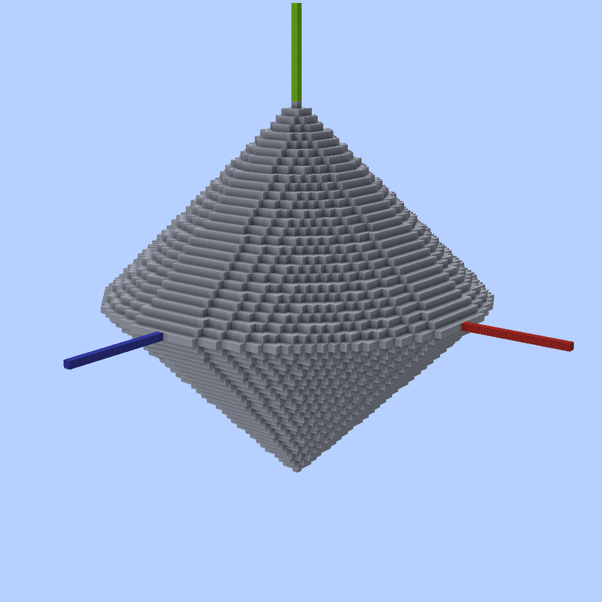
  * `Crystal([Sides:<sides>],[Extrusion:<value>])`&#x20;
    * 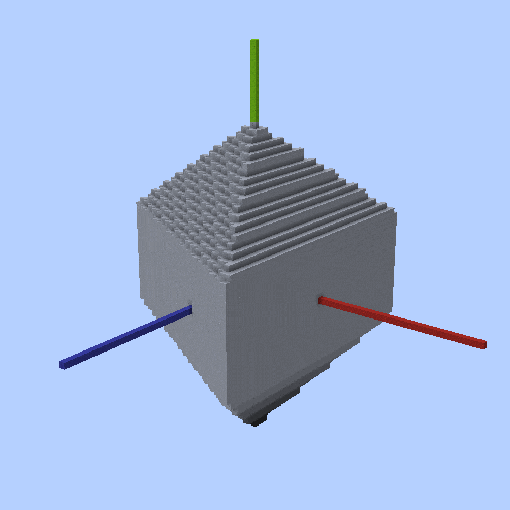
  * `Cuboid`
    * 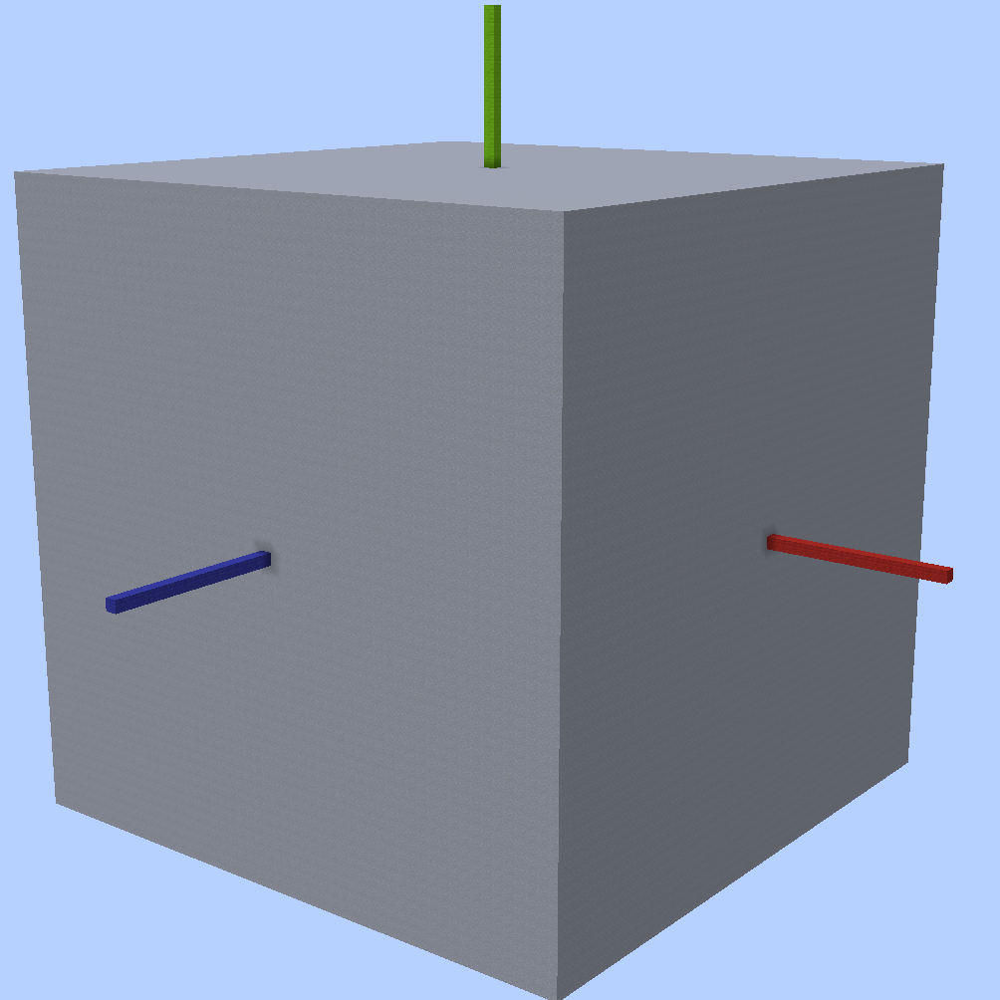
  * `Curl`
    * 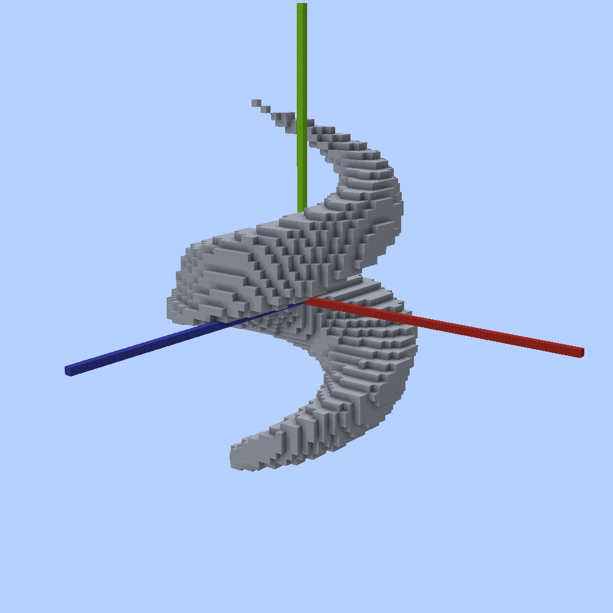
  * `Cylinder`
    * 
  * `Ellipsoid`
    * 
  * `Fur`
    * 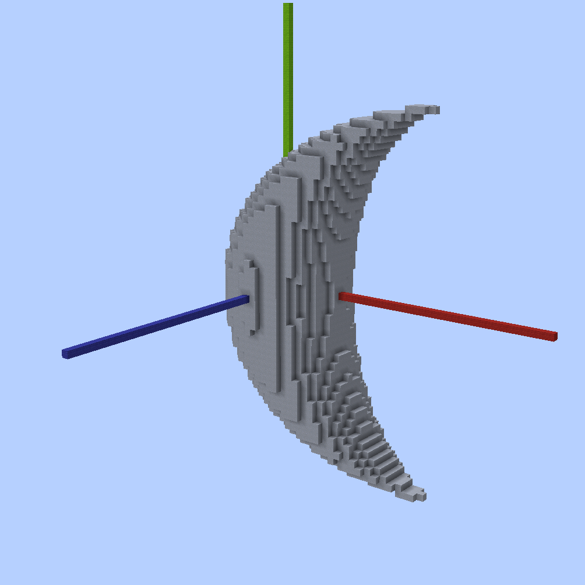
  * `Heart`
    * 
  * `Jellybean`
    * 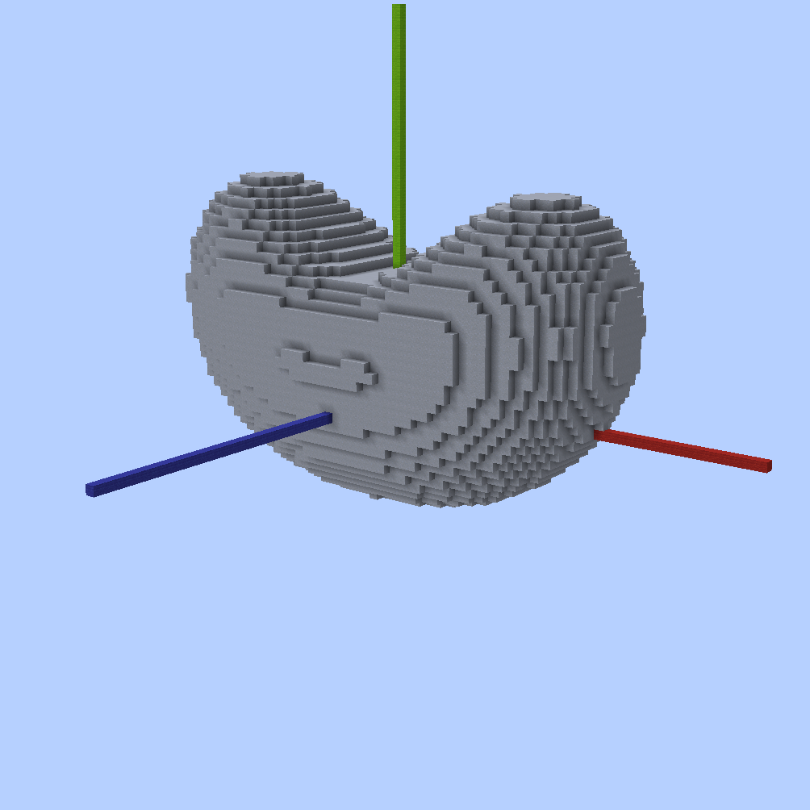
  * `Leaf`
    * 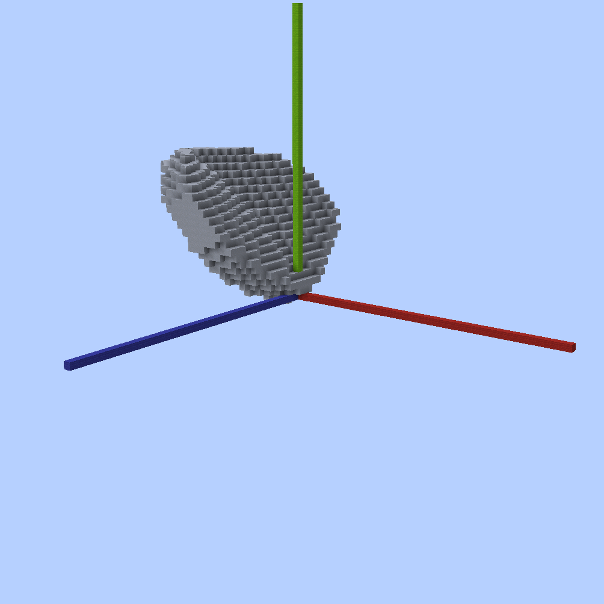
  * `Lemon`
    * 
  * `Onion`
    * 
  * `Polygon([Sides:<sides>])`
    * 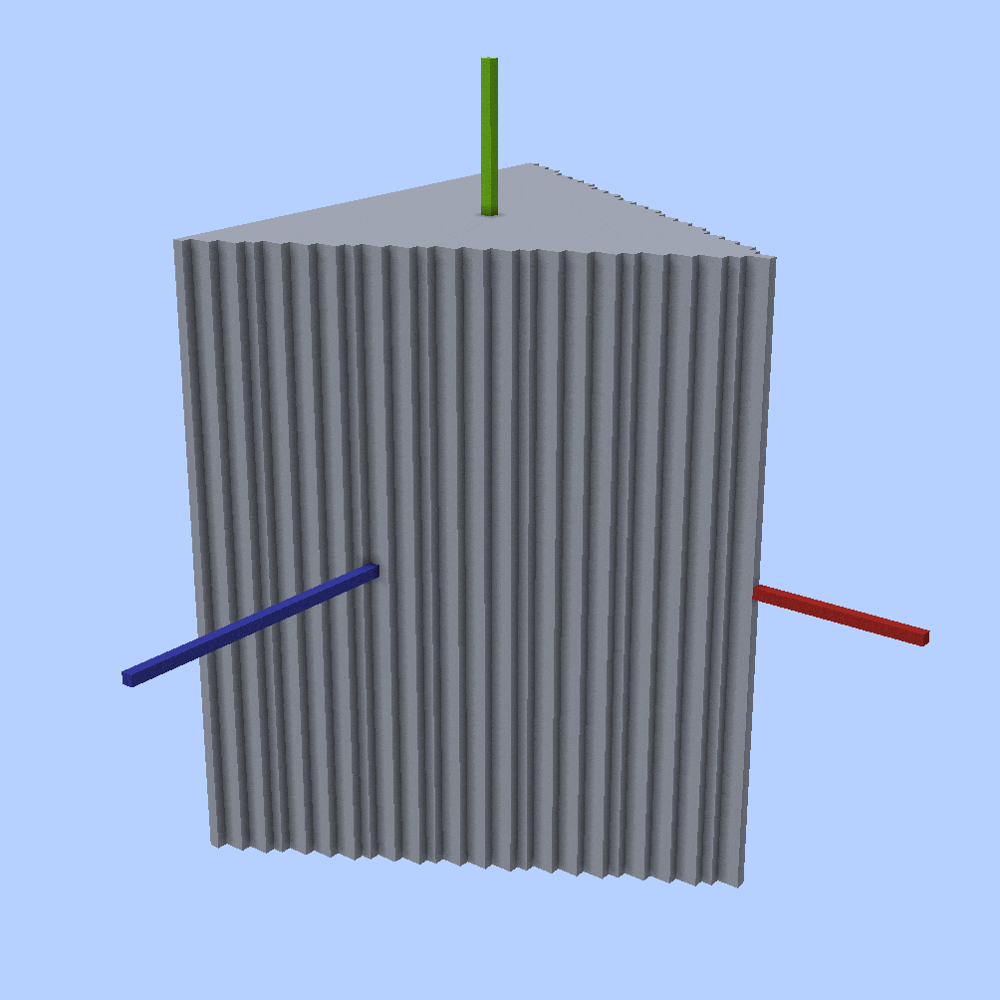
  * `Pyramid([Sides:<sides>])`
    * 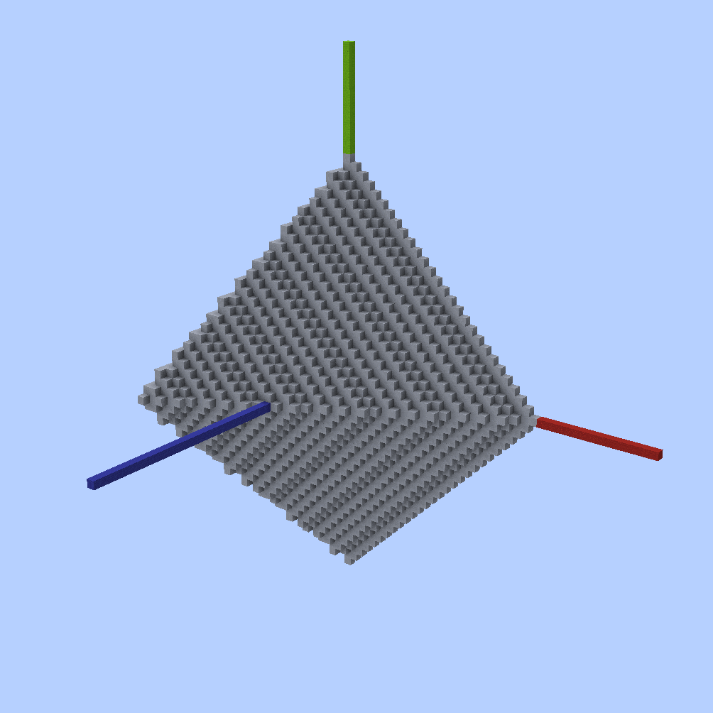
  * `Supersphere(Exponent:<exponent>)`
    * 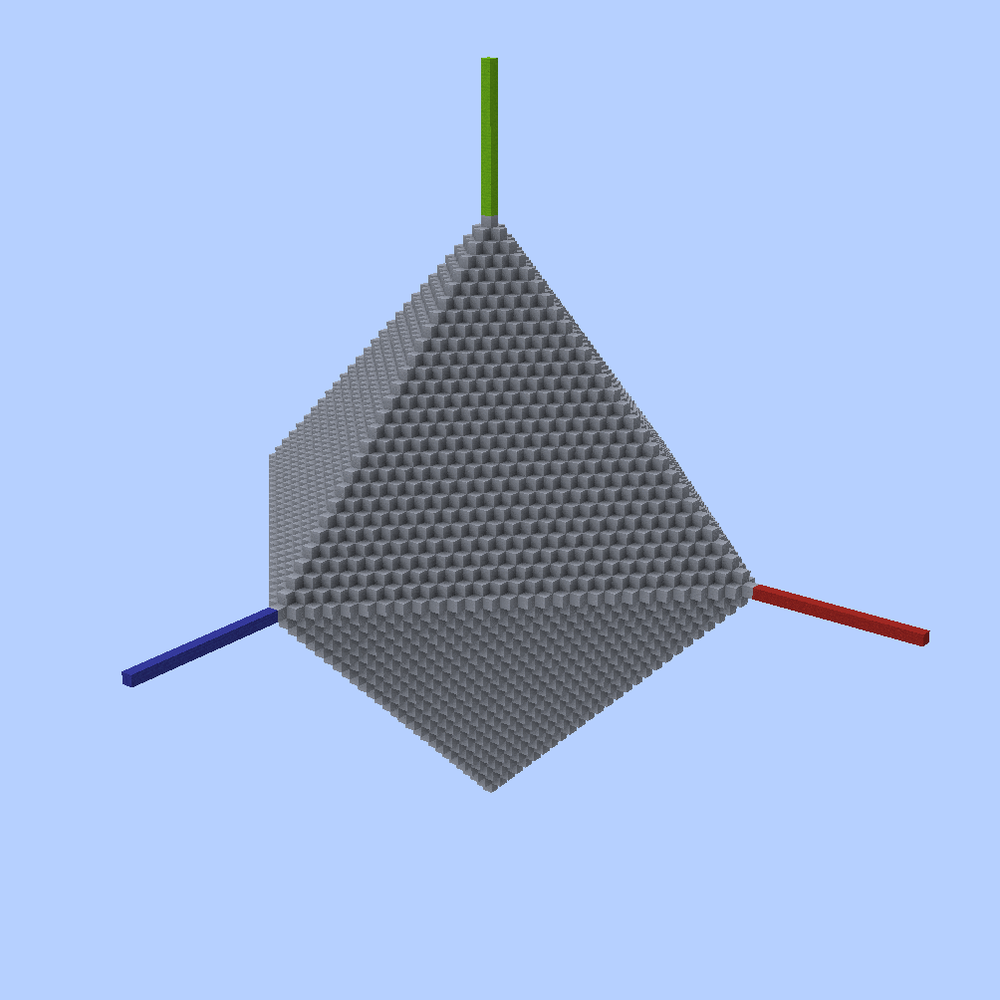
  * `Tetrahedron`
    * 
  * `Torus(Thickness:<value>)`
    * 
  * `=<expression>`
    * In addition to predefined shapes, you can also define your own shape with a WorldEdit expression.
    * For example, this expression will create spirals:\
      <mark style="color:blue;">`Shape(S:`</mark><mark style="color:blue;">**`=x+=sin(2*pi*y)/2;z+=cos(2*pi*y)/2;x*x+z*z<0.3^2`**</mark><mark style="color:blue;">`,P:clay)`</mark>
* <mark style="color:orange;">**`Pattern`**</mark> (<mark style="color:orange;">**`P`**</mark>). The pattern which the shape should be made of.
  * Note: Commas `,` being part of the argument breaks the input parser. If you want to use a pattern that uses commas then you need to put your Pattern argument in quotes: E.g. <mark style="color:blue;">`Sh(S:Cone,Pattern:`</mark><mark style="color:blue;">**`"dirt,diamond_block"`**</mark><mark style="color:blue;">`)`</mark>

<mark style="color:blue;"><strong>Expression (Ex)</strong></mark>

An expression-based shape. One expression defines both the shape and the texturing.

Syntax: <mark style="color:orange;">`Expression(Expression:=<expression>,Palette:<palette>)`</mark>

Abbr.: <mark style="color:orange;">`Ex(E:=<expression>,P:<palette>)`</mark>

Mandatory Parameters:

* <mark style="color:orange;">**Expression (E)**</mark>. Input variables are `x`, `y`, and `z`, all between \[-1,1]. `x=0`,`y=0`,`z=0` is the origin of the structure.
  * If the expression f(x,y,z) evaluates as _f_≤_0_, 0 or negative, then the position will be air.
  * If it evaluates as _1>f>0_, between 0 and 1, then the according palette block is placed.&#x20;
  * Otherwise, any value 1 or larger will place the last palette block.
*   <mark style="color:orange;">**Palette (P)**</mark>. The set of blocks of which the structure should be made of.

    * Note: Commas `,` being part of the argument breaks the input parser. If you want to use a palette that uses commas then you need to put your Palette argument in quotes: E.g. `Ex(E:=y*.5+.5,Palette:`**`"##GlowOrange,-##GlowPurple"`**`)`

<mark style="color:blue;"><strong>TexturedShape (TS)</strong></mark>

An expression-based shape with an expression-based texturing. The Shape parameter defines its shape. The Palette and Texturing-Shape parameters define its material.

Syntax: <mark style="color:orange;">`TexturedShape(Shape:<shape>,TexturingShape:<shape>,Palette:<palette>)`</mark>

Abbr.: <mark style="color:orange;">`TS(S:<shape>,T:<shape>,P:<palette>)`</mark>

Mandatory Parameters:

* <mark style="color:orange;">**Shape (S)**</mark>. See [Shape Structure](available-structures.md#shape-sh).
* <mark style="color:orange;">**TexturingShape (T)**</mark>. Defines which parts of the shape are painted with which blocks of the palette. Accepts a shape, just like the Shape Parameter.
*   <mark style="color:orange;">**Palette (P)**</mark><mark style="color:orange;">.</mark>  The set of blocks of which the shape should be made of.

    * Note: Commas `,` being part of the argument breaks the input parser. If you want to use a palette that uses commas then you need to put your Palette argument in quotes: E.g. `TS(S:Cone,T:=y*.5+.5;Palette:`**`"dirt,diamond_block"`**`)`

***

### Comparison between FAST and SMOOTH PasteMethod:

<mark style="color:blue;">&#x3C;-   Click me</mark>

Let's say this is our clipboard or our schematic:

* 

Here's how it would look pasted at an odd angle when using

* `PasteMethod:FAST`
  * 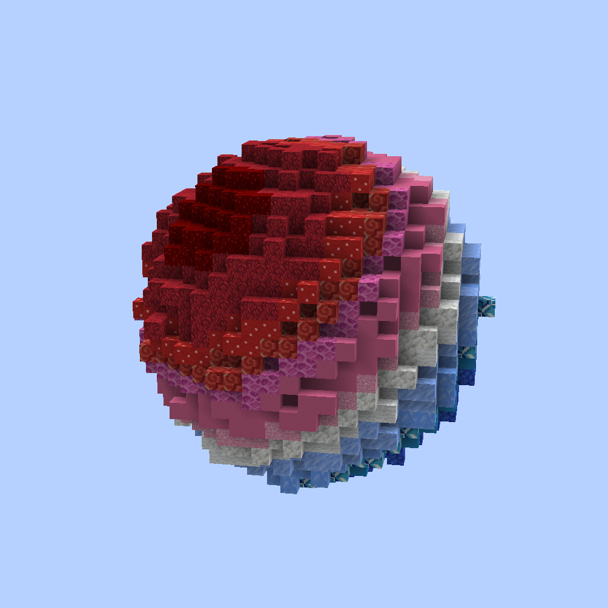
* vs `PasteMethod:SMOOTHED`
  * 

Or when pasted a significantly larger size:

* `PasteMethod:FAST`
  * 
* vs `PasteMethod:SMOOTHED`
  * 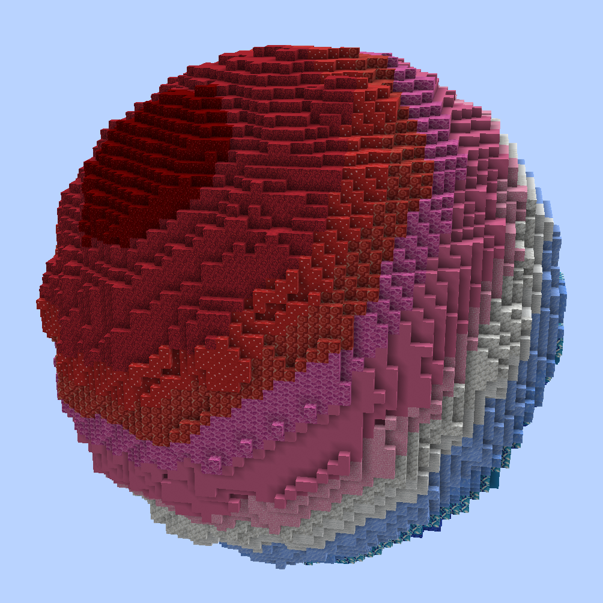

There's also an additional parameter to the SMOOTHED PasteMethod: The `FillBias`. It allows you to specify whether the tool should try to place _more_ blocks or try to place _less_ blocks. This could be particularly helpful for e.g., particularly thin structures.

Let's say this is our clipboard/schematic now.

* A curved one-block thick sheet:
  * 

Here's how _it_ would look pasted at an odd angle when using `//paste` or

* `PasteMethod:FAST`
  * 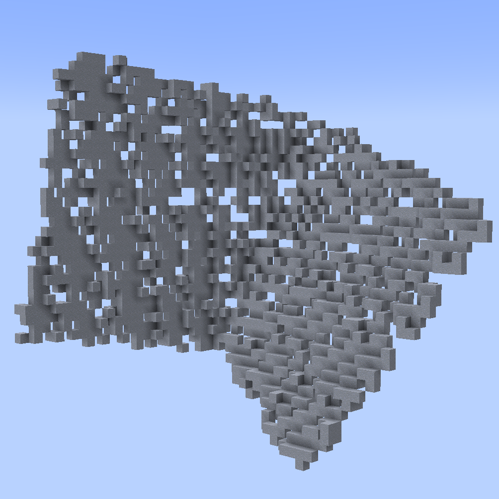
* compared to `PasteMethod:SMOOTHED`&#x20;
  * 
* compared to `PasteMethod:SMOOTHED,FillBias:3` (default FillBias is 1.0)
  * 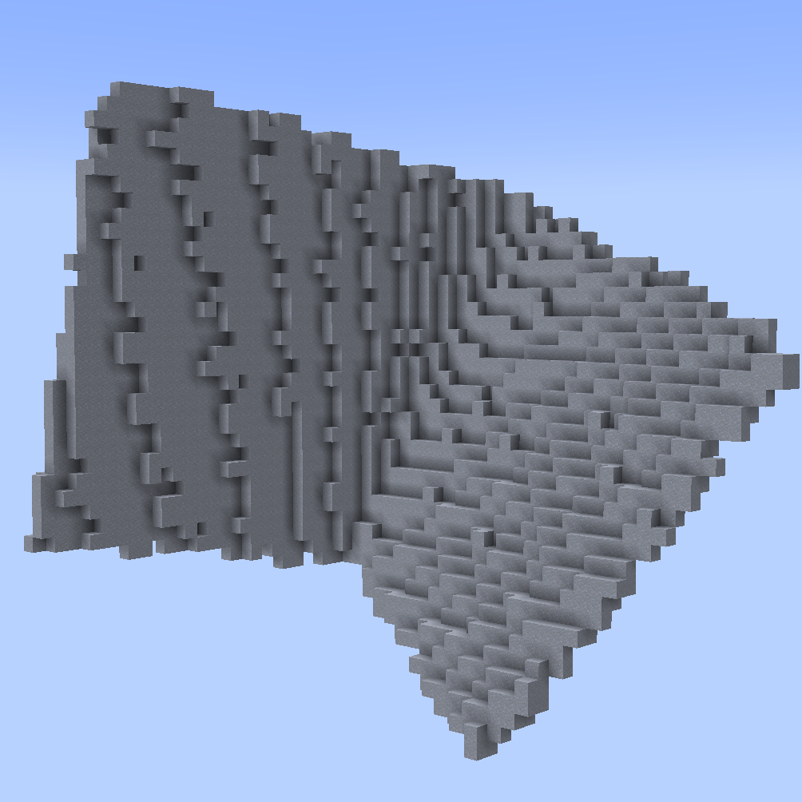
* compared to a GIF going from `Fillbias:`**`0.25`** up to `Fillbias:`**`3.0`**
  * 

