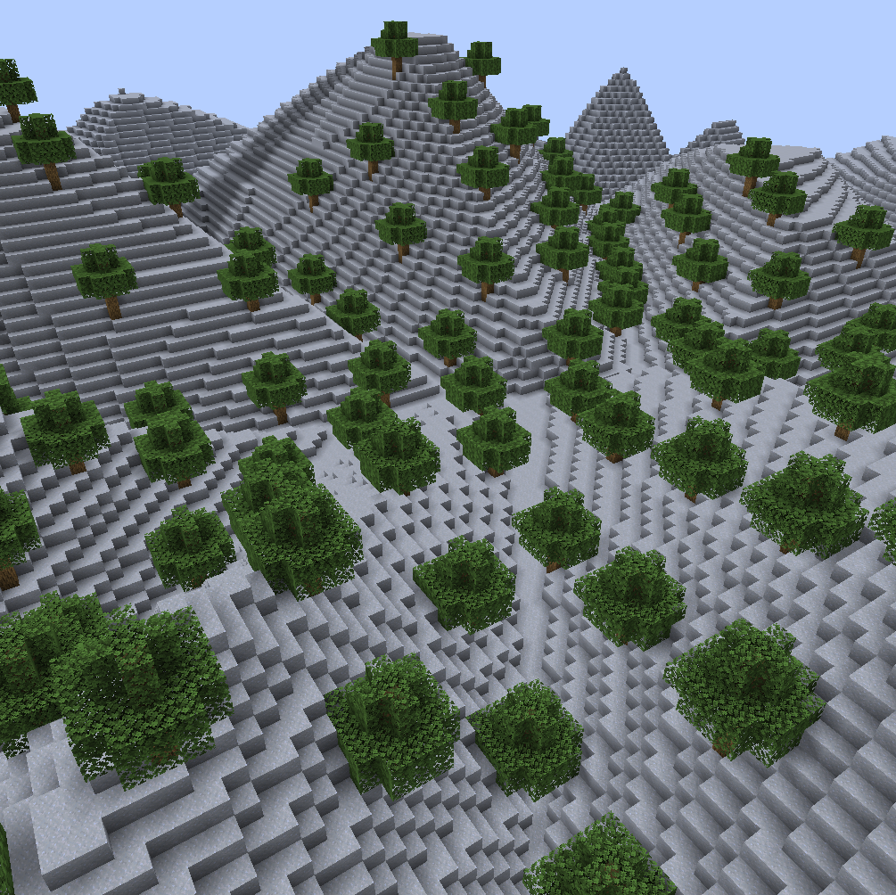
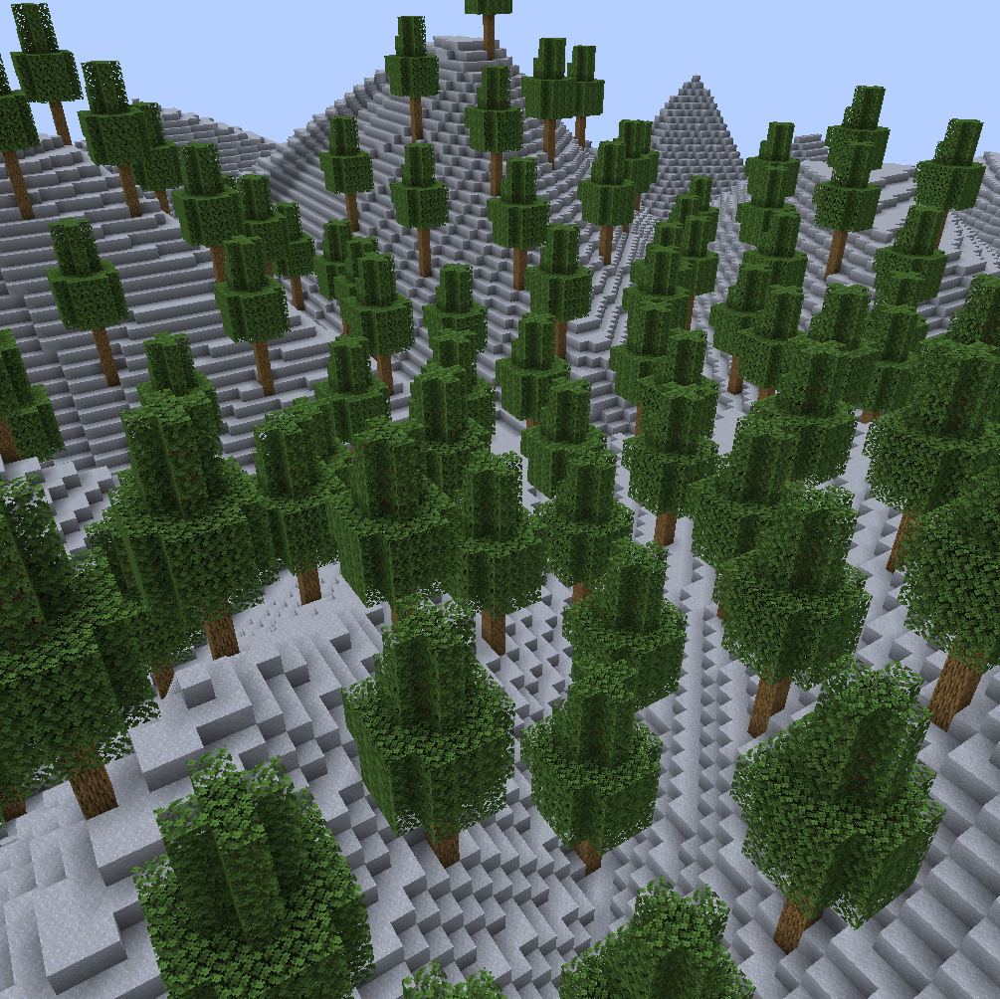
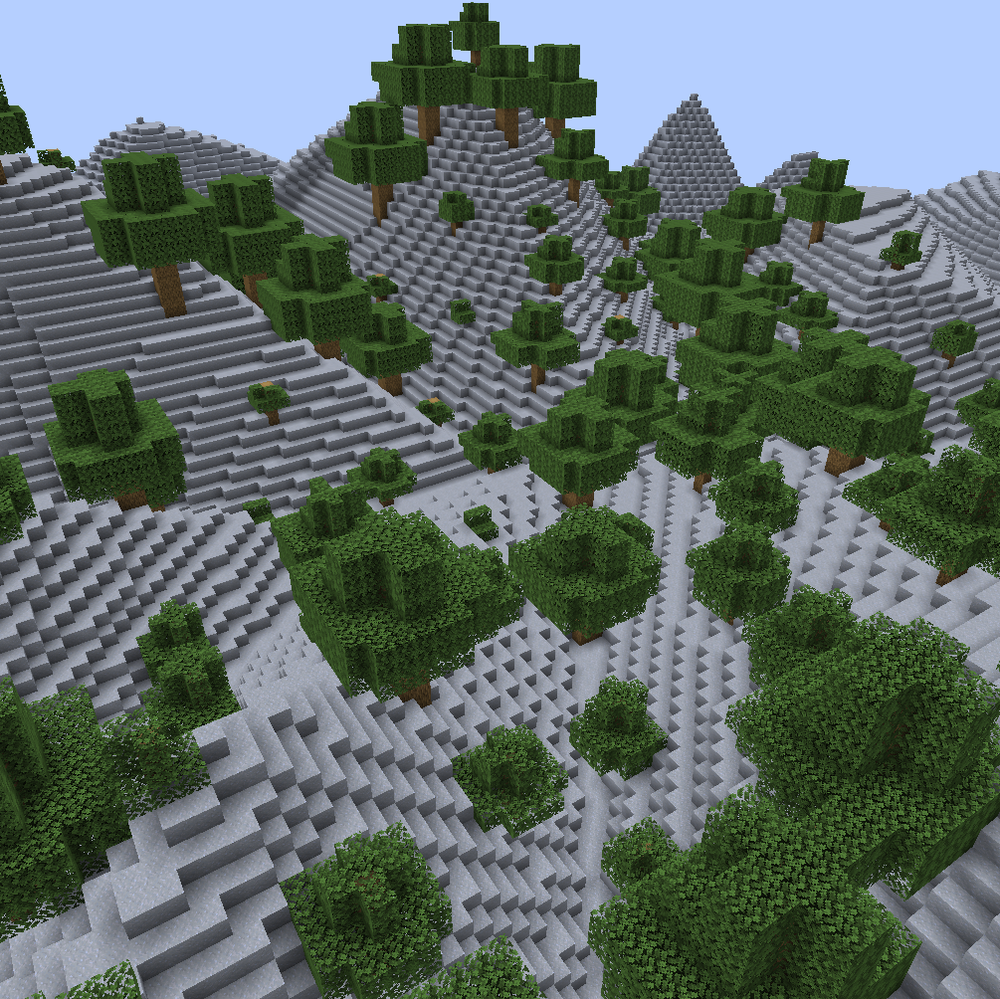
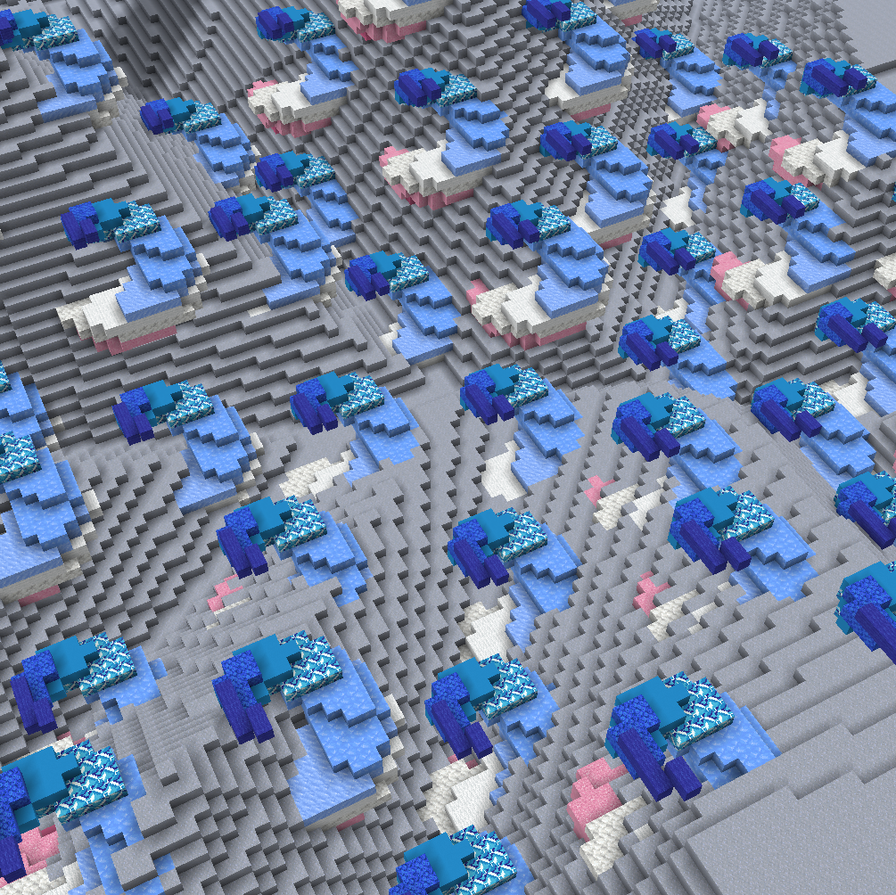
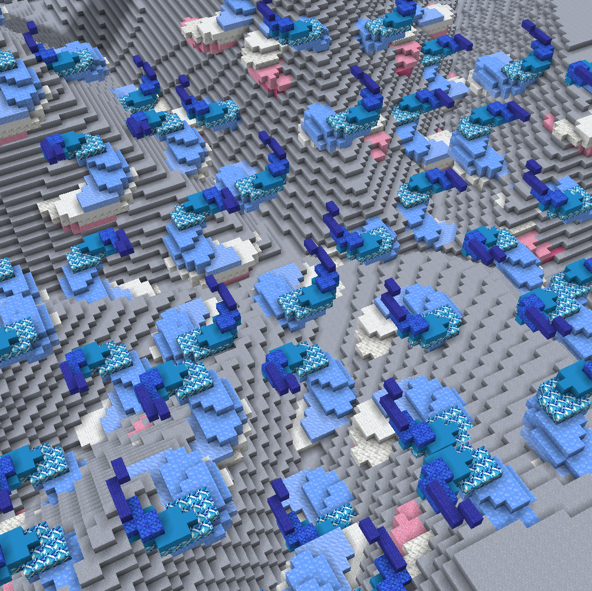
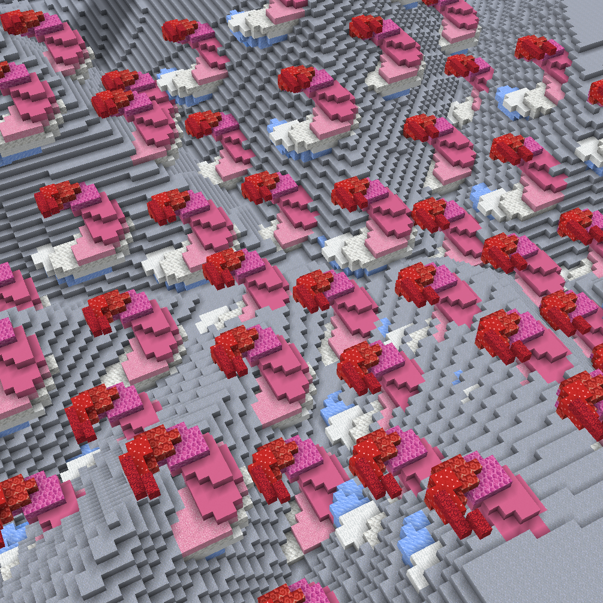
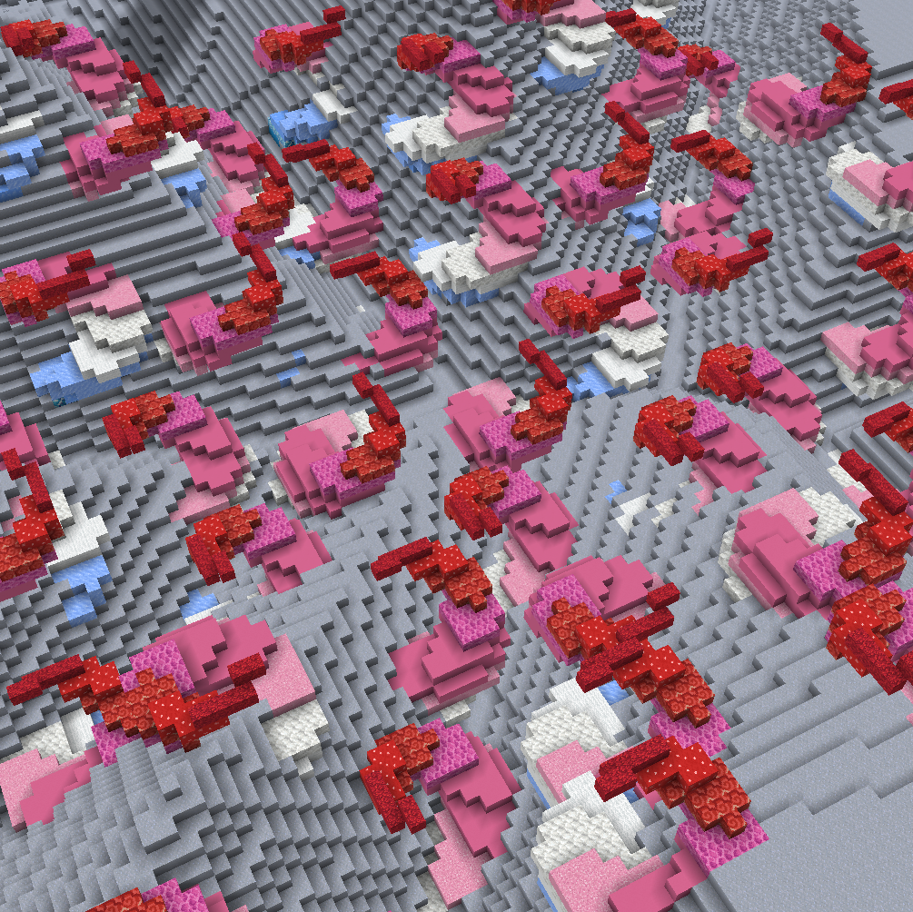

# Placement Parameters

Whenever a structure is placed, it goes through the following pipeline (in that order):

* [Applying Dimensions](placement-parameters.md#controlling-dimensions-s-less-than-dimensions-greater-than) (`-s`)
* [Random Scaling](placement-parameters.md#random-scaling-o-less-than-sizemultiplierrange-greater-than) (`-t`)
* [Orientation](placement-parameters.md#orientation-advanced-k-less-than-orientationaxis-greater-than-and-c-less-than-orientationangle-great) (`-c` and `-k`)
* [Random Flips](placement-parameters.md#random-flips-f-less-than-randomflipsaxes-greater-than) (`-f`)
* [Random 90° Rotations](placement-parameters.md#random-90-rotations-r-less-than-randomrotationaxis-greater-than) (`-r`)
* [**Alignment**](primary+secondary-alignment.md) (`<primary>` and `<secondary>`)

ezEdits lets you fully customize this pipeline. In brackets are the flags and arguments that apply changes to each step respectively.

***

### Controlling Dimensions: `-s <dimensions>`

The dimensions define the size of a structure placement, by setting its bounding box size.


The flag `-s <dimensions>` sets the desired absolute base dimensions of the placement (overriding the default values).


By default, expression-based structures have dimensions `20,20,20`, while Schematic/Clipboard structures are placed with their inherent original dimensions.

Note: The structure might appear stretched or compressed depending on your choice of values.

> For example, if your clipboard is inherently of size 5x7x5, then setting the dimensions as `-s 5,14,5` will stretch out the structure placement along its y-axis:
>
> First image: `//ezsc Clipboard -s 5,7,5` (original clipboard size)
>
> Second image: `//ezsc Clipboard -s 5,14,5`
>
> 
>
> 

***

### Random Scaling: `-o <sizeMultiplierRange>`

Most of the structure commands place multiple structure placements at once. To give a bit of variety you can apply some random scaling for each placement.


The `-o <sizeMultiplierRange>` applies random scaling for each placement. You specify a range of values. A random number from this range is chosen as the scaling factor for each placement.


By default, the range is `1,1`, meaning the scaling factor is always 1, and thus, does nothing.

> **Example**
>
> By setting the range as `-o 0.5,2.0` we get placements of e.g. our clipboard at random sizes between half the desired size and double the desired size,
>
> `//ezsc Clipboard -o 0.5,2.0`
>
> 
>
> (Same tree clipboard at various different sizes)

***

### Random Flips: `-f <randomFlipsAxes>`


The `-f <randomFlipsAxes>` flag enables random flipping of the structure across any of the axes for each placement.


Available values are:

* None (default)
* X
* Y
* Z
* XY
* XZ
* YZ
* XYZ

Flips are applied after orientation but before alignment.

> **Example**
>
> First Image: `//ezsc Clipboard` (no random flips)
>
> Second Image: `//ezsc Clipboard -f XZ` (random mirrors along x- and z-axis, but not y)
>
> 
>
> 

***

### Random 90°-Rotations: `-r <randomRotationAxis>`


The `-r <randomRotationAxis>` flag enables random 90° rotation of the structure across either of the axes for each placement.


Available values are:

* X
* Y
* Z

By default, this parameter is not set to anything, i.e. random rotations are disabled.

90°-rotations are applied after orientation but before alignment.

> **Example**
>
> First Image: `//ezsc Clipboard` (no random rotations)
>
> Second Image: `//ezsc Clipboard -r Y` (random 90°-rotations around the y-axis)
>
> 
>
> 

***

### Orientation (advanced): `-k <orientationAxis>` and `-c <orientationAngle>`

Setting an orientation means defining which internal coordinate system the structure has. That coordinate system is then used in the random flips/rotations and during alignment. _Defining an orientation is "defining which way is up and which way is forward"_

Orientation is set by a rotation axis (`-k <direction>`) and a rotation angle (`-c <angle>`). _The rotation works identically to `//ezd rotate`_

By default, the rotation axis `-k` is `y` or `up` and the rotation angle `-c` is `0`, which means no rotation.

For example, if you set the rotation axis to `-k x` and the rotation angle to `-c 90` then your structure is rotated to the side. Its Eastern side will now be its top side and so on.

***

### Place Air: `-a`

By default, if this flag _is not_ set, air blocks are skipped when placing a structure. When this flag _is_ set, air blocks within the structure are able to override existing blocks.

(Note: This behaviour is opposite to `//paste`'s `-a` flag. It may be confusing, but we think it's more convenient for our commands.)
