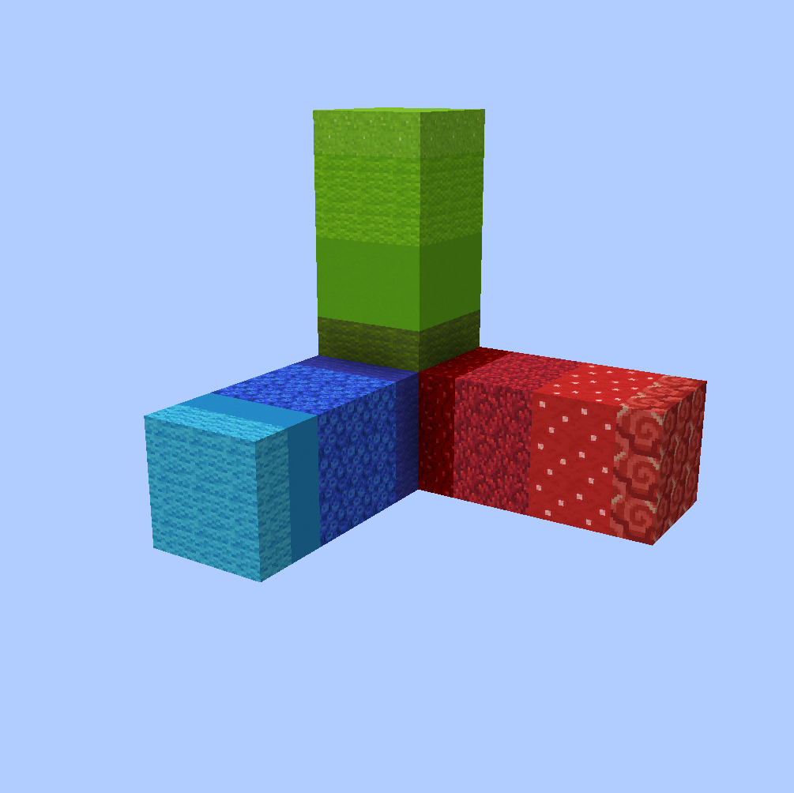
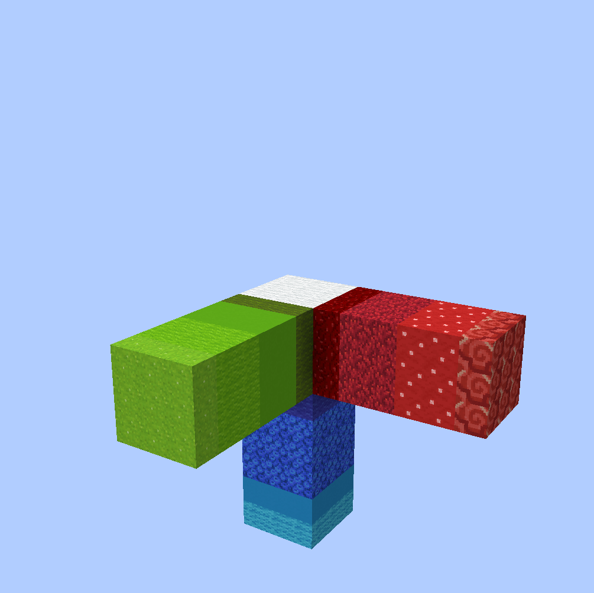
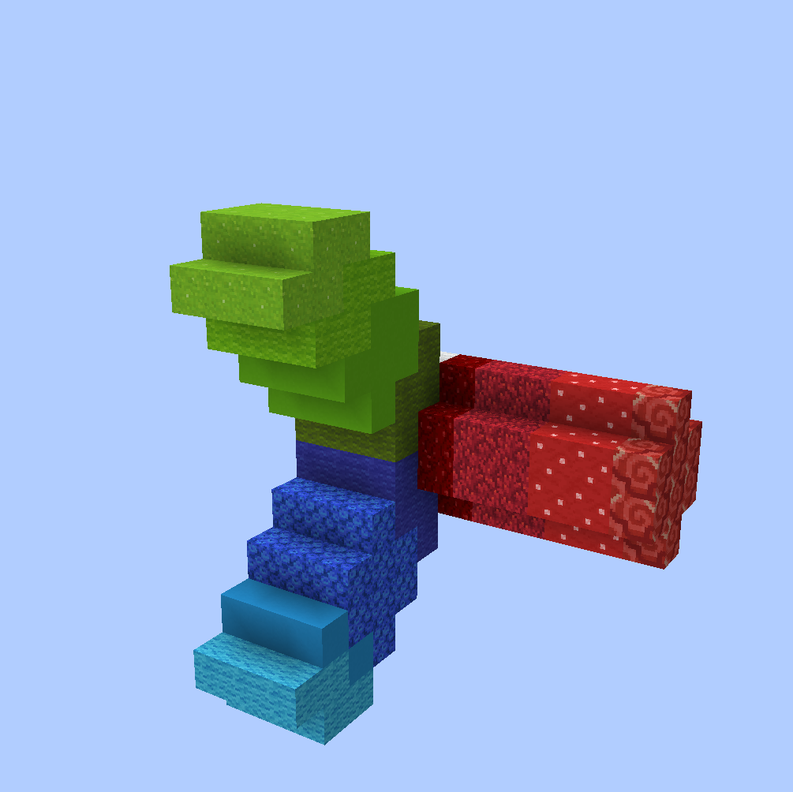
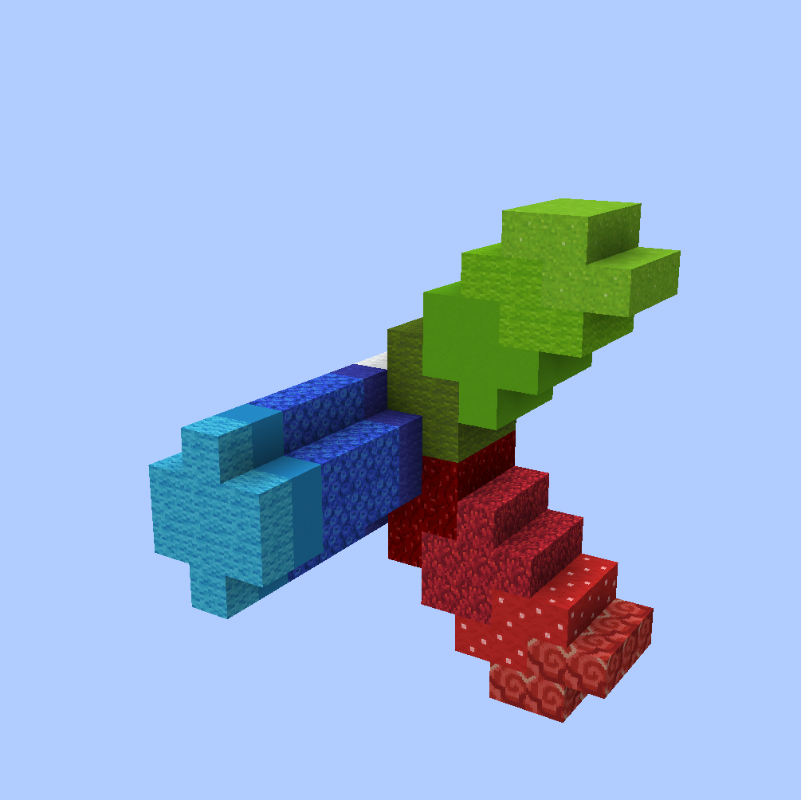
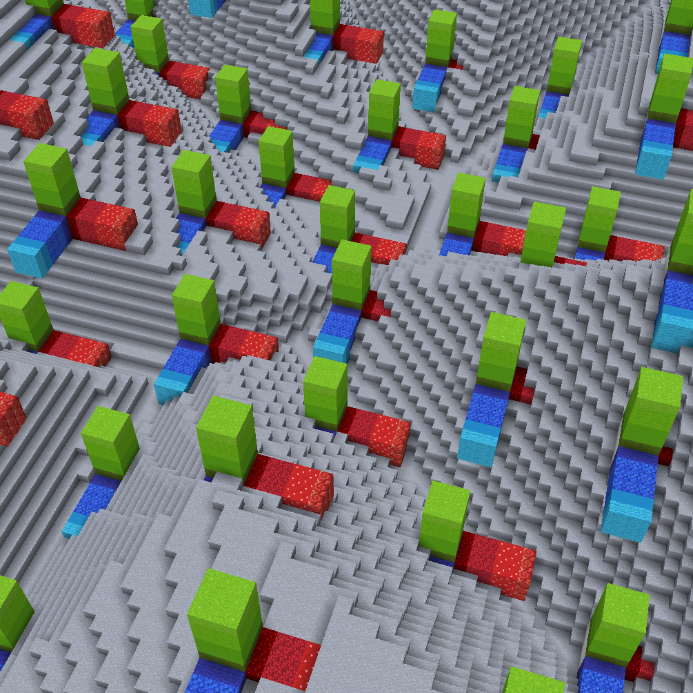

# Primary+Secondary Alignment

Alignment defines the orientation at which the structure is placed.

## Explanation

Every structure has an intrinsic "up" direction and an intrinsic "forward" direction. By default, structures are placed with their up direction facing, well, up (+y), and with their forward direction facing forward (+x) ("default" meaning setting both to just `Constant`).

The most important thing is now: You can define how a structure is placed by defining where its up direction should face and where its forward direction should face (aka. aligning its internal coordinate system).

We let the user define the alignment using two directions:


The `<primary>` direction defines the placement's +y direction.

The `<secondary>` direction together with the primary direction imply the placement's +x direction.


More in-depth explanation using examples:

Let's say this is our build that we want to place, by for example having it as our current WorldEdit clipboard.

For reference, the red beam is facing towards positive x (east), the blue beam is facing towards positive z (south), and the green beam is facing towards positive y (up).

We now want to place it at various orientations using any of the ezEdits structure commands. For this we need to define a \<primary> and \<secondary> direction. Let us go through a few examples for a few such assignments of these parameters and try to understand what is happening:

Let's set the `<primary>` to `up` and the `<secondary>` to `east` (These are their default values):

Our shape is pasted exactly in the same orientation as we copied it. Up is still up, right is still right, and so on.

Now, consider the following two examples:

1. The **`<primary>`** is set to **`south`** and the `<secondary>` remains at `east`:

Notice how, what was originally "up" when we copied it, i.e. the green beam in our case, is pointing into the direction that we set the primary to: south. Meanwhile what was originally east, is still east. The blue beam is going down as a consequence of this 90° rotation.&#x20;

2. The **`<primary>`** is set to the vector **`(0,1,1)`**, i.e. the direction going "diagonally" up and south, and the `<secondary>` to `east`:

Notice, again, how, what was originally "up" when we copied it, i.e. the green beam in our case, is pointing into the direction that we set the primary to: diagonally up and south.

Here's another interesting example:

The **`<primary>`** is set to the vector **`(1,1,0)`**, i.e. the direction going diagonally up and **east**, while the `<secondary>` is set to `east`:

The green beam is correctly pointing along the primary direction, diagonally up and east. Whatever was pointing up when we //copy'd our clipboard is always aligned with whatever direction we pass as the primary!

But now, notice how, even though the secondary is set to east, the red beam is not pointing directly east anymore (but diagonally down and east). This is intended behavior.

Imagine if it were pointing east: Then the green and red beam would be at a 45° angle instead of the original 90° angle. Our structure would be deformed/bent/sheared.

What we decided to implement instead, is that (while we align the structure's +y direction with the given primary direction) instead of aligning the structure's +x direction with the given secondary direction, we choose the direction that is most similar to the given secondary direction and that is still perpendicular to the primary.

So, if the primary and secondary are not perfectly perpendicular, as in the example above, the secondary is swapped out with the most similar but still perpendicular vector!

Just for reference, here's a small GIF that shows the remaining perpendicular secondary directions for a set primary direction:

To give a final example:

The **`<primary>`** is set to the vector **`(-1,2,-1)`**, i.e. a direction going up and northwest, while the **`<secondary>`** is set to **`west`**:

As you can see, the green beam, or what was originally up in our build when we copied it, is now pointing into our specified `northwest+2*up` direction, while the red beam, or what was originally east when we copied, is now pointing `west` as it can while still being perpendicular to the primary.

All of this applies independently of your current clipboard. Here's another structure at its original orientation followed by its placement aligned just like the previous example.

&#x20;

By the way, the command used was

`//ezbrush place Clipboard Constant(Direction:(-1,2,-1)) Constant(Direction:west)`

or, if you fancy abbreviations,

`//ezbr pl Cl C(D:(-1,2,-1)) C(D:west)`

With this primary + secondary system, we hope that you can easily and quickly construct your desired 3D orientation for each structure placement in any scenario.

Note: The primary and secondary may not be pointing in the exact same direction.

## Overview

The primary and secondary can be set to either:

<table data-view="cards" data-full-width="false"><thead><tr><th>Name</th><th>Abbreviation</th><th>Description</th></tr></thead><tbody><tr><td> <a href="primary+secondary-alignment.md#constant"><strong><code>Constant</code></strong></a></td><td><strong><code>C</code></strong></td><td>Explicitly set a constant direction for all placements.</td></tr><tr><td><a href="primary+secondary-alignment.md#random"><strong><code>Random</code></strong></a></td><td><strong><code>R</code></strong></td><td>Random direction for each placement.</td></tr><tr><td> <a href="primary+secondary-alignment.md#noise"><strong><code>Noise</code></strong></a></td><td>N</td><td>Direction based on the evaluation of a noise function at the placement's position.</td></tr><tr><td> <a href="primary+secondary-alignment.md#aim"><strong><code>Aim</code></strong></a></td><td><strong><code>A</code></strong></td><td>Your player aim direction.</td></tr><tr><td> <a href="primary+secondary-alignment.md#playerrelative"><strong><code>PlayerRelative</code></strong></a></td><td><strong><code>P</code></strong></td><td>The direction from the placement's position towards the current player position.</td></tr><tr><td> <a href="primary+secondary-alignment.md#surfacenormal"><strong><code>SurfaceNormal</code></strong></a></td><td><strong><code>S</code></strong></td><td>The approximate surface-normal in the region of the placement's position.</td></tr><tr><td> <a href="primary+secondary-alignment.md#viewdiff"><strong><code>ViewDiff</code></strong></a></td><td><strong><code>V</code></strong></td><td>Define a direction using two clicks. Exclusively for brushes.</td></tr><tr><td> <a href="primary+secondary-alignment.md#tangential"><strong><code>Tangential</code></strong></a></td><td><strong><code>T</code></strong></td><td>The direction tangential to the path. Exclusively for arrays.</td></tr><tr><td> <a href="primary+secondary-alignment.md#orthogonal"><strong><code>Orthogonal</code></strong></a></td><td><strong><code>O</code></strong></td><td>The direction orthogonal to the path. Exclusively for arrays.</td></tr></tbody></table>

## Settings

### Constant

Explicitly set a constant direction for all placements.

Syntax: `Constant(Direction:<direction>)`

Abbreviation: `C(D:<direction>)`

If you do not specify a `<direction>`, then:

* the default direction is **+y** if you're setting the `<primary>`.
* the default direction is **+x** if you're setting the `<secondary>`.

There are various ways to define a direction. From using the axes, using cardinal directions or using vector notation, or player relative directions like forward, left, right, etc. You can also add directions together using the '+' sign, like `east+south`

Examples

`//ezsc Clipboard C(v:(0,2,0)) C(v:east)`

`//ezsc Clipboard C(v:(-1,2,-1)) C(v:east)`

`//ezsc Clipboard C(v:(-1,2,-1)) C(v:-aim)`

### Random

Random direction for each placement.

Syntax: `Random`

Abbreviation: `R`

Examples

`//ezsc Clipboard Constant Random`&#x20;

* Only setting the `<secondary>` to Random, primary remains pointing up
* Notice how our structure's up direction (green beam) remains up (primary is set to up), but each placement is randomly rotated around the primary (y-axis in this case) since the secondary is random.

`//ezsc Clipboard Random Constant`&#x20;

* Only setting the `<primary>` to Random, secondary remains pointing east.
* Terrain replaced with glass so you can see better.
* Notice how the green beam is now facing all kinds of directions, but the red beam is roughly pointing east for all placements.

`//ezsc Clipboard Random Random`&#x20;

* Setting both to Random

### Noise

Uses the noise's values at the placement's position to get a direction.

Syntax: `Noise(Noise:<noise>)`

Abbreviation: `N(N:<noise>)`

Examples

### Aim

Your player's aim direction.

Syntax: `Aim`

Abbreviation: `A`

Note: For brushes, `Constant(Direction:aim)` will use your player's aim direction at the time of brush binding, while `Aim` will use the player's aim direction at the time of each brush act.&#x20;

Examples

### PlayerRelative

The direction from the placement's position towards the current player position.

Syntax: `PlayerRelative`

Abbreviation: `P`

Examples

### SurfaceNormal

Examples

### ViewDiff

Examples

### Tangential

Examples

### Orthogonal

Examples

