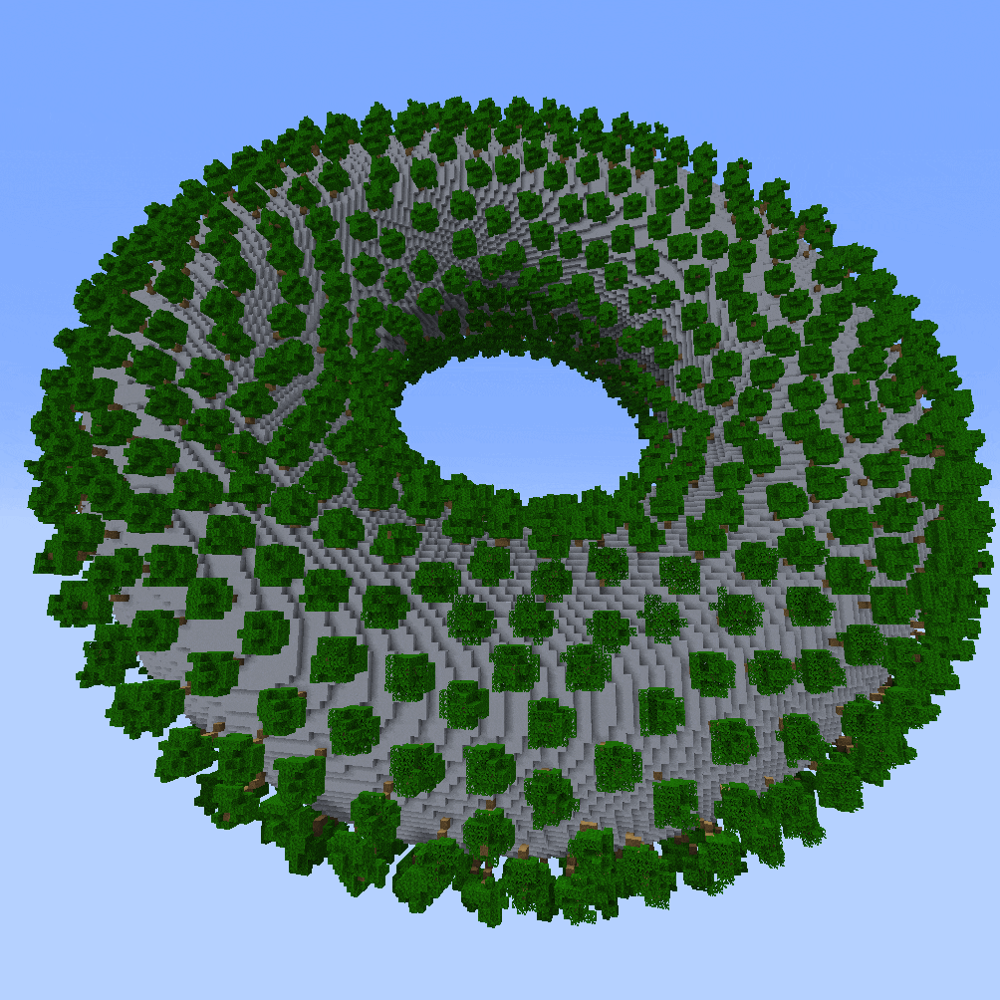

# Scatter Parameters

[`//ezscatter`](./#ezscatter) and [`//ezbrush scatter`](./#ezbrush-scatter) place multiple structures within a region. The positions that these commands choose can be customized with the parameters described on this page.

`scatter` first extracts surfaces from your region (all non-air blocks touching air). You can filter out surfaces that do not match certain conditions using `-d <directions>` & `-e <threshold>`, `-m <mask>`, and `-t`. On the remaining surfaces, a placement position distribution according to the given density `-n <density>` and uniformity  `-u <iterations>` is calculated and structures are placed.&#x20;

***

### Density: `-n <density>`

Determines how many placements are placed, by specifying a density percentage.

The density value is a percentage. It determines what percentage of surface blocks a structure should be placed.

To be overly specific: Let N be the result of `//count [!air]&[~air]`, then the final amount of structures placed is equal to _N \* density / 100_. (The total amount can be lower due to the mask filter, and the directional filter)

Note: Percent sign is optional. `0.5` is equal to `0.5%`.

> #### Examples:
>
> Ex. command: **`//ezsc Clipboard C C -n <density>`** (with the clipboard being a default vanilla oak tree for no particular reason)
>
>
>
> **`-n 2%`** (default) or **`-n 2`** ('%'-sign is optional):
>
> 
>
>
>
> **`-n 0.5%`**
>
> &#x20;
>
>
>
> **`-n 5%`**
>
> 

***

### Distribution Seed: `-i <seed>`

Sets the seed for the random number generator which chooses the initial random placement positions.&#x20;

Defaults to -1 (random seed), meaning that the placement positions differ in each execution of the scatter command.

***

### Uniformity: `-u <iterations>`

Determines how uniformly spread out all placement positions are. Expecting a positive integer including 0.

Defaults to 15.

The uniformity algorithm works by starting with fully random placement positions, and iteratively repelling all positions apart from one another. This parameter sets the number of iterations to perform. Thus, 0 means the placement positions within your region are purely random.

> #### Example:
>
> Ex. command: `//ezsc Clipboard C C`` `**`-u <iterations>`** (with the clipboard being a default vanilla oak tree for no particular reason)
>
>
>
> * `-u 0` (fully random distribution)
> * `-u 2` (slightly uniform distribution)
> * `-u 20` (maximal uniform distribution)
>
>
>
> GIF starting with **`-u 0`** and ending with **`-u 20`**:
>
> 

***

### Directional Filter: `-d <directions>` and `-e <threshold>`

Enables filtering out placement positions on surfaces that are facing certain directions.

The `-d <directions>` parameter defines the list of cardinal directions (up, down, north, east, south, west) in which the surface, on which the placement positions points are placed at, must face. If a placement position does not satisfy this condition, no structure will be placed there.

The `-e <threshold>` parameter defines how much the surface normal at the placement position must align with any of the directions given by `-d`. The higher the value the stronger the filter.

`-d` has defaults to an empty list (nothing).

`-e` defaults to 0.5. Expected value range is -1 to 1.

> #### Example
>
> Ex. command: `//ezsc Clipboard S C`` `**`-d <directions> -e <threshold>`** (with the clipboard being a default vanilla oak tree for no particular reason)
>
>
>
> **`-d west,up`** (scatter points must be on a surface facing either west or up)
>
>
>
> **`-d up -e <threshold>`** (scatter points must be on a surface facing roughly upwards)
>
> GIF
>
> * starts at **`-e -1.0`** (weakest filter threshold, all shapes are placed)
> * pauses at **`-e 0.0`** (half of all directions are filtered out)
> * and ends at **`-e 1.0`** (strongest filter threshold, no shapes are placed anymore).
>
> 

***

### Mask Filter: `-m <mask>`

Enables filtering out placement positions that do not match a mask given by `-m <mask>`. Placement positions must satisfy the mask for a structure to be placed.

> #### Examples:
>
> Ex. command: `//ezsc Clipboard S C`` `**`-m <mask>`** (with the clipboard being a default vanilla oak tree for no particular reason)
>
>
>
> GIF going through
>
> * **`-m red`** (only placement positions on red wool blocks are chosen)
> * **`-m !red`** (only placements positions on anything but red wool blocks are chosen)
> * **`-m =y>95`** (only placement positions which are above y>95 are chosen)
> * and the region before the execution of the command.
>
> 

***

### Mask Cover Block: `-b <pattern>`

After placing all structures, replace all unaffected blocks within the region that match the mask filter (-m) with the given block. (-m must be set for this flag to take effect.)

This is a niche utility option for cases in which you apply a scatter multiple times in a neighbouring region but do not want to place structures in areas where you already did scatter structures. So using this flag, you can (temporarily within your workflow) overwrite all surface blocks within your region with the given block, such that any following scatter operations that overlap with already covered regions, do not place structures there because the surface blocks have been "covered".

> Examples:
>
> `//ezbrush scatter Clipboard -m clay`
>
> Running ezbrush scatter **without** the `-b` flag results in densely placed area whereever the clicked areas overlap, which may not be the desired result.
>
> 
>
>
>
> `//ezbrush scatter Clipboard -m clay -b pink`
>
> Running ezbrush scatter **with** `-b pink`, whereby pink wool is just some random block in this case, covers the affected areas such that, combined with the `-m clay` mask filter subsequent brush clicks do not place any new shapes there, even when the regions overlap.
>
> 
>
>

***

### Trim outside selection: `-t`

By default `scatter` will determine placement positions within the currently selected region, but will place blocks outside the region if a placement position is at the border of the currently selected region. You may cut off any such blocks (prevent them from being placed) with this `-t` flag.

Turning on this flag is comparable to running the command with `//gmask #region`.

Note: This flag is only available for the scatter command, not the brush.

> Examples:
>
> If this is our selected region:
>
> 
>
> Then executing the ezsc command without the flag will result in blocks potentially being placed outside the region. Only the placement/origin positions are restricted to the region. Without flag:
>
> `//ezsc Cl C C -s 15,21,15 -n 0.5%`
>
> 
>
> With `-t` flag:
>
> `//ezsc Cl C C -s 15,21,15 -n 0.5% -t`
>
> 

***
