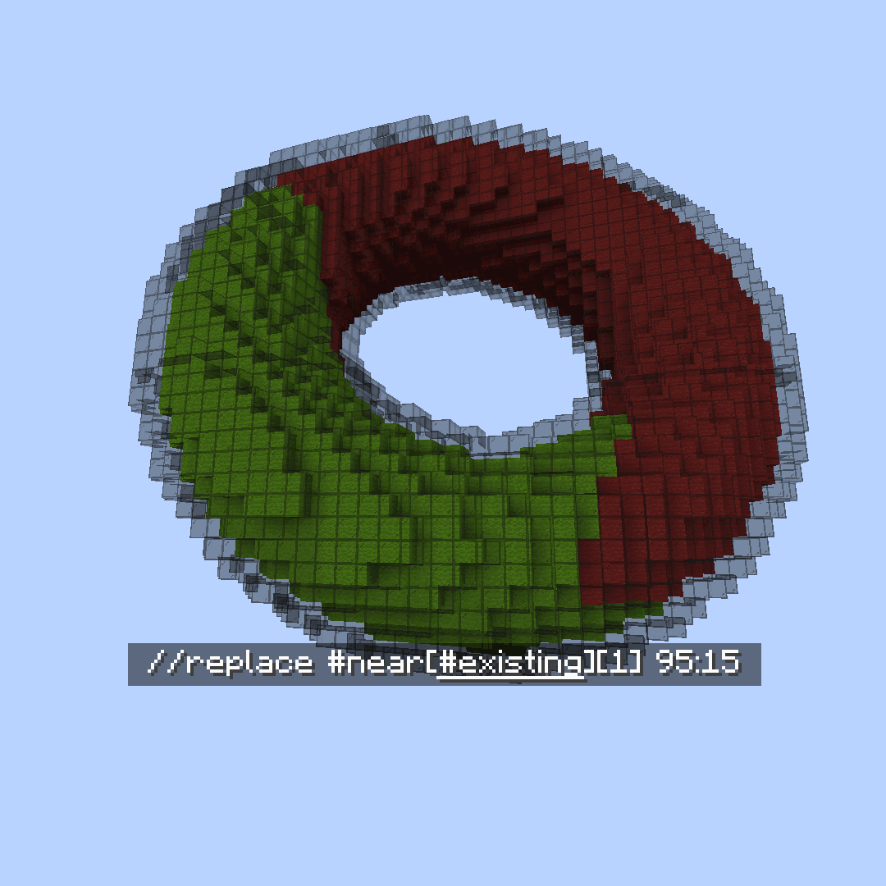
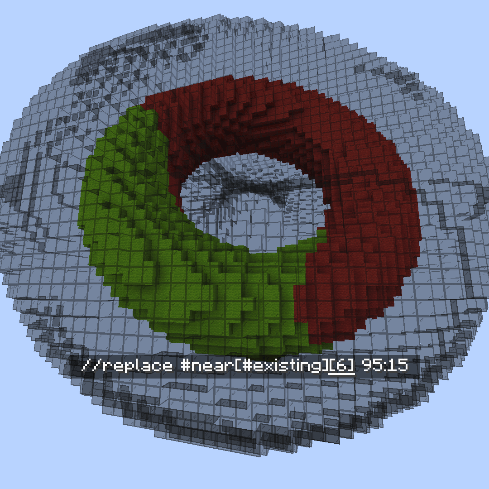

# Masks

### `#aim`

#aim Mask

**`#aim` or `#aim[True|False]`**

Takes the block the player is aiming at as the mask.

Optionally takes a True/False setting to make your aim sensitive to hitboxes.

- False will treat all blocks as full blocks. E.g. you cannot `#aim` at the block behind a button.
- True will respect the hitboxes of blocks you are looking at. E.g. you can `#aim` at the block behind a slab.

### `#attached`

#attached mask

**`#attached[<vector,vector,vector ...>]`**

Masks to blocks which are attached to at least 1 adjacent non-air block.

Optionally takes a list of direction vectors to check instead of every side.\
e.g `#attached[up,down,left,north]`

\
In either case, attached means that the block is "touching" the adjacent block. So a bottom slab would not pass `#attached[up]` whereas a lantern with the state `[hanging=true]` would.

### `#blocklight`

#blocklight Mask

**`#blocklight[lightLevel]` or `#blocklight[minLevel][maxLevel]`**

Masks to blocks of a given block light (Illumination provided by light sources other than skylight). Optionally takes a minimum and maximum light level, matching any level within that range.

### `#current`

#current mask

Shorthand: **`#c`**

A mask which represents your current global mask (gmask).

e.g running `//gmask !#current` will invert your current gmask

### `#eznoise`

#eznoise Mask

**`#eznoisemask[noisePreset][<scale>][<threshold>][<seed>]`**\
**Alias: `#eznm`**

Uses a noise preset values `0.0-1.0` to match blocks above a given noise threshold.

### `#fullblock`

#fullblock mask

Masks to blocks which fill an entire cube space.

e.g 1-7 layers of snow will not pass, but 8 layers of snow, a block like stone, or a transparent block like glass will pass.

### `#fuzzypalette`

#fuzzypalette mask

**`#fuzzypalette[palette]`**

Shorthand: **`#fpalette`**

Masks to blocks which match any block in the palette, regardless of block data.\
Equivalent to **`#palette[palette][False]`**

### `#infested`

#infested mask

Masks to blocks which are infested with silverfish.

### `#lightsource`

#lightsource Mask

**`#lightsource` or `#lightsource[lightLevel]` or `#lightsource[minLevel][maxLevel]`**

Masks to blocks which emit light. Optionally takes a specific light level to match, or minimum and maximum light level, matching any level within that range.

### `#near`

#near Mask

**`#near[mask][distance]`**\
**`#near[mask][minDistance][maxDistance]`**\
\
Masks to all blocks within a given spherical (Euclidean) distance of a mask.\
Doesn't modify blocks which match the inner `mask`.\
Can also be set to exclude blocks closer than the minimum distance.\\

 **`[mask]`**

 **`[distance]`**

 **`[minDistance][maxDistance]`**

### `#palette`

#palette mask

**`#palette[palette][<strict>]`**

Masks to blocks which match any block in the palette.

Optional `<strict>` value of True or False to determine if block data must also match.\
e.g `oak_stairs[facing=east]` will only match with `oak_stairs[facing=west]` if strict is set to **False**.

### `#truelight`

#truelight Mask

**`#truelight[lightLevel]` or `#truelight[minLevel][maxLevel]`**

Masks to blocks of a given total light level (Illimunation provided by any light sources including skylight). Optionally takes a minimum and maximum light level, matching any level within that range.

### `#vectorgradient`

#vectorgradient Mask

**`#vectorgradientmask[vector][distance][<noisePreset>][<noiseScale>][noiseSeed]`**

Shorthand: `#vgradientm`

Masks blocks along a vector with a given distance length. With closer blocks more likely to pass the mask check.\
Compatible with noise presets.

