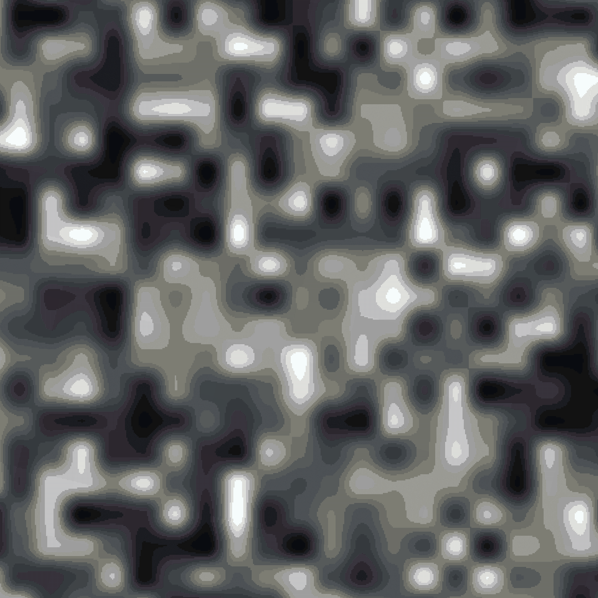
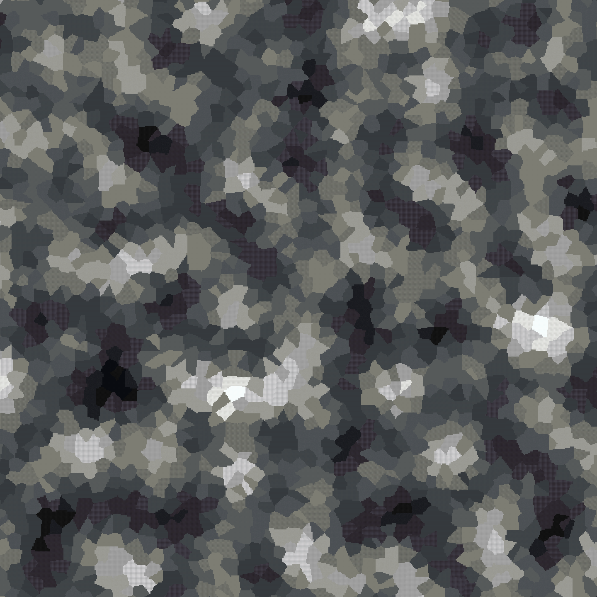

# Noise Explained

Noise can be a complex topic for anyone who has never read into it before, but in its simplest terms, noise is a way of getting a value out of some input (usually X,Y,Z coordinates).

The place you will likely be most familiar with noise is in Minecraft's terrain generation. At every point in the world, several noise functions are combined to determine if a block should be placed, and if so, which block.

This is pretty much what we do in ezEdits, using noise to generate shapes, terrain, and textures.

Within the plugin you will find several noise types, with each having different characteristics, and Cellular specifically coming with many additional parameters you can customise.

Some of the many features that use noise include:

* `//eznoisegen ...` - _Noisegen Commands_
* `#eznoisemask` - _Masks_
* `//ezbrush gradient ...` - _Brushes_

_Noise in ezEdits based on a modified version of FastNoiseLite, so we strongly recommend this website to experiment with noise parameters:_ [_http://auburn.github.io/FastNoiseLite/_](http://auburn.github.io/FastNoiseLite/)

## Noise Parameters

Each parameter and many values also has a shorthand, such as "ft" instead of "FractalType" or "Si" instead of "OpenSimplex2". Wherever this is possible, the shorthand will be shown in brackets.\
<mark style="color:red;">`Red = Parameter`</mark> <mark style="color:purple;">`Purple = Value`</mark>

### Noise Type

Setting the Noise Type 

Sets the type of noise to be used. This is the start of any noise and will be in the format of `Noise()`, for example `Perlin()`, where all other parameters will go between the brackets.

* <mark style="color:purple;">`Perlin (Pe)`</mark>
* <mark style="color:purple;">`OpenSimplex2 (Si)`</mark>
* <mark style="color:purple;">`OpenSimplex2S (Sm)`</mark>
* <mark style="color:purple;">`Value (Va)`</mark>
* <mark style="color:purple;">`ValueCubic (VC)`</mark>
* <mark style="color:purple;">`White (Wh)`</mark>
* <mark style="color:purple;">`Cellular (Ce)`</mark>
* <mark style="color:purple;">`Shard (Sh)`</mark>

### Basic Noise Parameters

Basic Noise Parameters

* <mark style="color:red;">`Seed (s)`</mark>\
  Sets the seed value for the noise. -1 or no value will result in a random noise seed.
* <mark style="color:red;">`Frequency (f)`</mark>\
  Sets the frequency for the noise. A higher frequency will lead to steeper noise, a lower value will lead to smoother noise.
* <mark style="color:red;">`Inverted (i)`</mark>\
  Whether to invert the noise value or not. Default is false.
  * <mark style="color:purple;">`True`</mark>
  * <mark style="color:purple;">`False`</mark>
* <mark style="color:red;">`ValueMapping (m)`</mark>\
  Whether to ignore or override the value mapping. By default noise is sampled to map between 0 and 1.
  * <mark style="color:purple;">`Default (Def)`</mark>
  * <mark style="color:purple;">`None (No)`</mark>
  * <mark style="color:purple;">`Override (OR)`</mark>\
    **If Overridden:**
    * <mark style="color:red;">`LowerBound (l)`</mark>
    * <mark style="color:red;">`UpperBound (u)`</mark>
* <mark style="color:red;">`XScaling (x)`</mark>\
  This can be used to stretch or squish the X axis.
* <mark style="color:red;">`YScaling (y)`</mark>\
  When using 3D noises this can be used to stretch or squish the Y axis.
* <mark style="color:red;">`ZScaling (z)`</mark>\
  This can be used to stretch or squish the Z axis.

### Cellular Noise Parameters

<strong>Additional Cellular Noise Parameters</strong>

* <mark style="color:red;">`CellularJitterModifier (cJ)`</mark>\
  Usually `0..1.0`\
  Controls the random jitter or distribution of cellular noise nodes, with 0 being a perfect grid, and 1 being maximally "random", without overlap. Values above 1 will start to overlap their neighbours.
* <mark style="color:red;">`CellularDistanceFunction (cD)`</mark>\
  Controls the mathematical method used to determine the distance value for each point to its node.
  * <mark style="color:purple;">`Euclidean (e)`</mark>
  * <mark style="color:purple;">`EuclideanSq (sq)`</mark>
  * <mark style="color:purple;">`Manhattan (man)`</mark>
  * <mark style="color:purple;">`Hybrid (h)`</mark>
  * <mark style="color:purple;">`Minkovski1 (m1)`</mark>
  * <mark style="color:purple;">`Minkowvki4 (m4)`</mark>
  * <mark style="color:purple;">`Minkowski99 (m99)`</mark>
  * <mark style="color:purple;">`Rounded (r)`</mark>
* <mark style="color:red;">`CellularReturnType (cR)`</mark>\
  Controls how the distance value is modified prior to being returned.\
  All Distance2\* values refer to the 2nd closest node instead of the closest.
  * <mark style="color:purple;">`CellValue (cell)`</mark>
  * <mark style="color:purple;">`Distance (1)`</mark>
  * <mark style="color:purple;">`DistanceSquared (sq)`</mark>
  * <mark style="color:purple;">`DistanceInverse (inv)`</mark>
  * <mark style="color:purple;">`DistanceLog (log)`</mark>
  * <mark style="color:purple;">`DistanceExp (exp)`</mark>
  * <mark style="color:purple;">`Distance2 (2)`</mark>
  * <mark style="color:purple;">`Distance2Add (2add)`</mark>
  * <mark style="color:purple;">`Distance2Add (2sub)`</mark>
  * <mark style="color:purple;">`Distance2Add (2mul)`</mark>
  * <mark style="color:purple;">`Distance2Add (2div)`</mark>
  * <mark style="color:purple;">`Distance2Sq (2sq)`</mark>
  * <mark style="color:purple;">`Distance2Inv (2inv)`</mark>
  * <mark style="color:purple;">`Distance2Log (2log)`</mark>
  * <mark style="color:purple;">`Distance2Exp (2exp)`</mark>
  * <mark style="color:purple;">`Edge (e)`</mark>
  * <mark style="color:purple;">`Rounded (r)`</mark>
  * <mark style="color:purple;">`NoiseLookup (n)`</mark>\
    **Additional Noise Lookup Parameters:**
    * <mark style="color:red;">`CellularNoiseLookup (cN)`</mark>\
      When using the NoiseLookup return type, this controls the underlying noise to overlay the cellular noise upon.
      * <mark style="color:purple;">`Perlin (Pe)`</mark>
      * <mark style="color:purple;">`OpenSimplex2 (Si)`</mark>
      * <mark style="color:purple;">`OpenSimplex2S (Sm)`</mark>
      * <mark style="color:purple;">`Value (Va)`</mark>
      * <mark style="color:purple;">`ValueCubic (VC)`</mark>
      * <mark style="color:purple;">`White (Wh)`</mark>
      * <mark style="color:purple;">`Cellular (Ce)`</mark>
    * <mark style="color:red;">`CellularNoiseLookupFrequency (cF)`</mark>\
      Controls the frequency of the underlying noise.

### Shard Noise Parameters

Additional Shard Noise Parameters

* <mark style="color:red;">`Sharpness (h)`</mark>\
  Usually `0..1.0`\
  Controls the pattern sharpness for Shard noise. Higher values have more defined edges within the pattern, whereas low values will appear more blurry.

### Fractal Noise Parameters

Fractal Noise Parameters

* <mark style="color:red;">`FractalType (fT)`</mark>\
  Sets the type of fractal noise to be used.
  * <mark style="color:purple;">`None (N)`</mark>
  * <mark style="color:purple;">`FBm (F)`</mark>
  * <mark style="color:purple;">`Ridged (R)`</mark>
  * <mark style="color:purple;">`PingPong (P)`</mark>\
    **Additional PingPong Fractal Parameter:**
    * <mark style="color:red;">`PingPongStrength (fP)`</mark>

**If Fractal Type other than `None` selected:**

* <mark style="color:red;">`Octaves (fO)`</mark>\
  Sets the number of layers of fractal noise to be used.
* <mark style="color:red;">`Lacunarity (fL)`</mark>\
  Sets the scale of each fractal layer. Values >1 will effectively increase the frequency for each layer, values <1 will effectively reduce the frequency for each layer.
* <mark style="color:red;">`Gain (fG)`</mark>\
  Sets the relative strength of each fractal layer. Values <1 will decrease in strength for each layer, values >1 will increase.
* <mark style="color:red;">`WeightedStrength (fW)`</mark>\
  Sets the responsiveness of each layer's strength to the noise value.

### Domain Warp Parameters

Domain Warp Parameters

* <mark style="color:red;">`DomainWarpType (wT)`</mark>\
  Sets the type of domain warping to be used.
  * <mark style="color:purple;">`None (N)`</mark>
  * <mark style="color:purple;">`BasicGrid (G)`</mark>
  * <mark style="color:purple;">`OpenSimplex2 (S)`</mark>
  * <mark style="color:purple;">`OpenSimplex2Reduced (R)`</mark>
  * <mark style="color:purple;">`Flow (F)`</mark>
  * <mark style="color:purple;">`Turbulence (T)`</mark>

**If Domain Warp Type other than `None` selected:**

* <mark style="color:red;">`DomainWarpFreq (wF)`</mark>\
  Sets the frequency for the domain warp.
* <mark style="color:red;">`DomainWarpOct (wO)`</mark>\
  Sets the number of layers for the domain warp.
* <mark style="color:red;">`DomainWarpGain (wG)`</mark>\
  Sets the relative strength of each domain warp layer.
* <mark style="color:red;">`DomainWarpAmp (wA)`</mark>\
  Sets the overall amplitude (strength) of the domain warp.
* <mark style="color:red;">`DomainWarpFrac (wC)`</mark>\
  Sets the domain warp specific fractal type to be used.
  * <mark style="color:purple;">`None (N)`</mark>
  * <mark style="color:purple;">`DomainWarpIndependent (I)`</mark>
  * <mark style="color:purple;">`DomainWarpProgressive (P)`</mark>
* <mark style="color:red;">`DomainWarpLacunarity (wl)`</mark>\
  Sets the scale of each domain warp layer.

## Examples

**`Value(Seed:123,Frequency:0.04)`**

<figure><figcaption></figcaption></figure>

**`Cellular(cellularDistanceFunction:Euclidean,cellularReturnType:NoiseLookup,cellularNoiseLookup:Perlin,cellularNoiseLookupFrequency:0.2,Frequency:0.1)`**

_Same noise, but using all abbreviations:_ **`Ce(cD:e,cR:n,cN:Pe,cF:.2,F:.1)`**

<figure><figcaption></figcaption></figure>
