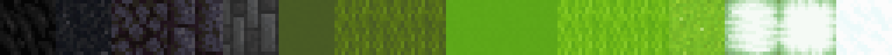
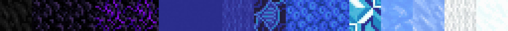
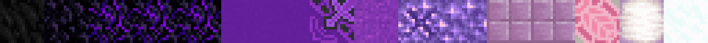
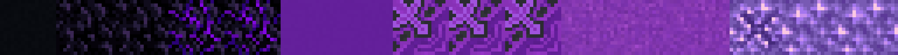
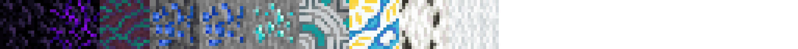
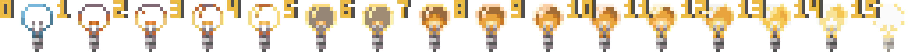
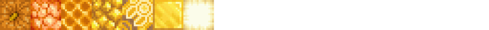

# Default Palettes

By default, palettes are saved per player. However, server admins may define a set of default palettes accessible to all players in

```
plugins/ezEdits/resources/DefaultPalettes.json
```

We also come with a predefined set of default palettes:

***

<figure><figcaption><p>##Grayscale</p></figcaption></figure>

<figure><figcaption><p>##GrayRough</p></figcaption></figure>

<figure><figcaption><p>##GrayWarm</p></figcaption></figure>

<figure><figcaption><p>##GrayCold</p></figcaption></figure>

***

<figure><figcaption><p>##BlueWhiteRed</p></figcaption></figure>

<figure><figcaption><p>##Infrared</p></figcaption></figure>

<figure><figcaption><p>##Magma</p></figcaption></figure>

<figure><figcaption><p>##Beige</p></figcaption></figure>

***

<figure><figcaption><p>##GlowRed</p></figcaption></figure>

<figure><figcaption><p>##GlowOrange</p></figcaption></figure>

<figure><figcaption><p>##GlowYellow</p></figcaption></figure>

<figure><figcaption><p>##GlowLime</p></figcaption></figure>

<figure><figcaption><p>##GlowCyan</p></figcaption></figure>

<figure><figcaption><p>##GlowBlue</p></figcaption></figure>

<figure><figcaption><p>##GlowPurple</p></figcaption></figure>

<figure><figcaption><p>##GlowMagenta</p></figcaption></figure>

***

<figure><figcaption><p>##FadeRed</p></figcaption></figure>

<figure><figcaption><p>##FadeOrange</p></figcaption></figure>

<figure><figcaption><p>##FadeGold</p></figcaption></figure>

<figure><figcaption><p>##FadeLime</p></figcaption></figure>

<figure><figcaption><p>##FadeCyan</p></figcaption></figure>

<figure><figcaption><p>##FadeBlue</p></figcaption></figure>

<figure><figcaption><p>##FadePurple</p></figcaption></figure>

<figure><figcaption><p>##FadeMagenta</p></figcaption></figure>

***

<figure><figcaption><p>##Brown</p></figcaption></figure>

<figure><figcaption><p>##DustyBrown</p></figcaption></figure>

***

<figure><figcaption><p>##EnchantedDark</p></figcaption></figure>

<figure><figcaption><p>##EnchantedWarm</p></figcaption></figure>

<figure><figcaption><p>##EnchantedBright</p></figcaption></figure>

***

<figure><figcaption><p>##LegacyWool</p></figcaption></figure>

<figure><figcaption><p>##Light</p></figcaption></figure>

***

<figure><figcaption><p>##Moss</p></figcaption></figure>

<figure><figcaption><p>##Ice</p></figcaption></figure>

<figure><figcaption><p>##Rocks</p></figcaption></figure>

<figure><figcaption><p>##Leaf</p></figcaption></figure>

<figure><figcaption><p>##LeavesAll</p></figcaption></figure>

<figure><figcaption><p>##Sand</p></figcaption></figure>

<figure><figcaption><p>##ShiningGold</p></figcaption></figure>

***
