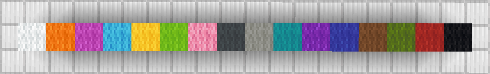

# Palettes Explained

Palettes in ezEdits represent a list of blocks that can be used in several commands where the order of blocks will be maintained.\\

Palettes can be saved and accessed using the **`#`** prefix for user-saved palettes, and **`##`** for inbuilt preset palettes.\
e.g `##LegacyWool` represents the inbuilt wool palette starting from white wool, orange wool up to red wool and finally black wool.

Some of the many features that use palettes include:

* `//eztexture ...` - _Texturing Commands_
* `#palette` - _Masks_
* `//ezbrush gradient ...` - _Brushes_

Palettes can be constructed as a simple list of blocks, or via several modifiers:

* **`,`** - Concatenate: Adds one block or palette on to the end of the preceding block or palette.\
  e.g `stone,dirt` is a 2 block palette of stone and dirt. `stone,##LegacyWool` is a palette made of stone and the blocks of the ##LegacyWool preset palette.
* **`-`** - Invert: Reverses the order of a palette.\
  e.g `-##LegacyWool` is the wool preset palette in reverse order (starts with black instead of white)
* **`(start:end)`** - Sub-palette: Returns a portion of a palette.\
  e.g `##LegacyWool(1:8)` will return the first 8 blocks of the ##LegacyWool preset palette.
* **`*`** - Repeater: Repeats the previous segment a given number of times.\
  e.g `gold_block*10,diamond_block` will return a palette of 10 gold blocks, followed by a single diamond block.
* **`[]`** - Grouping: Groups palettes together to allow a modifer to treat them as a single palette.\
  e.g `-##LegacyWool,gold_block` will return the ##LegacyWool preset palette in reverse order, with a gold block at the end. Where `-[##LegacyWool,gold_block]` will return the gold block at the start.
* **`=`** - Result: Allows a palette to be tab-completed into its list of blocks if needed.

**##LegacyWool preset palette:**

<figure><figcaption></figcaption></figure>
