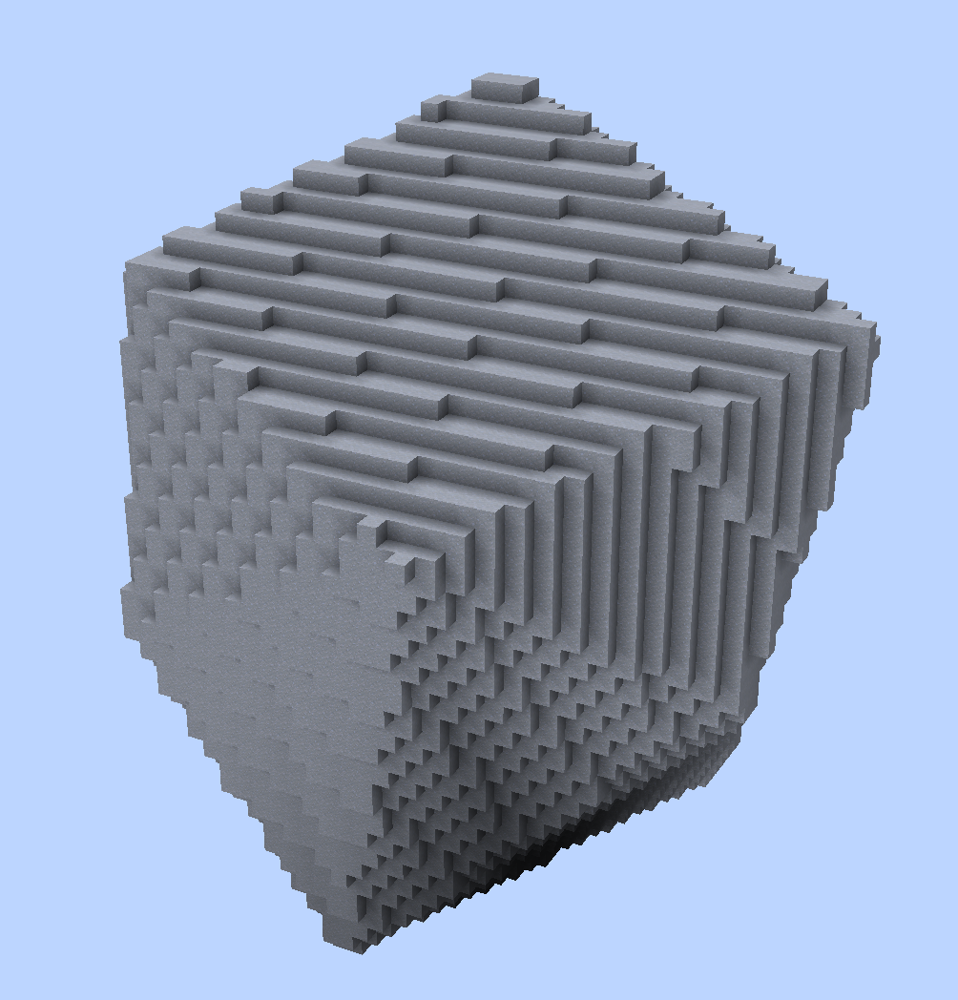
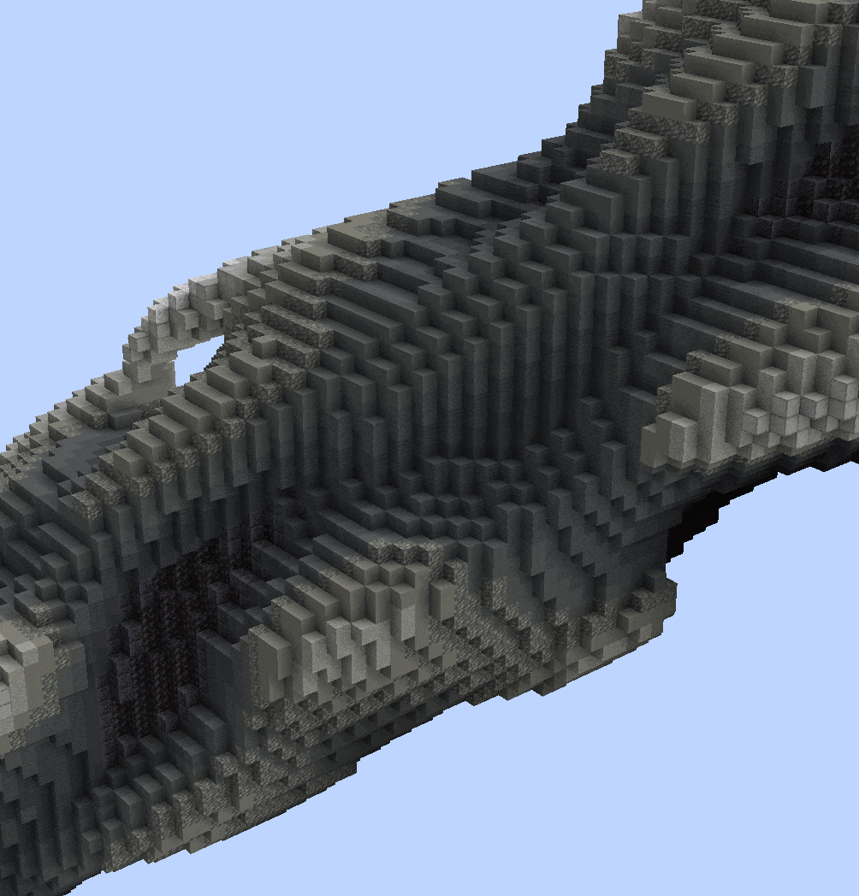

# Smoothblocks

Some commands enable you to generate, place shapes, and perform edits using shaping blocks like slabs and stairs.

#### Currently supported commands are:

[Placement Commands](../commands/placement/)

[Spline Commands](../commands/spline/)

#### How it works

There are different smoothblocks presets. One may, for example, use only slabs, the other may use stairs and slabs, and yet another may also use stairs and slabs but with different orientations. We hardcoded each preset with the goal of getting a certain result.

Each preset uses a specific subset of shaping blocks. We named each preset by which shaping blocks they use. For example, the SlabsOnly preset only uses slabs (and full blocks), while StairsSlabsAndWalls uses the named shaping blocks.&#x20;

By default, without smoothblocks, blocks are placed as is, meaning if you use the pattern `stone_slab[half=bottom]`, then our commands will place the _bottom_ slab at every affected block. To use our shaping block capabilities, it is important to know in which context you want to use them.

There are four flavours, but they all function very similarly and mainly differ in which context they are used:

<mark style="color:blue;">Pattern-based</mark>

* You may define a (single) material for each shaping block, e.g.
  * <mark style="color:orange;">`SlabsOnly(FullBlock:clay,Slab:stone)`</mark>
* You can use this one in place of a `<pattern>` (within the above-mentioned commands) using a tilde symbol, e.g.:
  * `//ezplace Ic(`<mark style="color:orange;">`Pattern:clay)`</mark>`)`    _(no smoothblocks)_\
    
  * `//ezplace Ic(`<mark style="color:orange;">`Pattern:~SlabsOnly(FullBlock:clay,Slab:stone)`</mark>`)`\
    

<mark style="color:blue;">Palette-based (Closest-Color)</mark>

* You may define a palette. For each block shape variant and each palette entry, the shaping block with the closest color will be placed.
  * <mark style="color:orange;">`SlabsOnly(Palette:##grayscale)`</mark>

- You can use this one in place of a `<palette>` (within the above-mentioned commands) using a tilde symbol, e.g.:
  * `//ezspline noise`` `<mark style="color:orange;">`##grayscale`</mark>` ``20`
  * `//ezspline noise`` `<mark style="color:orange;">`~SlabsOnly(Palette:##grayscale)`</mark>` ``20`
  * 

<mark style="color:blue;">Palette-based (Manual)</mark>

* This one is activated by setting the boolean "manual" parameter to "true", otherwise, the closest-color mode is used
* You may define a material-palette for each shaping block, e.g.
  * <mark style="color:orange;">`SlabsOnly(Palette:##grayscale,Manual:true,Slab:"blackstone,stone,diorite")`</mark>
  * This means you have the choice to define the shaping block materials yourself (as opposed to letting ezEdits choose it for you)
* Just like above, you can use this one in place of a `<palette>` (within the above-mentioned commands) using a tilde symbol and by setting "manual" to "true", e.g.:
  * `//ezspline noise`` `<mark style="color:orange;">`##grayscale`</mark>` ``20`
  * `//ezspline noise`` `<mark style="color:orange;">`~SlabsOnly(Palette:##grayscale,Manual:true,Slab:"blackstone,stone,diorite")`</mark>` ``20`
  * 

<mark style="color:blue;">Closest-color</mark>

* This mode is used in cases where there is no pattern or palette, for e.g. when placing clipboards. This case is currently only available for the [Schematic](../commands/placement/available-structures.md#schematic-sc) and [Clipboard](../commands/placement/available-structures.md#clipboard-cl) Structures (see [Available Structures](../commands/placement/available-structures.md)).
* Since the materials are chosen automatically, there often aren't that many parameters, so you'd e.g. just type:
  * <mark style="color:orange;">`SlabsOnly`</mark>
* You may enable smoothblocks using the smoothblocks parameter, e.g.
  * `//ezplace Clipboard() Aim`    _(no smoothblocks)_
  * `//ezplace Clipboard(`<mark style="color:orange;">`SmoothBlocks:SlabsOnly`</mark>`) Aim`
  * 

