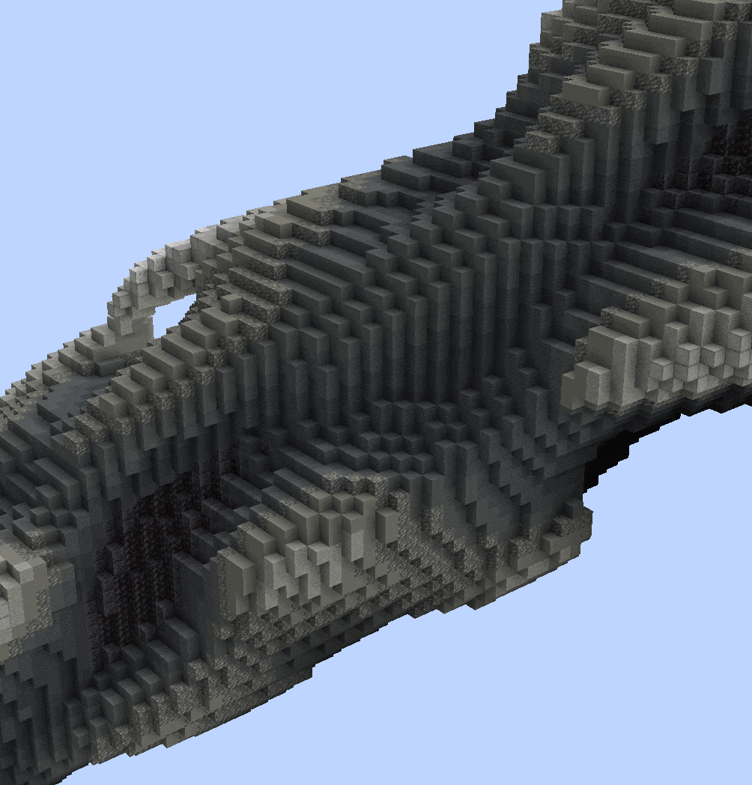
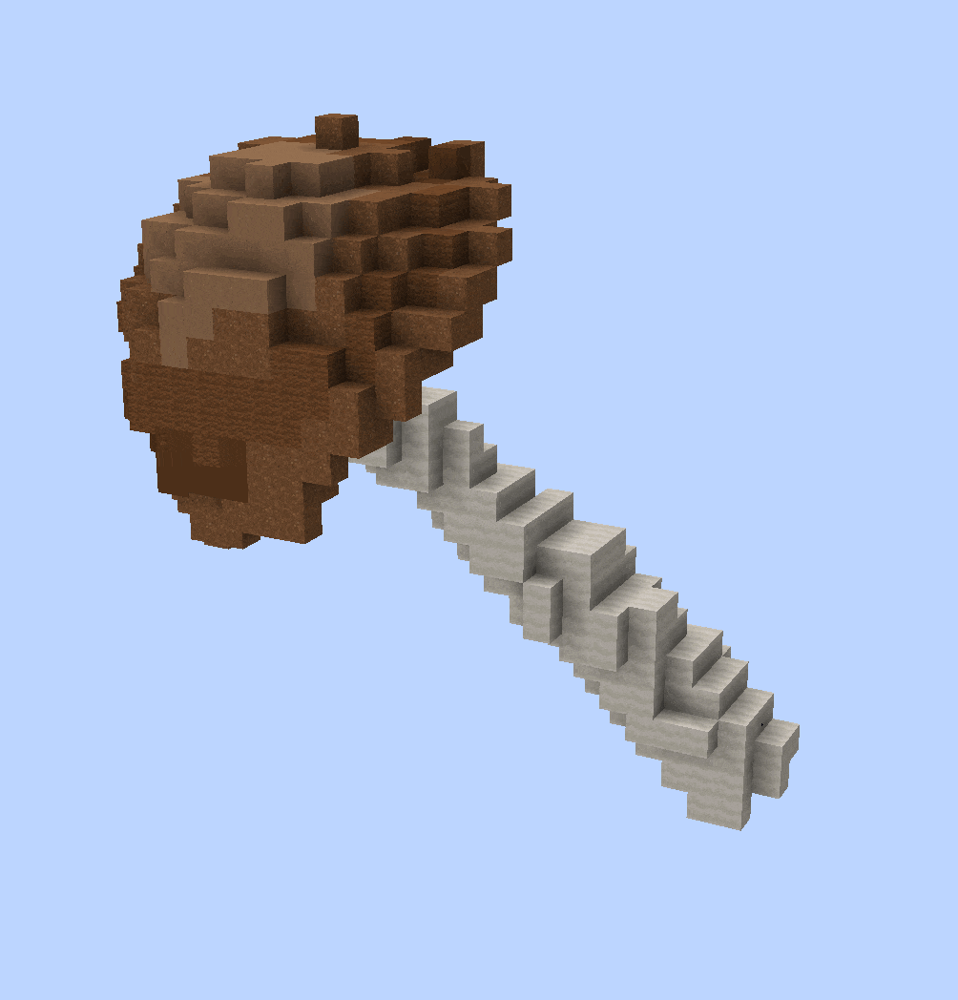
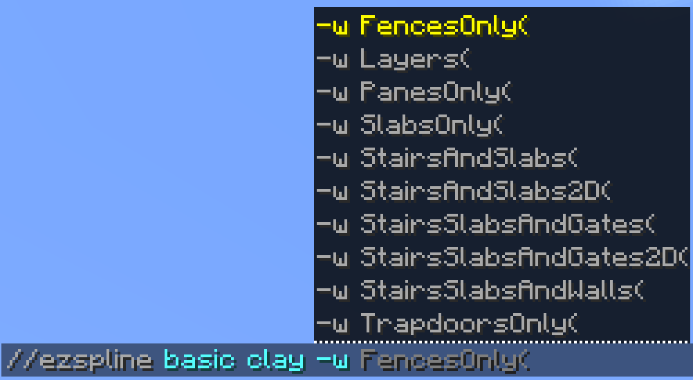
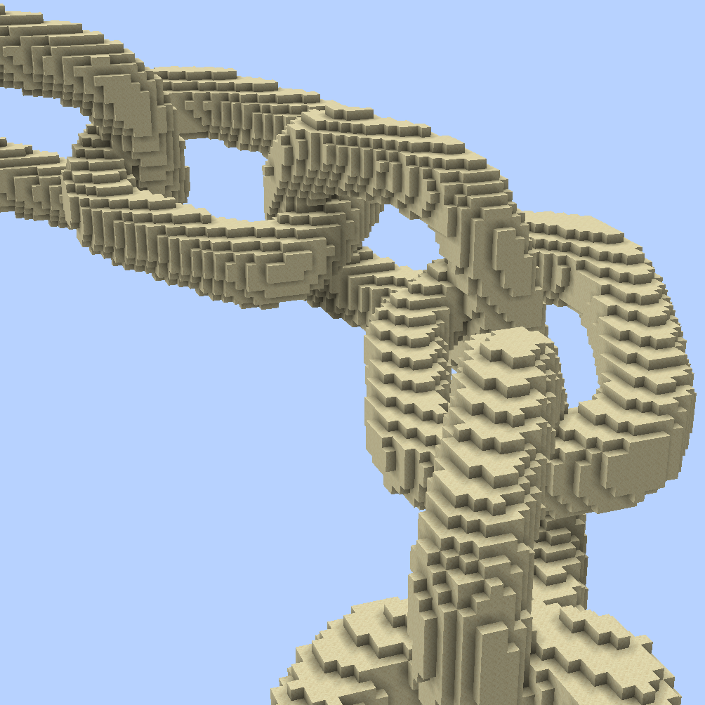
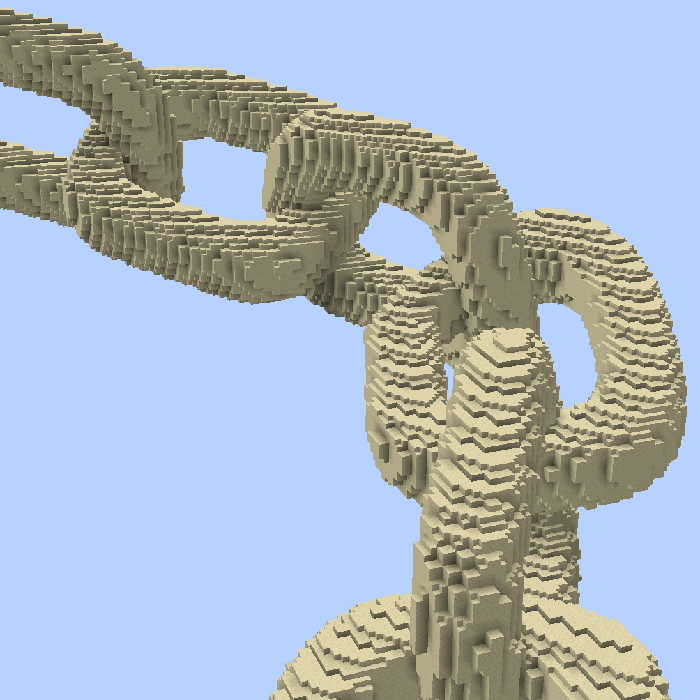
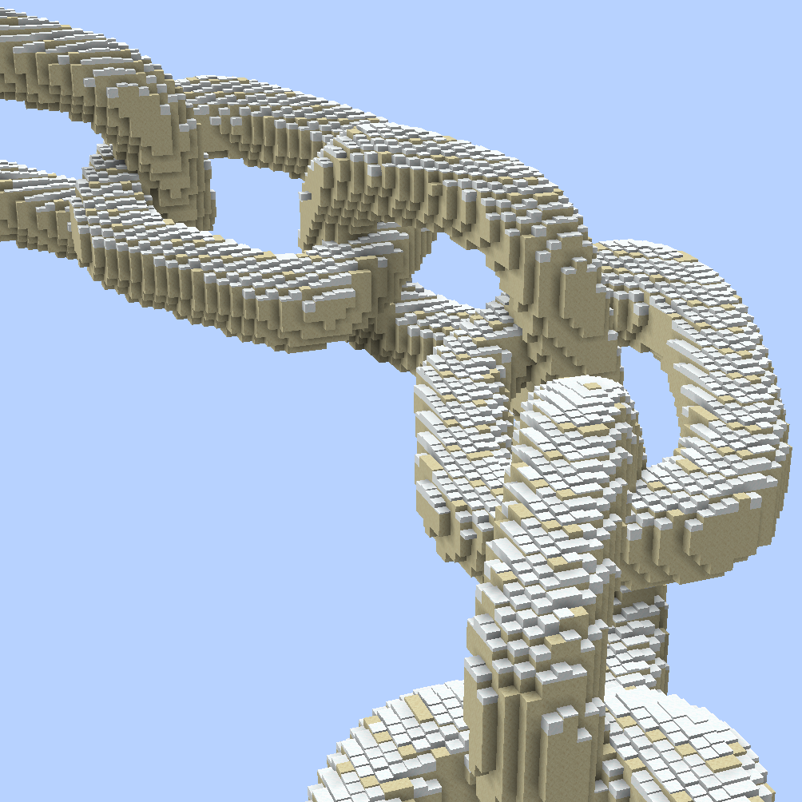
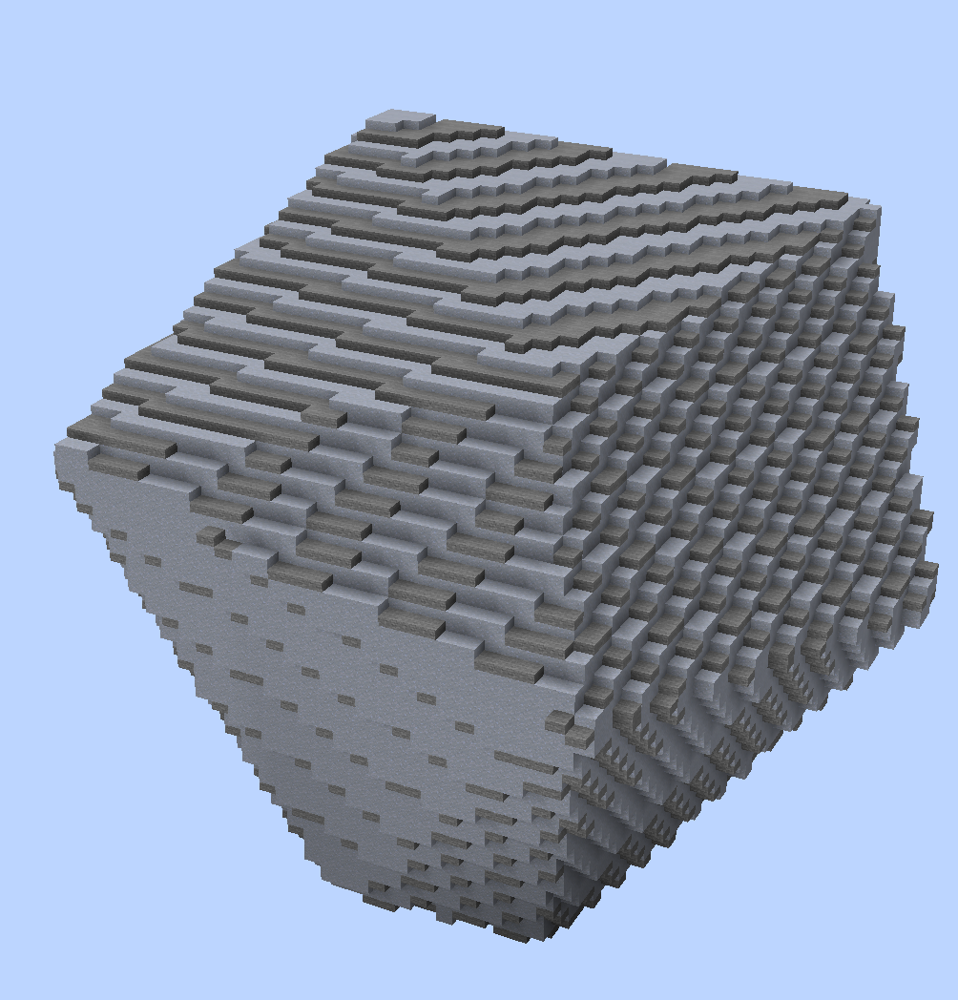

# Smoothblocks

Generate, place shapes, and perform edits using shaping blocks like slabs, stairs, snow layers, water levels, etc.

### Currently supported commands are:

[Placement Commands](../commands/placement/)

[Spline Commands](../commands/spline/)

### How to use

Add the <mark style="color:orange;">**`-w <profile>`**</mark> flag when using one of the supported(!) commands.

<mark style="color:blue;">Examples</mark>

Comparing generating a noise spline with and without the SlabsOnly profile.

* `//ezspline noise ##grayscale 20`

- `//ezspline noise ##grayscale 20`` `<mark style="color:orange;">**`-w SlabsOnly`**</mark>

Comparing pasting a rotated mushroom schematic with and without the SlabsOnly profile.

* `//ezplace Clipboard Aim`
* `//ezplace Clipboard Aim`` `<mark style="color:orange;">**`-w SlabsOnly`**</mark>

### Profiles

There are different smoothblocks profiles. One may, for example, use only slabs, the other may use stairs and slabs, and yet another may also use stairs and slabs but with different orientations. We hardcoded each preset to achieve a certain result. Each preset uses a specific subset of shaping blocks. We named each preset by which shaping blocks they use. Depending on their complexity, some may take longer to run than others.

<figure><figcaption></figcaption></figure>

<mark style="color:blue;">Examples</mark>

Comparing <mark style="color:blue;">**`//ezspline 3d ch smooth_sandstone -w <profile>`**</mark>

No smoothblocks\
\

-w Slabs\
\

-w SlabsAndStairs\
\

-w SlabsAndStairs2D\
\

-w Layers\

### Materials

By default, the <mark style="color:orange;">**closest color**</mark> shaping block to the specified [pattern](https://worldedit.enginehub.org/en/latest/usage/general/patterns/), [palette](../palettes/palettes-explained.md) or block that would've been placed instead.

<mark style="color:blue;">Example</mark>

If you generate a [Structure](../commands/placement/available-structures.md) (e.g. an [Icosphere](../commands/placement/available-structures.md#icosphere-ic)) using the pattern <mark style="color:blue;">**`clay`**</mark> using the <mark style="color:blue;">**`SlabsOnly`**</mark> smoothblocks profile. Then, since there is no clay slab, it will use the slab variant that is **closest in colour** (determined using the default minecraft textures), which for clay would be a stone slab.

You may also <mark style="color:orange;">**override**</mark> the material of each shaping block variant, by setting the material yourself, e.g.: <mark style="color:orange;">**`-w SlabsOnly(Slab:acacia)`**</mark>
