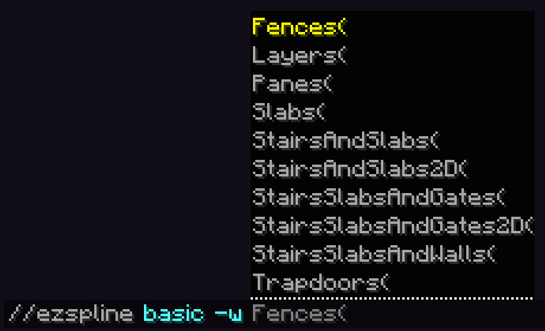
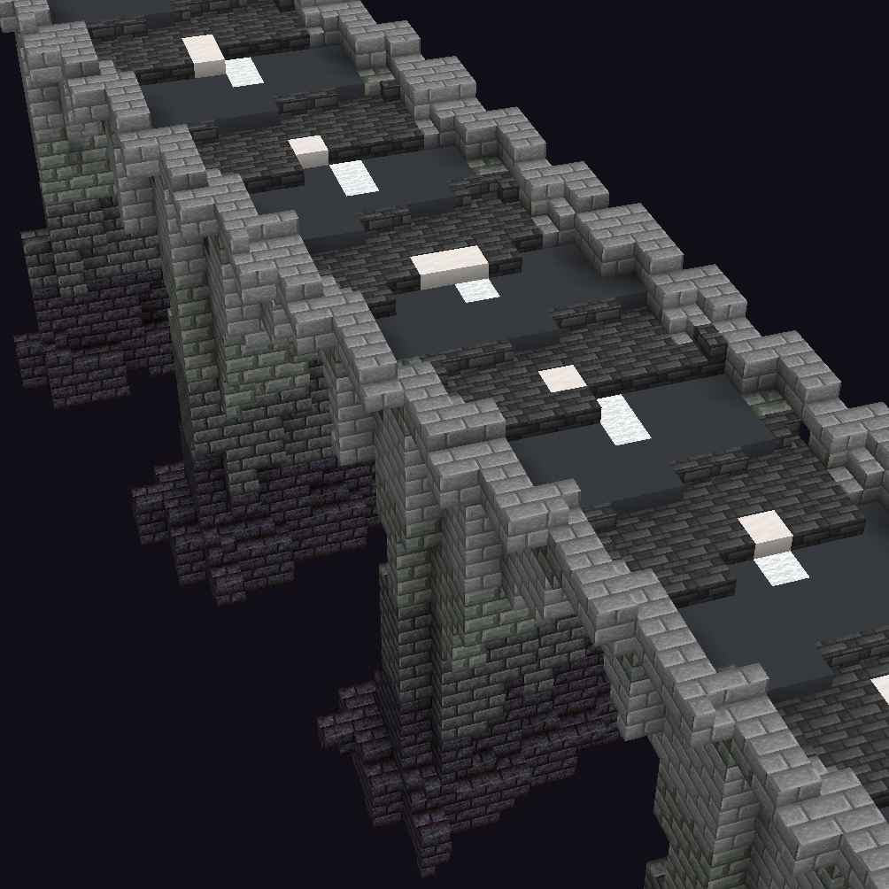
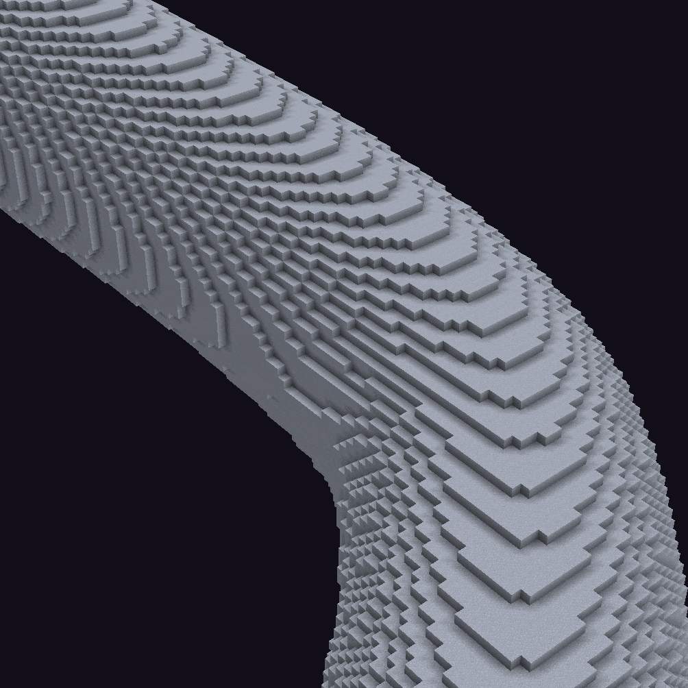
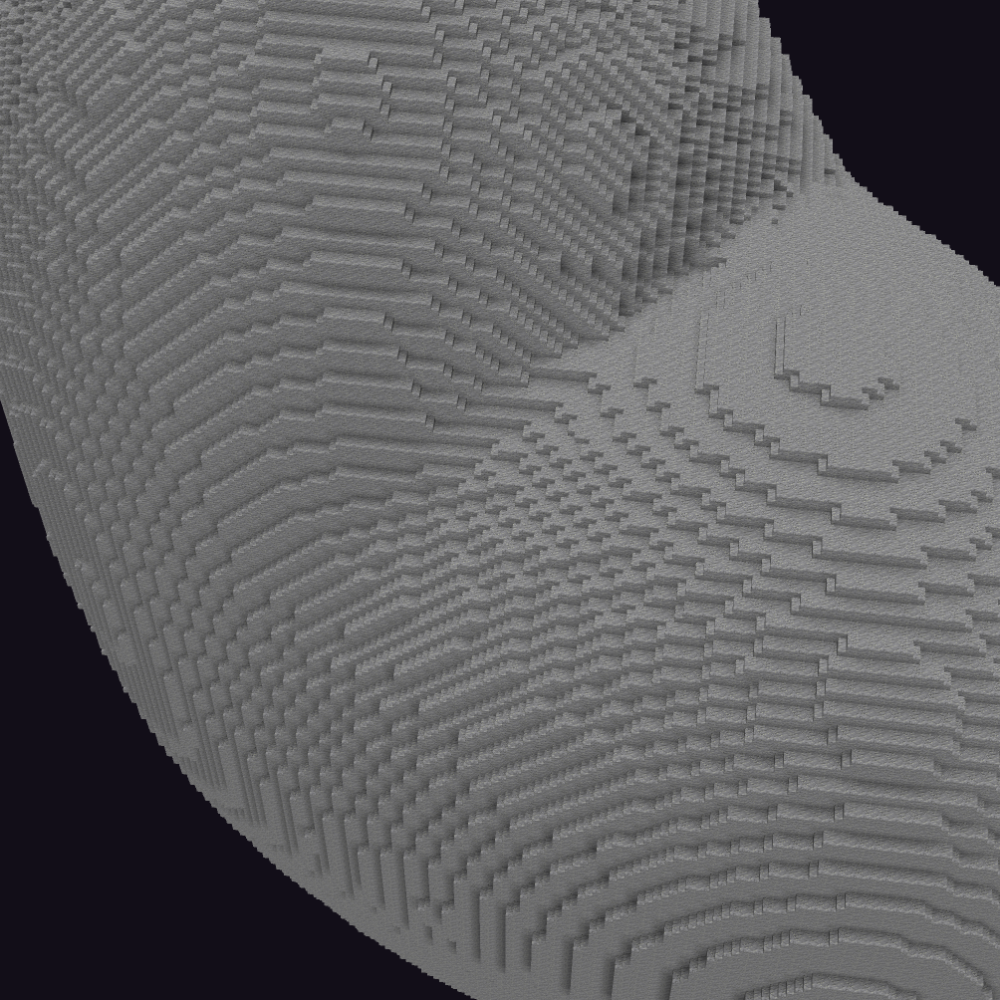

# Smoothblocks

Generate, place shapes, and perform edits using shaping blocks like slabs, stairs, snow layers, water levels, etc.

### Currently supported commands are:

[Deform Commands (//ezdeform)](../commands/deformation.md)

[Placement Commands (//ezplace, //ezarray, //ezscatter)](../commands/placement/)

[Spline Commands (//ezspline)](../commands/spline/)

[Smoothing Commands (//ezsmooth, //ezinflate, //ezdeflate, //ezsmoothblocks)](../commands/smoothing.md)

[Surface Commands (//ezsurface)](../commands/surface.md)

[Texturing Commands (//eztexture)](../commands/texturing.md)

### How to use

Add the <mark style="color:orange;">**`-w <profile>`**</mark> flag when using one of the supported(!) commands.

<mark style="color:blue;">Examples</mark>

Comparing generating a noise spline with and without the SlabsOnly profile.

* `//ezspline noise ##grayscale 20`

- `//ezspline noise ##grayscale 20`` `<mark style="color:orange;">**`-w Slabs`**</mark>

Comparing pasting a rotated mushroom schematic with and without the SlabsOnly profile.

* `//ezplace Clipboard Aim`
* `//ezplace Clipboard Aim`` `<mark style="color:orange;">**`-w Slabs`**</mark>

### Profiles

There are different smoothblocks profiles. One may, for example, use only slabs, the other may use stairs and slabs, and yet another may also use stairs and slabs but with different orientations. We hardcoded each preset to achieve a certain result. Each preset uses a specific subset of shaping blocks. We named each preset by the shaping blocks it uses. Depending on their complexity, some may take longer to run than others.

<figure><figcaption></figcaption></figure>

<mark style="color:blue;">Examples</mark>

Comparing <mark style="color:blue;">**`//ezspline 3d ch smooth_sandstone -w <profile>`**</mark>

No smoothblocks\
\

-w Slabs\
\

-w SlabsAndStairs\
\

-w SlabsAndStairs2D\
\

-w Layers\

### Materials

By default, we use the <mark style="color:orange;">**closest colour**</mark> shaping block to the specified [pattern](https://worldedit.enginehub.org/en/latest/usage/general/patterns/), [palette](../palettes/palettes-explained.md) or corresponding block within the schematic.

<mark style="color:blue;">Examples</mark>

If you generate a [Structure](../commands/placement/available-structures.md) (e.g. an [Icosphere](../commands/placement/available-structures.md#icosphere-ic)) using the pattern <mark style="color:blue;">**`clay`**</mark> using the <mark style="color:blue;">**`Slabs`**</mark> smoothblocks profile. Then, since there is no clay slab, it will use the slab variant that is **closest in colour** (determined using the default minecraft textures), which for clay would be a stone slab.

\

Another example: ezEdits determined\
\- `deepslate_tile_slab` as the closest slab to `gray_concrete`\
\- `smooth_quartz_slab` as the closest slab to `white_wool`\
(The original schematic does not contain `deepslate_tile` or `smooth_quartz`)

You may also <mark style="color:orange;">**override**</mark> the material of each shaping block variant, by setting the material yourself, e.g.: <mark style="color:orange;">**`-w Slabs(Slab:acacia)`**</mark>. When using commands that accept a palette, you may even define a whole custom palette or materials for each block variant.

* (Note: Currently, you cannot override materials when pasting schematics, clipboards or editing an existing region using smoothblocks.)
* (Special case: To override the shaping block materials of Structures which themselves require a Pattern or Palette field, you need to use the internal "Smoothblocks" parameter instead of the -w flag.)

### Coverage

The Coverage parameter is very specific parameter that (not directly but effectively) lets you control how many shaping blocks should be used as a percentage. 0 means only full blocks are placed, 1 means every surface block will be some shaping block.

The default (and the mathematically most accurate) value is `0.5`.

Examples

Gif going from `Coverage:0.0` to `Coverage:1.0`.\

Example Command: `//ezspline basic clay 15 -w SSW(C:0.5)`

Another comparison between `C:0.5` and `C:1.0`:

<figure><figcaption>
Coverage:0.5
</figcaption></figure> <figure><figcaption>
Coverage:1.0
</figcaption></figure>

Note how 0.5 creates smoother and more faithful contours, while 1.0 places the stair at every possible corner block, sacrificing accuracy, but looking nice with Minecraft's default shading.

